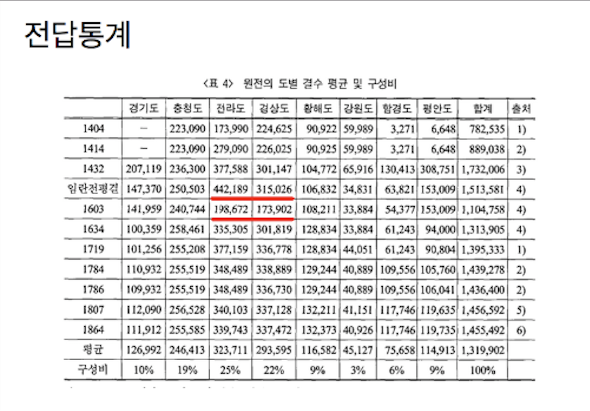

## Problem

조선시대 전답 통계를 stacked area graph로 표시

<!--

-->

```{r, field table}
options(warn = -1)
library(knitr)
library(magrittr)
library(showtext)
```

```{r, out.width = "80%"}

```

<P style = "page-break-before:always">

## Data

```{r, data}
library(knitr)
Year <- c(1404, 1414, 1432, 1592, 1603, 1634, 1719, 1784, 1786, 1807, 1864)
Province <- c("경기도", "충청도", "전라도", "경상도", "황해도", "강원도", "함경도", "평안도")
field <- matrix(c(NA, 223090, 173990, 224625, 90922, 59989, 3271, 6648,
                  NA, 223090, 279090, 226025, 90925, 59989, 3271, 6648,
                  207119, 236300, 377588, 301147, 104772, 65916, 130413, 308751, 
                  147370, 250503, 442189, 315026, 106832, 34831, 63821, 153009,
                  141959, 240744, 198672, 173902, 108211, 33884, 54377, 153009,
                  100359, 258461, 335305, 301819, 128834, 33884, 61243, 94000,
                  101256, 255208, 377159, 336778, 128834, 44051, 61243, 90804,
                  110932, 255519, 348489, 335730, 129244, 40889, 109556, 105760,
                  109932, 255519, 348489, 336730, 129244, 40889, 109556, 106041,
                  112090, 256528, 340103, 337128, 132211, 41151, 117746, 119635, 
                  111912, 255585, 339743, 337472, 132373, 40926, 117746, 119735), 
                ncol = 8, 
                byrow = TRUE)
rownames(field) <- Year
colnames(field) <- Province
field %>% str
options(digits = 2)
mean_field <- field %>% colMeans(na.rm = TRUE)
prop_field <- field %>% 
  {colMeans(., na.rm = TRUE) / sum(colMeans(., na.rm = TRUE))} %>%
  `*`(100) %>%
  round(digits = 2)
```

<!--
<P style = "page-break-before:always">
-->

## Reshape

`matrix` (array)에 특화된 `melt` 사용

```{r, reshape}
library(reshape2)
field_melt <- field %>%
  melt(varnames = c("Year", "Province"), value.name = "Area")
field_melt %>% str
# kable(field_melt)
```

<P style = "page-break-before:always">

## ggplot

```{r, ggplot, warning = FALSE, message = FALSE, fig.width = 9, fig.height = 5}
library(ggplot2)
library(extrafont)
showtext_auto()
font_add(family = "KoPubWorld Dotum Medium", regular = "KoPubWorld/KoPubWorld Dotum Medium.ttf")
font_add(family = "KoPubWorld Dotum Bold", regular = "KoPubWorld/KoPubWorld Dotum Bold.ttf")
g0 <- ggplot()
g1 <- g0 +
  geom_area(data = field_melt, 
            mapping = aes(x = Year, y = Area, fill = Province),
            colour = "black", 
            size = 0.2, 
            alpha = 0.4, 
            na.rm = TRUE)
g1
```

<P style = "page-break-before:always">

```{r, ggplot2, warning = FALSE, message = FALSE, fig.width = 9, fig.height = 5}
g2 <- g1 +
  scale_fill_brewer(palette = "Spectral", 
                    name = "",
                    breaks = levels(field_melt$Province)) +
  theme_bw()
g2
```

<P style = "page-break-before:always">

```{r, warning = FALSE, message = FALSE, fig.width = 9, fig.height = 5}
g3<- g2 + 
  scale_x_continuous(name = "연도", 
                     breaks = as.numeric(row.names(field)[-9]),
                     labels = row.names(field)[-9])
g3
```

<P style = "page-break-before:always">

```{r, warning = FALSE, message = FALSE, fig.width = 9, fig.height = 5}
g4 <- g3 +
  theme(axis.text.x = element_text(angle = 90))
g4
```

<P style = "page-break-before:always">

```{r, warning = FALSE, message = FALSE, fig.width = 9, fig.height = 5}
g5 <- g4 + 
  scale_y_continuous(name = "토지 면적(결)",
                     breaks = cumsum(rev(field[3, ])),
                     labels = format(cumsum(rev(field[3, ])), big.mark = ","))
g5
```

<P style = "page-break-before:always">

```{r, warning = FALSE, message = FALSE, fig.width = 9, fig.height = 5}
g6 <- g5 +
  labs(title = "조선 시대 도별 논밭통계", 
       subtitle = "(도표 안의 수치는 기록된 값들의 평균)") +
  theme(plot.subtitle = element_text(family = "KoPubWorldDotum Medium", 
                                     hjust = 1))
g6
```

<P style = "page-break-before:always">

```{r, warning = FALSE, message = FALSE, fig.width = 9, fig.height = 5}
g7 <- g6 +
  theme(plot.title = element_text(size = 20, 
                                  hjust = 0.5,
                                  family = "KoPubWorldDotum Bold"))
g7
```

<P style = "page-break-before:always">

```{r, warning = FALSE, message = FALSE, fig.width = 9, fig.height = 5}
#  x.max <- max(Year) + 0.15 * diff(range(Year))
# g8 <- g7 +
#  scale_x_continuous(name = "연도", 
#                     breaks = as.numeric(row.names(field)[-9]),
#                     labels = row.names(field)[-9],
#                     limits = c(min(Year), x.max)) +
#  theme(legend.position = c(0.95, 0.5),
#        legend.box.background = element_rect(fill = "white", colour = "black"),
#        legend.title = element_blank())
# g8
g9 <- g7 +
  theme(legend.position = c(0.75, 0.9),
        legend.box.background = element_rect(fill = "white", colour = "black"),
        legend.direction = "horizontal")
g9
```

```{r, warning = FALSE, message = FALSE, fig.width = 9, fig.height = 5}
y_coord <- apply(field[3:4, ], 2, mean)
y_text <- cumsum(c(0, head(rev(y_coord), -1))) + rev(y_coord) / 2
mean_text <- rev(paste(Province, 
                       ":", 
                       format(mean_field, big.mark = ","), 
                       "결(", 
                       format(prop_field, digits = 2, nsmall = 0), 
                       "%)", 
                       sep = ""))
text_df <- data.frame(x = (Year[3] + Year[4]) / 2, 
                      y = y_text, 
                      label = mean_text, 
                      row.names = NULL, 
                      stringsAsFactors = FALSE)
```

<P style = "page-break-before:always">

```{r, warning = FALSE, message = FALSE, fig.width = 9, fig.height = 6.75}
g10 <- g9 +
  guides(fill = FALSE) +
  geom_text(data = text_df, 
            mapping = aes(x = x, y = y), 
            label = mean_text, 
            family = "KoPubWorldDotum Medium", size = 3) +
  annotate("text", x = 1592, y = 1650000, 
           label = "임진왜란", 
           colour = "red",
           size = 5,
           family = "KoPubWorldDotum Medium")
#  theme(text = element_text(family = "KoPubWorldDotum Medium"))
#  annotate("text", 
#           x = text_df$x, 
#           y = text_df$y, 
#           label = mean_text, 
#           family = "KoPubWorldDotum Medium")

g10

ggsave("../pics/chosun_field_ggplot.png", dpi = 72)
```

