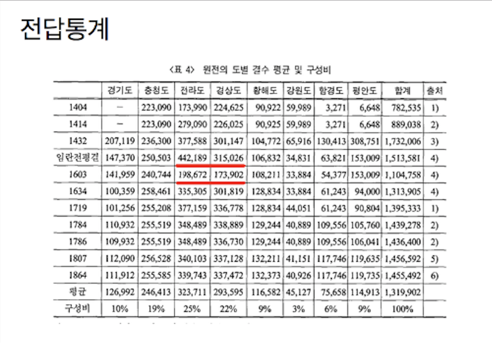

## Problem

조선시대 전답 통계를 stacked area graph 로 표시.

```{r setup, message = FALSE, warning = FALSE}
library(knitr)
library(showtext)
library(ggplot2)
library(dplyr)
library(tidyr)
library(RColorBrewer)

## 한글 폰트: 구글 폰트에서 나눔고딕
font_add_google("Nanum Gothic", "nanum")
showtext_auto()
showtext_opts(dpi = 96)
```

```{r cover, out.width = "80%"}

```

<P style = "page-break-before:always">

## Data

```{r data}
Year <- c(1404, 1414, 1432, 1592, 1603, 1634, 1719, 1784, 1786, 1807, 1864)
Province <- c("경기도", "충청도", "전라도", "경상도",
              "황해도", "강원도", "함경도", "평안도")

## 경기도의 1404·1414 자료는 결측이라 NA
field <- matrix(c(
  NA, 223090, 173990, 224625,  90922, 59989,   3271,   6648,
  NA, 223090, 279090, 226025,  90925, 59989,   3271,   6648,
  207119, 236300, 377588, 301147, 104772, 65916, 130413, 308751,
  147370, 250503, 442189, 315026, 106832, 34831,  63821, 153009,
  141959, 240744, 198672, 173902, 108211, 33884,  54377, 153009,
  100359, 258461, 335305, 301819, 128834, 33884,  61243,  94000,
  101256, 255208, 377159, 336778, 128834, 44051,  61243,  90804,
  110932, 255519, 348489, 335730, 129244, 40889, 109556, 105760,
  109932, 255519, 348489, 336730, 129244, 40889, 109556, 106041,
  112090, 256528, 340103, 337128, 132211, 41151, 117746, 119635,
  111912, 255585, 339743, 337472, 132373, 40926, 117746, 119735),
  ncol = 8, byrow = TRUE)
rownames(field) <- Year
colnames(field) <- Province

## stacked area 의 아래쪽에 면적이 큰 지역(전라·경상)을 두기 위해 컬럼 재배열
field    <- field[, c(3, 4, 1, 2, 5:8)]
Province <- colnames(field)

## 평균 면적과 비율(통계 라벨용)
mean_field <- colMeans(field, na.rm = TRUE)
prop_field <- round(mean_field / sum(mean_field) * 100, digits = 2)

str(field)
```

<!--
<P style = "page-break-before:always">
-->

## Tidy Data

```{r tidy, message = FALSE}
## matrix → long form
field_long <- as.data.frame(as.table(field)) %>%
  rename(Year = Var1, Province = Var2, Area = Freq) %>%
  mutate(Year = as.numeric(as.character(Year)))
str(field_long)
kable(head(field_long, 12))
```

<P style = "page-break-before:always">

## ggplot

```{r ggplot, warning = FALSE, message = FALSE, fig.width = 12, fig.height = 7, fig.keep = "last"}
## 축 눈금/라벨 — 인덱스 대신 연도 기반
year_levels    <- as.numeric(rownames(field))
visible_years  <- setdiff(year_levels, 1786)         # 1786 은 1784 와 너무 가까워 제외

## y축 누적 눈금: 1432 년 행을 기준으로 누적 (지역별 누적 면적 가늠)
ref_year <- "1432"
y_breaks <- cumsum(rev(field[ref_year, ]))

## 평균면적 라벨을 area chart 위에 얹기 위한 좌표
label_years <- c("1432", "1592")
y_coord <- colMeans(field[label_years, ])
y_text  <- cumsum(c(0, head(rev(y_coord), -1))) + rev(y_coord) / 2

mean_text <- rev(paste0(Province, ": ",
                        format(mean_field, big.mark = ","),
                        "결 (",
                        format(prop_field, digits = 2, nsmall = 0),
                        "%)"))

text_df <- data.frame(x = mean(as.numeric(label_years)),
                      y = y_text,
                      label = mean_text,
                      stringsAsFactors = FALSE)

g <- ggplot() +
  geom_area(data = field_long,
            mapping = aes(x = Year, y = Area, fill = Province),
            colour = "black", linewidth = 0.2, alpha = 0.4,
            na.rm = TRUE) +
  scale_fill_brewer(palette = "Spectral", name = "",
                    breaks = levels(field_long$Province)) +
  scale_x_continuous(name   = "연도",
                     breaks = visible_years,
                     labels = visible_years) +
  scale_y_continuous(name   = "토지 면적(결)",
                     breaks = y_breaks,
                     labels = format(y_breaks, big.mark = ",")) +
  labs(title    = "조선 시대 도별 논밭통계",
       subtitle = "(도표 안의 수치는 기록된 값들의 평균)") +
  geom_text(data = text_df,
            mapping = aes(x = x, y = y, label = label),
            family = "nanum", size = 3) +
  annotate("segment",
           x = 1592, xend = 1592, y = 1500000, yend = 1100000,
           colour = "red", arrow = arrow(length = unit(0.2, "cm"))) +
  annotate("text", x = 1592, y = 1550000,
           label = "임진왜란",
           colour = "red", size = 5, family = "nanum") +
  guides(fill = "none") +
  theme_bw(base_family = "nanum") +
  theme(
    plot.title             = element_text(size = 20, hjust = 0.5,
                                          face = "bold"),
    plot.subtitle          = element_text(hjust = 1),
    axis.text.x            = element_text(angle = 90, vjust = 0.5),
    legend.position        = "inside",
    legend.position.inside = c(0.75, 0.9),
    legend.box.background  = element_rect(fill = "white", colour = "black"),
    legend.direction       = "horizontal"
  )
g

ggsave("../pics/chosun_field_ggplot_v2.png", plot = g,
       width = 12, height = 7, units = "in", dpi = 96)
```
