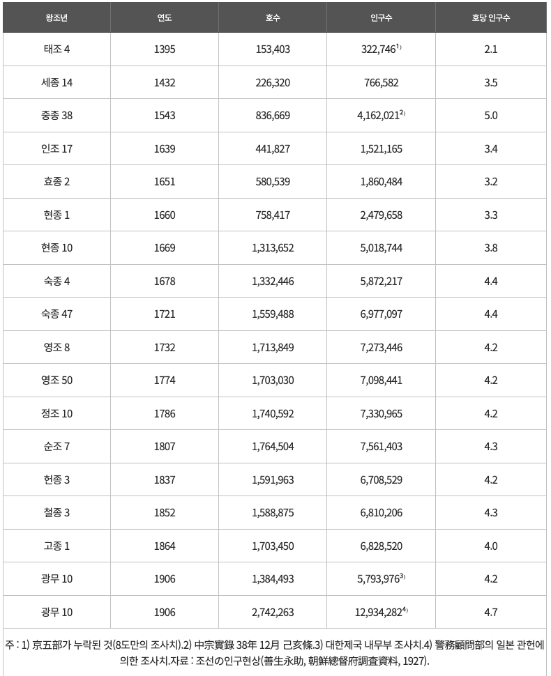

## Problem

오기수 교수의 논문 조선시대 각 도별 인구 및 전답과 조세부담액 분석에 등장하는 __연도별 호수 및 인구와 호당인구__ 를 도표로 제시


```{r, out.width = "75%", fig.align = "center"}

```

<P style = "page-break-before:always">

## Data

```{r, data}
Years <- c(1395, 1432, 1543, 1639, 1651, 1660, 1669, 1678, 1721, 1732, 1774, 1786, 1807, 1837, 1852, 1864, 1906)
Households <- c(153403, 226320, 836669, 441827, 580539, 758417, 1313652, 1332446, 1559488, 1713849, 1703030, 1740592, 1764504, 1591963, 1588875, 1703450, 2742263)
Population <- c(322746, 766582, 4162021, 1521165, 1860484, 2479658, 5018744, 5872217, 6977097, 7273446, 7098441, 7330965, 7561403, 6708529, 6810206, 6828520, 12934282)
chosun_df <- data.frame(Years, Households, Population)
str(chosun_df)
```

## Plot (R Base)

```{r, base plot, fig.width = 9, fig.height = 6.75}
library(extrafont)
par(mar = c(5, 5, 4, 2) + 0.1, family = "KoPubWorldDotum Medium")
plot(Population / 10000 ~ Years, 
     data = chosun_df, 
     type = "b", 
     pch = 21, 
     col = "red", 
     bg = "white",
     ylim = c(0, 1300), 
     xaxt = "n", 
     yaxt = "n", 
     ann = FALSE)
lines(Households / 10000 ~ Years, 
      data = chosun_df, 
      type = "b",
      pch = 21, 
      col = "blue", 
      bg = "white")
Years_ticks <- c(1395, 1432, 1543, 1639, 1669, 1678, 1721, 1807, 1906)
Years %in% Years_ticks
Households_ticks <- Households[Years %in% c(1404, 1669, 1807)]
Population_ticks <- Population[Years %in% c(1404, 1432, 1678, 1721, 1807, 1906)]
y_breaks <- c(Population_ticks, Households_ticks) / 10000
y_labels <- format(c(Population_ticks, Households_ticks) / 10000, 
                   digits = 3, 
                   nsmall = 0)
axis(side = 1, 
     at = Years_ticks, 
     labels = Years_ticks, 
     las = 2)
axis(side = 2, 
     at = c(Population_ticks, Households_ticks) / 10000, 
     labels = format(c(Population_ticks, Households_ticks) / 10000, 
                     digits = 3, 
                     nsmall = 0), 
     las = 2)
legend("topleft", 
       inset = 0.05, 
       legend = c("인구", "호수"), 
       lty = 1, 
       col = c("red", "blue"))
text(x = 1700, 
     y = c(500, 100), 
     labels = c("인구", "호수"))
main_title <- "조선시대 호수와 인구수의 변화"
x_lab <- "연도"
y_lab <- "호수와 인구수(단위 만)"
title(main = main_title, 
      line = 1, 
      cex.main = 2, 
      family = "KoPubWorldDotum Bold")
title(xlab = x_lab, 
      ylab = y_lab, 
      line = 4, 
      family = "KoPubWorldDotum Bold")
# dev.copy(png, file = "../pics/chosun_demo.png", width = 800, height = 450)
# dev.off()
```

<!--
<P style = "page-break-before:always">
-->

## ggplot

### Reshaping (Tidy)

```{r, reshape, message = FALSE}
library(ggplot2)
library(tidyverse)
library(reshape2)
chosun_melt <- melt(chosun_df, 
                    id.vars = "Years", 
                    measure.vars = c("Households", "Population"),
                    variable.name = "Variable", 
                    value.name = "Counts")
str(chosun_melt)
## tidy 한 데이터 만들기 
Counts <- c(as.matrix(chosun_df[, 2:3]))
N <- length(Counts)
Years <- rep(chosun_df[, 1], length.out = N)
Variable <- gl(2, length(chosun_df[, 1]), N, 
               labels = c("Households", "Population")) 
chosun_tbl <- data.frame(Years, Counts, Variable)
```

### geom_line(), geom_point(), ...

```{r, ggplot, fig.width = 9, fig.height = 5.1}
library(extrafont)
g1 <- ggplot(data = chosun_tbl, 
#              data = chosun_melt,
             mapping = aes(x = Years, 
                           y = Counts / 10000, 
                           colour = Variable)) + 
  geom_line() + 
  geom_point(shape = 21, 
             fill = "white", 
             size = 3, 
             show.legend = FALSE) 
g2 <- g1 + 
  theme_bw() 
g3 <- g2 + 
#  theme(panel.grid.major = element_line(linetype = "dotted", 
#                                        colour = "black")) +
  scale_x_continuous(name = x_lab, 
                     breaks = Years_ticks, 
                     labels = Years_ticks) +
  theme(axis.title.x = element_text(hjust = 0.5, angle = 0, family = "KoPubWorldDotum Light"),
        axis.text.x = element_text(angle = 90))
g4 <- g3 +
  scale_y_continuous(name = y_lab, 
                     breaks = y_breaks, 
                     labels = y_labels) +
  theme(axis.title.y = element_text(angle = 90, family = "KoPubWorldDotum Light"))
g5 <- g4 + 
  scale_colour_manual(values = c("red", "blue"), 
                      labels = c("호수", "인구수")) +
  theme(legend.text = element_text(family = "KoPubWorldDotum Light"),
        legend.title = element_blank())
g6 <- g5 + 
  theme(legend.position = c(0.2, 0.8), 
        legend.background = element_rect(colour = "black", 
                                         linetype = "solid"))
g7 <- g6 + 
  ggtitle(main_title) + 
  theme(plot.title = element_text(hjust = 0.5, 
                                  size = 18, 
                                  margin = margin(b = 12),
                                  family = "KoPubWorldDotum Bold")) +
  annotate("text", x = 1700, y = c(500, 100), 
           label = c("인구", "호수"), 
           family = "KoPubWorldDotum Medium")
g7
# ggsave("../pics/chosun_demo_ggplot.png", width = 9, height = 81/16, units = "in", dpi = 72)
```
