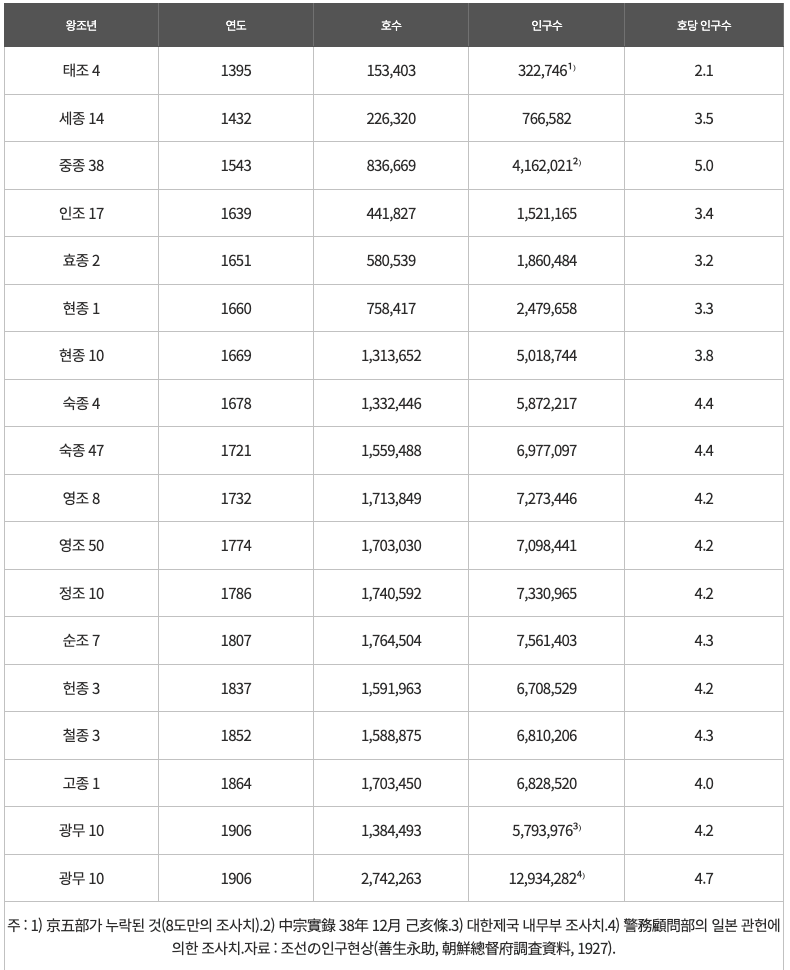

## Problem

오기수 교수의 논문 「조선시대 각 도별 인구 및 전답과 조세부담액 분석」에 등장하는 __연도별 호수 및 인구와 호당인구__ 를 도표로 제시.

```{r setup, message = FALSE, warning = FALSE}
library(knitr)
library(showtext)
library(ggplot2)
library(dplyr)
library(tidyr)

## 한글 폰트: 구글 폰트에서 나눔고딕 받아오기 (regular + bold)
font_add_google("Nanum Gothic", "nanum")
showtext_auto()
showtext_opts(dpi = 96)        # knitr 기본 dpi 와 정합
```

```{r cover, out.width = "75%", fig.align = "center"}

```

<P style = "page-break-before:always">

## Data

```{r data}
chosun_df_full <- data.frame(
  Years = c(1395, 1432, 1543, 1639, 1651, 1660, 1669, 1672,
            1678, 1721, 1732, 1774, 1786, 1807,
            1837, 1852, 1864, 1906),
  Households = c( 153403,  226320,  836669,  441827,  580539,  758417,
                 1313652, 1178144, 1332446, 1559488, 1713849, 1703030,
                 1740592, 1764504, 1591963, 1588875, 1703450, 2742263),
  Population = c( 322746,  766582, 4162021, 1521165, 1860484, 2479658,
                 5018744, 4701359, 5872217, 6977097, 7273446, 7098441,
                 7330965, 7561403, 6708529, 6810206, 6828520, 12934282)
)

## 1807년까지의 자료만 사용 (이후 시기는 조사 방식이 달라져 별도 분석)
chosun_df <- subset(chosun_df_full, Years <= 1807)
str(chosun_df)

## 시각화에서 공통으로 쓰는 라벨/눈금
main_title  <- "조선시대 호수와 인구수의 변화"
x_lab       <- "연도"
y_lab       <- "인구수 (단위 만)"
y4_lab      <- "호수 (단위 만)"
Years_ticks <- c(1395, 1432, 1543, 1639, 1669, 1678, 1721, 1774, 1807)
```

## Plot (R Base)

```{r base-plot, fig.width = 9, fig.height = 6.75, message = FALSE}
par(mar = c(5, 5, 4, 5) + 0.1, family = "nanum")
plot(Population / 10000 ~ Years,
     data = chosun_df,
     type = "b", pch = 21, col = "blue", lwd = 2, bg = "white",
     ylim = c(0, 800),
     xaxt = "n", yaxt = "n", ann = FALSE)
lines(Households / 10000 ~ Years,
      data = chosun_df,
      type = "b", pch = 21, col = "red", lwd = 2, bg = "white")

Households_ticks <- with(chosun_df,
                         Households[Years %in% c(1395, 1543, 1669, 1807)])
Population_ticks <- with(chosun_df,
                         Population[Years %in% c(1395, 1432, 1543, 1639,
                                                 1669, 1672, 1678, 1721, 1807)])

axis(side = 1, at = Years_ticks, labels = Years_ticks, las = 2)
axis(side = 2,
     at     = Population_ticks / 10000,
     labels = format(Population_ticks / 10000, digits = 3, nsmall = 0),
     las = 2)
axis(side = 4,
     at     = Households_ticks / 10000,
     labels = format(Households_ticks / 10000, digits = 3, nsmall = 0),
     las = 2)

legend("topleft", inset = 0.05,
       legend = c("인구", "호수"), lty = 1, col = c("blue", "red"))

text(x = c(1592, 1700), y = c(380, 430),
     labels = c("임진왜란", "경신대기근"),
     cex = 1.3, col = "red")

title(main = main_title, line = 1, cex.main = 2,
      family = "nanum", font.main = 2)
title(xlab = x_lab, ylab = y_lab, line = 4, family = "nanum")
mtext(y4_lab, side = 4, line = 2, family = "nanum")
```

<!--
<P style = "page-break-before:always">
-->

## ggplot

### Reshaping (Tidy)

```{r reshape, message = FALSE}
## tidyr::pivot_longer 로 wide → long
chosun_tbl <- chosun_df %>%
  pivot_longer(cols      = c(Households, Population),
               names_to  = "DemoType",
               values_to = "Counts") %>%
  mutate(DemoType = factor(DemoType, levels = c("Households", "Population")))
str(chosun_tbl)
```

### geom_line(), geom_point(), ...

```{r ggplot, fig.width = 9, fig.height = 5.1, message = FALSE}
## 인구·호수 단위가 같으므로 한 축에 일정 간격 눈금
y_breaks <- seq(0, 800, by = 100)

g <- ggplot(chosun_tbl,
            aes(x = Years, y = Counts / 10000, colour = DemoType)) +
  geom_line(linewidth = 0.6) +
  geom_point(shape = 21, fill = "white", size = 3, show.legend = FALSE) +
  scale_x_continuous(name = x_lab,
                     breaks = Years_ticks, labels = Years_ticks) +
  scale_y_continuous(name = y_lab,
                     breaks = y_breaks, labels = y_breaks) +
  scale_colour_manual(values = c(Households = "red", Population = "blue"),
                      labels = c("호수", "인구수")) +
  ggtitle(main_title) +
  annotate("text", x = 1592, y = 480, label = "임진왜란",
           colour = "red", family = "nanum", size = 5) +
  annotate("text", x = 1700, y = 540, label = "경신대기근",
           colour = "red", family = "nanum", size = 5) +
  theme_bw(base_family = "nanum") +
  theme(
    plot.title             = element_text(hjust = 0.5, size = 18,
                                          margin = margin(b = 12),
                                          face = "bold"),
    axis.text.x            = element_text(angle = 90, vjust = 0.5),
    legend.position        = "inside",
    legend.position.inside = c(0.15, 0.8),
    legend.background      = element_rect(colour = "black", linetype = "solid"),
    legend.title           = element_blank()
  )
g

ggsave("../pics/chosun_demo_ggplot.png",
       plot = g, width = 9, height = 81/16, units = "in", dpi = 96)
```
