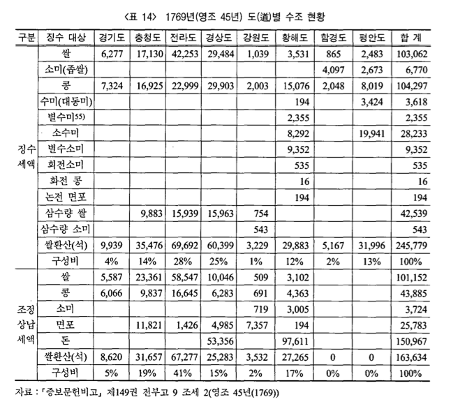

```{r, echo = FALSE}
options(warn = -1)
library(knitr)
library(magrittr)
```

## Problem

1769년(영조 45년) 도별 수조 현황표를 막대그래프로 표시

```{r, out.width = "75%"}

```

<P style = "page-break-before:always">

## Data Setup

```{r, data}
Province <- c("경기도", "충청도", "전라도", "경상도", "강원도", "황해도", "함경도", "평안도")
Province <- factor(Province, levels = Province)
Expected <- c(9939, 35476, 69692, 60399, 3229, 29883, 5167, 31996)
Collected <- c(8620, 31657, 67277, 25283, 3532, 27265, 0, 0)
tax_df <- data.frame(Province, Expected, Collected)
tax_df
#> 그래프 상에 0을 표시하게 되는 문제 피하기
# tax_df[, 3] %<>%
#   `[<-`(. == 0, NA)
tax_df[, 3][tax_df[, 3] == 0] <- NA
tax_df
```

<P style = "page-break-before:always">

## Barplot(R Base)

```{r, fig.width = 12, fig.height = 6}
library(extrafont)
par(family = "KoPubWorldDotum Medium")
b1 <- barplot(t(as.matrix(tax_df[, 2:3])),
              axes = FALSE, 
              ylim = c(0, 80000), 
              beside = TRUE, 
              names.arg = tax_df[, 1], 
              legend.text = c("징수액", "상납액"), 
              col = c("darkgrey", "blue"))
# axis(side = 2, 
#     at = as.vector(as.matrix(rates.df[, 2:3])), 
#     labels =  as.vector(as.matrix(rates.df[, 2:3])), las = 1)
text(x = b1[1, ], 
     y = tax_df[, 2] + 2000, 
     labels = format(tax_df[, 2], big.mark = ","), 
     col = "black")
text(x = b1[2, ], 
     y = tax_df[, 3] + 2000, 
     labels = format(tax_df[, 3], big.mark = ","), 
     col = "black")
main_title <- "영조 45년 도별 수조 현황"
sub_title <- "증보문헌비고, 제149권 전부고 9 조세 2 (영조 45년, 1769년)"
main_text <- "쌀환산(석)\n상납비율은 약 66%"
title(main = main_title, 
      sub = sub_title, 
      cex.main = 2, 
      family = "KoPubWorldDotum Bold")
text(x = 18, y = 60000, 
     main_text, 
     cex = 1.6, 
     adj = 0.5,
     family = "KoPubWorldDotum Medium")
```

<P style = "page-break-before:always">

## ggplot

### Reshaping (Tidy)

```{r, data reshaping}
library(reshape2)
tax_df
str(tax_df)
tax_df_melt <- melt(tax_df, 
                    id.vars = "Province", 
                    measure.vars = c("Expected", "Collected"), 
                    variable.name = "tax", 
                    value.name = "amount")
#> tax_df_melt
str(tax_df_melt)
Amount <- c(as.matrix(tax_df[, 2:3]))
N <- length(Amount)
Province <- rep(tax_df[, 1], length.out = N)
Tax <- gl(2, length(tax_df[, 1]), N, 
          labels = c("Expected", "Collected")) 
tax_tbl <- data.frame(Province, Amount, Tax)
```

<P style = "page-break-before:always">

### `geom_bar()`

```{r, fig.width = 12, fig.height = 6, fig.keep = 'all'}
library(ggplot2)
g0 <- ggplot(data = tax_tbl, 
             mapping = aes(x = Province, 
                           y = Amount, 
                           fill = Tax)) 
g1 <- g0 + 
  geom_bar(stat = "identity", 
           position = position_dodge(),
           na.rm = TRUE) 
#> g1
g2 <- g1 +
  geom_text(mapping = aes(x = Province, 
                          y = Amount + 2000, 
                          label = format(Amount, big.mark = ",")), 
            colour = "black",
            position = position_dodge(width = 1), 
            size = 4,
            na.rm = TRUE)
#> g2
g3 <- g2 +
  theme_bw() 
#> g3
g4 <- g3 + 
    scale_fill_manual(values = c("darkgrey", "blue"), 
                      labels = c("징수액", "상납액")) +
    scale_colour_manual(values = c("darkgrey", "blue"), 
                        labels = c("징수액", "상납액")) + 
    theme(legend.title = element_blank(), 
          legend.box.background = element_rect(), 
          legend.spacing.x = unit(6, "pt"))
#> g4
g5 <- g4 + 
    scale_x_discrete(name = "지역")
#> g5
g6 <- g5 +
    scale_y_continuous(name = "쌀환산(석)", 
                       breaks = tax_df[, 2],
                       labels = format(tax_df[, 2], big.mark = ",")) +
  theme(axis.text = element_text(family = "KoPubWorldDotum Light"))
#> g6
g7 <- g6 +
    labs(title = main_title, subtitle = sub_title)
#> g7
g8 <- g7 +
  theme(plot.title = element_text(hjust = 0.5, 
                                  size = 24,
                                  family = "KoPubWorldDotum Bold"), 
        plot.subtitle = element_text(family = "KoPubWorldDotum Medium"),
        legend.position = c(0.9, 0.8))
g8
```

```{r}
ggsave("../pics/chosun_tax_ggplot.png", dpi = 72)
```
