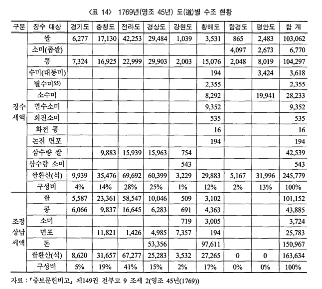

```{r setup, echo = FALSE, message = FALSE, warning = FALSE}
library(knitr)
library(showtext)
library(ggplot2)
library(dplyr)
library(tidyr)
library(scales)

## 한글 폰트: 구글 폰트에서 나눔고딕
font_add_google("Nanum Gothic", "nanum")
showtext_auto()
showtext_opts(dpi = 96)
```

## Problem

1769년(영조 45년) 도별 수조 현황표를 막대그래프로 표시.

```{r cover, out.width = "75%"}

```

<P style = "page-break-before:always">

## Data Setup

```{r data}
province  <- c("경기도", "충청도", "전라도", "경상도",
               "강원도", "황해도", "함경도", "평안도")
expected  <- c(9939, 35476, 69692, 60399, 3229, 29883, 5167, 31996)
collected <- c(8620, 31657, 67277, 25283, 3532, 27265,    0,     0)

## 함경도·평안도의 collected = 0 은 결측이 아니라 "실제 0".
## 험준한 운송로와 산적의 약탈, 그리고 변경 방위에 곡식이 다시 필요하다는
## 사정상 거둔 세곡을 중앙으로 올려보내지 않고 지역에서 그대로 소비한 결과로
## 기록되어 있다 → 그래프에서도 0 막대로 표시한다.

tax_df <- data.frame(province, expected, collected,
                     stringsAsFactors = FALSE)
tax_df
```

<P style = "page-break-before:always">

## Barplot (R Base)

```{r base-plot, fig.width = 12, fig.height = 6}
par(family = "nanum")

bar_mat <- t(as.matrix(tax_df[, c("expected", "collected")]))
b1 <- barplot(bar_mat,
              axes        = FALSE,
              ylim        = c(0, 80000),
              beside      = TRUE,
              names.arg   = tax_df$province,
              legend.text = c("징수액", "상납액"),
              col         = c("darkgrey", "blue"))

## 막대 위 숫자: 0 막대 위에는 "0(자체 소비)" 로 의미 표시
text(x = b1[1, ], y = expected + 2000,
     labels = format(expected, big.mark = ","), col = "black")
text(x = b1[2, ],
     y = collected + 2000,
     labels = ifelse(collected == 0,
                     "0\n(자체 소비)",
                     format(collected, big.mark = ",")),
     col = ifelse(collected == 0, "red", "black"))

main_title <- "영조 45년 도별 수조 현황"
sub_title  <- "증보문헌비고, 제149권 전부고 9 조세 2 (영조 45년, 1769년)"
main_text  <- "쌀환산(석)\n상납비율은 약 66%"
title(main = main_title, sub = sub_title,
      cex.main = 2, family = "nanum", font.main = 2)

## 본문 텍스트 위치: 마지막 막대그룹 오른쪽으로 자동 계산
x_text <- mean(range(b1)) + diff(range(b1)) * 0.25
text(x = x_text, y = 60000, main_text, cex = 1.6, adj = 0.5)
```

<P style = "page-break-before:always">

## ggplot

### Data for ggplot

```{r tidy-data, message = FALSE}
tax_df_long <- tax_df %>%
  mutate(province_f = factor(province, levels = province)) %>%
  pivot_longer(cols      = c(expected, collected),
               names_to  = "tax",
               values_to = "amount") %>%
  mutate(tax = factor(tax, levels = c("expected", "collected")))
str(tax_df_long)
```

<P style = "page-break-before:always">

### `geom_bar()`

```{r ggplot-final, fig.width = 12, fig.height = 6, fig.keep = "all"}
main_title <- "조선 시대 지역별 상납/징수 현황"
sub_title  <- "쌀 환산 기준(석) — 『증보문헌비고』를 바탕으로"

g <- ggplot(tax_df_long,
            aes(x = province_f, y = amount, fill = tax)) +
  geom_bar(stat = "identity", position = position_dodge(width = 0.9)) +
  geom_text(aes(y = amount + 2000,
                label = ifelse(tax == "collected" & amount == 0,
                               "0\n(자체 소비)",
                               format(amount, big.mark = ","))),
            colour = ifelse(tax_df_long$tax == "collected" &
                            tax_df_long$amount == 0, "red", "black"),
            position = position_dodge(width = 0.9),
            size = 4, family = "nanum") +
  scale_fill_manual(values = c(expected = "darkgrey", collected = "blue"),
                    labels = c("징수액", "상납액")) +
  scale_x_discrete(name = "지역") +
  scale_y_continuous(name = "쌀환산(석)",
                     labels = comma,
                     breaks = seq(0, 80000, by = 10000)) +
  labs(title = main_title, subtitle = sub_title) +
  theme_bw(base_family = "nanum") +
  theme(
    plot.title             = element_text(hjust = 0.5, size = 24,
                                          face = "bold"),
    plot.subtitle          = element_text(hjust = 0.5),
    legend.position        = "inside",
    legend.position.inside = c(0.9, 0.85),
    legend.title           = element_blank(),
    legend.box.background  = element_rect(),
    legend.spacing.x       = unit(6, "pt")
  )
g

ggsave("../pics/chosun_tax_ggplot.png", plot = g,
       width = 12, height = 6, units = "in", dpi = 96)
```

## Comments

조선시대 세금은 ...

영조시대에 ... <br><br>

전체 상납률 ≈ 66% (= 8개 도 collected 합 163,634석 / expected 합 245,781석).

함경도·평안도의 상납액이 0인 이유는 결측이 아니라 정책적 결과입니다.
변경(邊境) 지역에서 거둔 세곡은 험준한 운송로와 산적의 약탈을 피하기 어렵고,
어차피 변경 방위와 군량으로 다시 올라오게 되므로 거둔 그대로 지역에서 소비한
것이라는 기록이 남아 있습니다.

강원도는 expected(3,229석) 보다 collected(3,532석) 가 약간 더 많은데,
누적된 미상납분이 그해에 함께 정리됐을 가능성이 있으나 정확한 사정은
추가 자료가 필요합니다.
