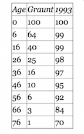

# Source of Data

```{r, echo = TRUE, out.width = "25%", fig.align = "left"}

```

## Data Input

* Graunt's Life Table

```{r}
graunt <- data.frame(x = c(0, seq(6, 76, by = 10)),
                     xPo_g = c(100, 64, 40, 25, 16, 10, 6, 3, 1))
```

* US 1993 life table for the same age group

```{r}
us93 <- data.frame(x = graunt$x,
                   xPo_us = c(100, 99, 99, 98, 97, 95, 92, 84, 70))
```

---

## Data Extraction

There are many ways to extract part of `us93` data frame.
The three most common patterns are shown below.

```{r}
us93["xPo_us"]       # data.frame 반환 (행 정보 포함)
us93$xPo_us          # 벡터 반환 (가장 일반적)
us93[ , "xPo_us"]    # 행렬 스타일 인덱싱
```

---

### Into one single data frame

Combine two data frames into one.

```{r}
(graunt_us <- data.frame(graunt, xPo_us = us93$xPo_us))
```

### Life Expectancy

The basic principle is that the area under the survival function is the life expectancy.

$X \ge 0$, $X \sim F(x)$ => $X \equiv F^{-1}(U), U \sim U(0,1)$, therefore,

$E(X) = E\{F^{-1}(U)\} = \int_{0}^{1} F^{-1}(u)du = \int_0^{\infty} 1-F(x) dx = \int_{0}^{\infty} S(x) dx$

---

# Step by step approach to draw survival function plot

1. Basic plot with points and lines — compare the following three methods

```{r, fig.width = 9, fig.height = 9}
par(mfrow = c(2, 2))
plot(x = graunt$x, y = graunt$xPo_g)
plot(xPo_g ~ x, data = graunt)
plot(graunt)
plot(graunt, ann = FALSE, xaxt = "n", yaxt = "n", type = "b")
```

---

2. Denote the ages and observed survival rates on the axes

```{r, fig.width = 6, fig.height = 6}
plot(graunt, ann = FALSE, xaxt = "n", yaxt = "n", type = "b")
axis(side = 1, at = graunt$x,     labels = graunt$x)
axis(side = 2, at = graunt$xPo_g, labels = graunt$xPo_g)
```

---

### Helper function for repeated base plot setup

From step 3 onward, the first three lines are always the same.
Define a helper function to avoid repetition.

```{r}
graunt_base_plot <- function() {
  plot(graunt, ann = FALSE, xaxt = "n", yaxt = "n", type = "b")
  axis(side = 1, at = graunt$x,     labels = graunt$x)
  axis(side = 2, at = graunt$xPo_g, labels = graunt$xPo_g)
}
```

3. Denote age 0 and 76 by dotted lines

```{r, fig.width = 6, fig.height = 6}
graunt_base_plot()
abline(v = c(0, 76), lty = 2)
```

---

### Setting up coordinates for `polygon()` (Clockwise)

```{r}
graunt_x    <- c(graunt$x,     0)
graunt_y    <- c(graunt$xPo_g, 0)
graunt_poly <- data.frame(x = graunt_x, y = graunt_y)
```

4. Shading

Note the effect of the last line of code.

```{r, fig.width = 6, fig.height = 6}
graunt_base_plot()
abline(v = c(0, 76), lty = 4)
polygon(graunt_poly, density = 15, angle = 135)
points(graunt, pch = 21, col = "black", bg = "white")
```

---

5. Grids

```{r, fig.width = 6, fig.height = 6}
graunt_base_plot()
abline(v = c(0, 76), lty = 2)
polygon(graunt_poly, density = 15)
abline(v = graunt$x, lty = 2)
points(graunt, pch = 21, col = "black", bg = "white")
```

---

6. Title, x-axis label, and y-axis label

```{r, fig.width = 6, fig.height = 6}
main_title <- "Graunt's Survival Function"
x_lab      <- "Age (years)"
y_lab      <- "Proportion of Survival (%)"

graunt_base_plot()
abline(v = c(0, 76), lty = 2)
polygon(graunt_poly, density = 15, angle = 45)
abline(v = graunt$x, lty = 2)
points(graunt, pch = 21, col = "black", bg = "white")
title(main = main_title, xlab = x_lab, ylab = y_lab)
```

7. Horizontal Grids

```{r, fig.width = 6, fig.height = 6}
graunt_base_plot()
abline(v = c(0, 76), lty = 2)
polygon(graunt_poly, density = 15, angle = 45)
abline(h = graunt$xPo_g, lty = 2)
points(graunt, pch = 21, col = "black", bg = "white")
title(main = main_title, xlab = x_lab, ylab = y_lab)
```

---

### Area under the curve

The area under the curve can be approximated by the sum of the areas of trapezoids:
$\sum_{i=1}^{n-1} (x_{i+1}-x_i)\times\frac{1}{2}(y_i + y_{i+1})$

* `diff()`, `head()`, and `tail()` can be used to compute the area easily.

```{r}
area_R <- function(x, y) {
  sum(diff(x) * (head(y, -1) + tail(y, -1)) / 2)
}
area_R(graunt$x, graunt$xPo_g) / 100
```

---

## Comparison with US 1993 life table

The shaded area between the two survival functions represents the difference in life expectancies.

### Helper function for repeated comparison base plot

```{r}
comparison_base_plot <- function() {
  plot(graunt, ann = FALSE, xaxt = "n", yaxt = "n", type = "b")
  axis(side = 1, at = graunt$x,     labels = graunt$x)
  axis(side = 2, at = graunt$xPo_g, labels = graunt$xPo_g)
  abline(v = c(0, 76), lty = 2)
}
```

1. Draw Graunt's first with axes, lower and upper limits.
   Check what happens if you place `abline(...)` right after `plot(...)`.

```{r, fig.width = 6, fig.height = 6}
comparison_base_plot()
```

---

2. Add US 1993 survival function

```{r, fig.width = 6, fig.height = 6}
comparison_base_plot()
lines(us93, type = "b")
```

---

3. US 1993 life table is truncated at age 76 — specify that point.

```{r, fig.width = 6, fig.height = 6}
comparison_base_plot()
lines(us93, type = "b")
abline(h = 70, lty = 2)
```

---

4. Using `las = 1` to label 70% on the y-axis.

```{r, fig.width = 6, fig.height = 6}
comparison_base_plot()
lines(us93, type = "b")
abline(h = 70, lty = 2)
axis(side = 2, at = 70, labels = 70, las = 1)
```

---

### Setting coordinates for `polygon()`

```{r}
us_graunt_x <- c(us93$x,       rev(graunt$x))
us_graunt_y <- c(us93$xPo_us,  rev(graunt$xPo_g))
us_graunt   <- data.frame(x = us_graunt_x, y = us_graunt_y)
```

5. Shading

What is the effect of `border = NA`, the last line of code?

```{r, fig.width = 6, fig.height = 6}
comparison_base_plot()
lines(us93, type = "b")
abline(h = 70, lty = 2)
axis(side = 2, at = 70, labels = 70, las = 1)
polygon(us_graunt, density = 15, col = "blue", border = NA)
points(us_graunt, pch = 21, col = "black", bg = "white")
```

---

6. Grids

```{r, fig.width = 6, fig.height = 6}
comparison_base_plot()
lines(us93, type = "b")
abline(h = 70, lty = 2)
axis(side = 2, at = 70, labels = 70, las = 1)
polygon(us_graunt, density = 15, col = "blue", border = NA)
abline(v = graunt$x, lty = 2)
points(us_graunt, pch = 21, col = "black", bg = "white")
```

---

7. Title, x-axis and y-axis labels

```{r, fig.width = 6, fig.height = 6}
main_title_g_us <- "Survival Function of Graunt and US 1993"

comparison_base_plot()
lines(us93, type = "b")
abline(h = 70, lty = 2)
axis(side = 2, at = 70, labels = 70, las = 1)
polygon(us_graunt, density = 15, col = "blue", border = NA)
abline(v = graunt$x, lty = 2)
points(us_graunt, pch = 21, col = "black", bg = "white")
title(main = main_title_g_us, xlab = x_lab, ylab = y_lab)
```

파일 저장이 필요한 경우 아래 패턴을 사용하세요:
```r
png("../pics/graunt_us93.png", width = 6, height = 6, units = "in", res = 150)
  # ... 위 플롯 코드 붙여넣기 ...
dev.off()
```

---

### Life expectancy

The area under the US 1993 survival function is

```{r}
area_R(us93$x, us93$xPo_us) / 100
```

The area of the shaded region (difference in life expectancies) is

```{r}
area_R(us93$x, us93$xPo_us) / 100 - area_R(graunt$x, graunt$xPo_g) / 100
```

---

## ggplot

```{r, message = FALSE}
library(ggplot2)
library(tidyr)
library(dplyr)
```

### Data Reshape

`tidyr::pivot_longer()`로 wide format → long format 변환.

```{r}
graunt_us_long <- graunt_us |>
  pivot_longer(cols      = c(xPo_g, xPo_us),
               names_to  = "times",
               values_to = "xPo") |>
  mutate(times = factor(times,
                        levels = c("xPo_g", "xPo_us"),
                        labels = c("Graunt", "US1993")))
graunt_us_long
str(graunt_us_long)
```

---

# Graunt

## Structure of ggplot

```{r, fig.width = 4, fig.height = 4}
(g1 <- ggplot(data    = graunt,
              mapping = aes(x = x, y = xPo_g)) +
   geom_line())
```

---

```{r, fig.width = 4, fig.height = 4}
(g2 <- g1 +
   geom_point(shape = 21, fill = "white"))
```

---

```{r, fig.width = 4, fig.height = 4}
(g3 <- g2 +
   theme_bw())
```

---

```{r, fig.width = 4, fig.height = 4}
(g4 <- g3 +
   xlab(x_lab) + ylab(y_lab) +
   ggtitle(main_title) +
   theme(plot.title = element_text(hjust = 0.5)) +
   scale_x_continuous(breaks = graunt$x) +
   scale_y_continuous(breaks = graunt$xPo_g))
```

---

```{r, fig.width = 4, fig.height = 4}
(g5 <- g4 +
   geom_vline(xintercept = graunt$x,  linetype = "dotted") +
   geom_hline(yintercept = 0,         linetype = "dotted"))
```

---

```{r, fig.width = 4, fig.height = 4}
(pg5 <- g5 +
   geom_polygon(data    = graunt_poly,
                mapping = aes(x = x, y = y),
                alpha = 0.3, fill = "grey"))
# ggsave("../pics/graunt_poly_ggplot.png", pg5)
```

```{r, fig.width = 8, fig.height = 12}
library(gridExtra)
g_graunt <- grid.arrange(g1, g2, g3, g4, g5, pg5, nrow = 3)
# ggsave(g_graunt, file = "../pics/graunt_ggplots.png", width = 8, height = 12)
```

---

# Graunt and US 1993

### Points and Lines

Step by step approach to understand the grammar of ggplot.

* We set `ggplot()` to accept varying `data.frame()` and `aes()` in `geom_polygon`.

```{r, fig.width = 6, fig.height = 6}
(gu1 <- ggplot() +
   geom_line(data    = graunt_us_long,
             mapping = aes(x = x, y = xPo, colour = times)))
```

---

```{r, fig.width = 6, fig.height = 6}
(gu2 <- gu1 +
   geom_point(data    = graunt_us_long,
              mapping = aes(x = x, y = xPo, colour = times),
              shape = 21, fill = "white"))
```

---

```{r, fig.width = 6, fig.height = 6}
(gu3 <- gu2 +
   theme_bw())
```

---

## Polygon

Reuse `us_graunt` for `geom_polygon()`. Note how to remove default legends.

```{r, fig.width = 6, fig.height = 6}
(gup3 <- gu3 +
   geom_polygon(data    = us_graunt,
                mapping = aes(x = x, y = y),
                alpha = 0.3, fill = "blue"))
```

---

```{r, fig.width = 6, fig.height = 6}
(gup4 <- gup3 +
   guides(colour = "none"))
```

---

## Change default annotations

### Points and Lines

Add labels, title, legend, and axis ticks step by step.

```{r, fig.width = 6, fig.height = 6}
(gu4_1 <- gu3 +
   xlab(x_lab) + ylab(y_lab))
```

---

```{r, fig.width = 6, fig.height = 6}
(gu4_2 <- gu4_1 +
   ggtitle(main_title_g_us))
```

---

```{r, fig.width = 6, fig.height = 6}
(gu4_3 <- gu4_2 +
   labs(colour = "Era"))
```

---

```{r, fig.width = 6, fig.height = 6}
(gu4 <- gu4_3 +
   scale_colour_discrete(labels = c("Graunt Era", "US 1993")))
```

---

```{r, fig.width = 6, fig.height = 6}
(gu5 <- gu4 +
   theme(legend.position        = "inside",
         legend.position.inside = c(0.8, 0.5)))
```

---

```{r, fig.width = 6, fig.height = 6}
(gu6 <- gu5 +
   scale_x_continuous(breaks = graunt$x) +
   scale_y_continuous(breaks = graunt$xPo_g))
# ggsave("../pics/graunt_us_ggplot.png", gu6)
```

---

## Polygon

Add information to the plot drawn with `geom_polygon()`.

1. Start with `gup4`

```{r, fig.width = 6, fig.height = 6}
gup4
```

---

2. Main title, x-axis and y-axis labels

```{r, fig.width = 6, fig.height = 6}
(gup5 <- gup4 +
   xlab(x_lab) + ylab(y_lab) +
   ggtitle(main_title_g_us) +
   theme(plot.title = element_text(hjust = 0.5)))
```

---

3. Annotate `"Graunt Era"`, `"US 1993"`, `"Difference of Life Expectancies"` at proper positions

```{r, fig.width = 6, fig.height = 6}
(gup6 <- gup5 +
   annotate("text",
            x     = c(20, 40, 70),
            y     = c(20, 60, 90),
            label = c("Graunt Era",
                      "Difference of\nLife Expectancies",
                      "US 1993")))
```

---

4. x-axis and y-axis tick marks

```{r, fig.width = 6, fig.height = 6}
(gup7 <- gup6 +
   scale_x_continuous(breaks = graunt$x) +
   scale_y_continuous(breaks = graunt$xPo_g))
# ggsave("../pics/graunt_us_poly.png", gup7)
```

---

### `dump()` and `source()`

* Check out how to save and retrieve. Use `source()` for retrieval.

```{r}
dump("area_R", file = "area.R")
```
