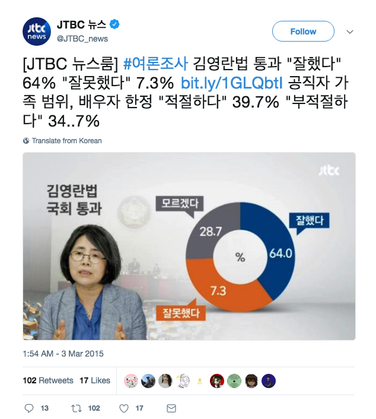
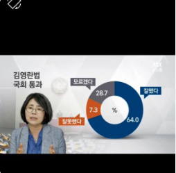

```{r setup, include=FALSE}
knitr::opts_chunk$set(echo = TRUE)
library(knitr)
library(extrafont)
```

# Problem,

JTBC 뉴스룸에서 김영란법 국회 통과에 관련하여 여론조사한 결과라고 보여 준 자료는 더 이상 남아 있지 않으나 트위터에 다음과 같은 내용으로 남아 있다. 어딘가 이상하다.

```{r, echo = TRUE, out.width = "50%", fig.align = "center"}

```


이 도표의 문제점을 여러 네티즌들이 지적하였더니 방송본에는 다음과 같은 스크린캡처가 남아 있다.


```{r, echo = TRUE, out.width = "45%", fig.align = "center"}

```

이 도표를 제대로 그려보자.

# Math

Base R의 `pie()`함수를 활용한다. 
도표 안의 텍스트 라벨 좌표는 극좌표 변환식 $x = r \cos(\theta),\; y = r \sin(\theta)$를 이용한다.

각 텍스트 라벨의 좌표를 계산하려면 64.0의 각도가 0으로 세팅되어 있음에 유의하고, 극좌표의 각도를 계산하기 위하여 시계 반대 방향으로 90도가 25%에 해당한다는 점에 착안한다. 텍스트 라벨 7.3이 새겨져 있는 각도가 28.7%와 7.3%의 가운데이므로 (25% + 28.7%)와 (25% + 28.7% + 7.3%)의 가운데이고 이를 각도로 표현하면 $\frac{(25 + 28.7) + (25 + 28.7 + 7.3)}{2}\times\frac{1}{100}\times2\pi$이 된다. 같은 방식으로 텍스트 라벨 28.7이 새겨진 위치의 각도는 25%와 (25% + 28.7%)의 가운데인 $\frac{25 + (25 + 28.7)}{2}\times\frac{1}{100}\times2\pi$
이 된다. 

또는 텍스트 라벨 7.3의 위치를 25% + 27.8% 에서 7.3%의 반을 더한 것으로 이해하여도 된다. 이 때의 식은 $(25 + 28.7 + 7.3/2)\times\frac{1}{100}\times2\pi$으로 표현할 수 있다. 텍스트 라벨 28.7의 위치는 25%에서 28.7%의 반을 더한 위치, $(25 + 28.7/2)\times\frac{1}{100}\times2\pi$이 된다.

# Programming

## Data

```{r}
poll <- c(64.0, 7.3, 28.7)
names(poll) <- c("잘했다", "잘못했다", "모르겠다")
#> 도표 안 레이블의 좌표 계산. 각도를 어떻게 계산하는지 유의할 것
pos <- cumsum(poll) - poll / 2
x_text <- 0.75 * cos(pi / 2 - (2 * pi) * pos / 100)
y_text <- 0.75 * sin(pi / 2 - (2 * pi) * pos / 100)
# x_text <- 0.75 * cos(c(0, 
#                        ((25 + 28.7) + (25 + 28.7 + 7.3)) * pi / 100, 
#                        (25 + (25 + 28.7)) * pi / 100))
# y_text <- 0.75 * sin(c(0, 
#                        ((25 + 28.7) + (25 + 28.7 + 7.3)) * pi / 100, 
#                        (25 + (25 + 28.7)) * pi / 100))
x_text0 <- x_text
y_text0 <- y_text
x_text[1] <- 0.75
y_text[1] <- 0
kable(t(as.matrix(poll)), caption = "김영란법 국회 통과")
```

<P style ="page-break-before: always">

## `pie()`

```{r, out.width = "67%", fig.align = "center", fig.showtext = FALSE}
par(family = "KoPubWorldDotum Medium")
pie(poll, 
    labels = "", 
    radius = 1,
    clockwise = TRUE, 
    init.angle = 90, 
    cex = 1.5,
    col = c("blue", "red", "grey"))
par(new = TRUE)
pie(1,
    labels = "",
    radius = 0.5,
    border = NA,
    col = "white")
text(x = 0, y = 0, 
     labels = "%", 
     cex = 1.5)
text(x = x_text, y = y_text, 
     labels = format(poll, nsmall = 1), 
     col = "white", 
     cex = 1.5)
rect(2.1 * x_text0 - 0.6, 2.1 * y_text0 - 0.1, 
     2.1 * x_text0 + 0.6, 2.1 * y_text0 + 0.1,
     col = c("blue", "red", "grey"),
     border = "black")
text(x = 2.1 * x_text0, y = 2.1 * y_text0, 
     labels = names(poll), 
     col = "white", 
     cex = 1.5)
title(main = "김영란법\n국회 통과", 
      cex.main = 2, 
      family = "KoPubWorldDotum Bold")
box(which = "figure", lwd = 3)
dev.copy(png, "../pics/jtbc150303.png", width = 480, height = 480)
dev.off()
```

## `coord_polar()`

```{r, out.width = "75%", fig.align = "center"}
library(ggplot2)
pos <- cumsum(poll) - poll / 2
pos2 <- pos
pos2[1] <- 25
poll_tbl <- data.frame(key = names(poll), 
                       value = poll, 
                       row.names = NULL)
ggplot(data = poll_tbl, 
       mapping = aes(x = 2, y = value, fill = key)) +
  geom_bar(stat = "identity") +
  geom_text(aes(y = pos2, label = poll), 
            size = 5, 
            colour = "white") +
  geom_label(aes(x = 3.0, y = pos, label = key), 
             colour = "white", 
             family = "KoPubWorldDotum Medium") +
  xlim(0.5, 3.5) +
  annotate("text", x = 0.5, y = 0, label = "%", size = 6) +
  labs(title = "김영란법\n국회통과", x = NULL, y = NULL) +
  scale_fill_manual(values = c("gray", "red", "blue")) +
#  scale_y_continuous(breaks = NULL) +
#  guides(fill = guide_legend(title = "", reverse = TRUE)) +
  guides(fill = "none") +
  theme_void() +
  theme(axis.ticks = element_blank(),
        axis.text = element_blank(),
        legend.text = element_text(family = "KoPubWorldDotum Medium"),
        panel.background = element_rect(colour = "black"),
        plot.title = element_text(family = "KoPubWorldDotum Bold", 
                                  size = 20, 
                                  vjust = -10,
                                  hjust = 0.5)) +
  coord_polar(theta = "y")
```

## Comments

Cheating Charts 를 학습하고 느낀 점을 간단히 기술합니다.  
