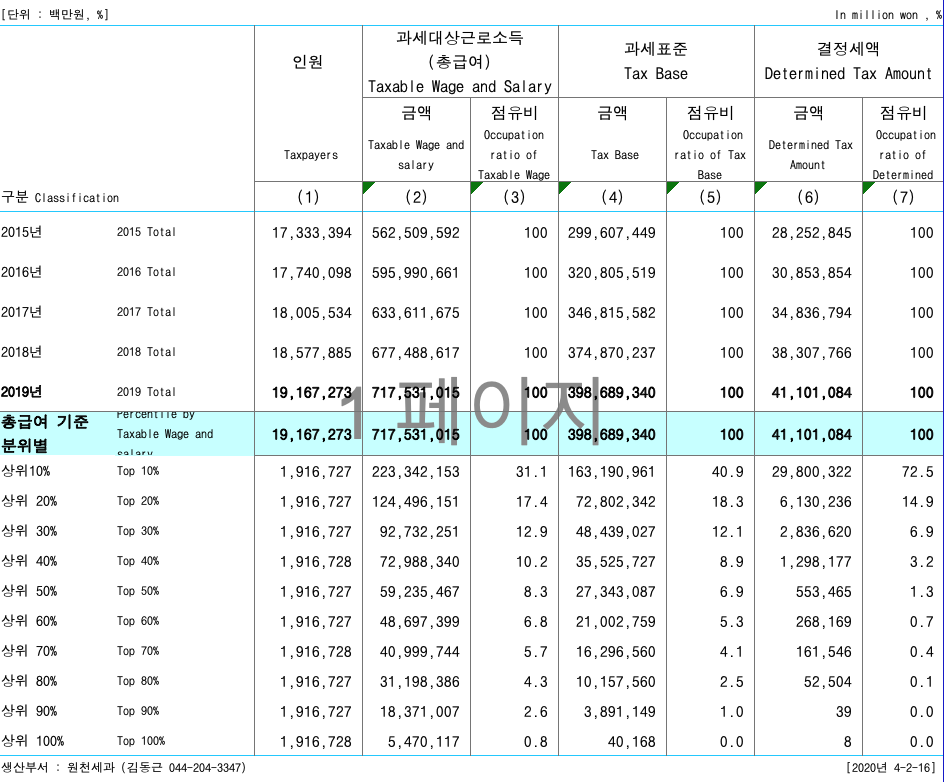

```{r include = FALSE}
library(knitr)
library(magrittr)
knitr::opts_chunk$set(echo = TRUE, tidy = FALSE, highlight = FALSE)
```

## Data

자료 입력

```{r, out.width = "75%"}

```

```{r, data, highlight = FALSE}
income_kr <- 
  "../data/labor_income_2019.txt" %>% 
  read.table(header = TRUE, row.names = 1)
income_kr %>% 
  kable
names(income_kr) <- 
  c("Earners", "Income")
# rbind("계" = colSums(.))
```

변수명을 조정하고, 다시 확인.

```{r}
names(income_kr) <- c("Earners(%)", "Income(%)")
income_kr %>% kable
# income_kr %>% kable
```

<P style = "page-break-before:always">

## Cumulative distribution

`barplot` 보다 누적도표가 분포의 윤곽을 살피는 데 더 낫다는 점을 상기하면, 누적분포를 구하는 일부터 시작하여야 함. 누적도표를 그리려면 첫 좌표는 `(0, 0)`이어야 함에 유의. 마침 `income_breaks` 와 맞춰보면 `income_kr_cum`의 첫 행을 0으로만 추가해 주면 되는 일임. 
자료로부터 이미 아는 사실이지만, `cumsum()`함수의 활용겸 확인차 계산해보면

```{r}
income_kr_cum <- income_kr %>%
  apply(MARGIN = 2, FUN = cumsum) %>%
  rbind(c(0, 0), .)
```

누적분포의 각 계급은  `10 - 20`의 열리고 닫힌 구간이 아니라 한 쪽으로 열린 구간이어야 하고, 누적백분률임을 명시하려면   

```{r, eval = FALSE}
rownames(income_kr_cum) %<>% 
  strsplit(., split = " - ") %>%
  sapply(., function(.)`[`(., 2)) %>%
  paste("0 ~", .) %>%
  `[<-`(., c(1, 9), c("0 ~ 0", "0 ~ 2000"))
colnames(income_kr_cum) <- c("Cumulated Wage Earners (%)", "Cumulated Income (%)")
income_kr_cum %>% kable
earners_kor_cum_df <- data.frame(x = income_breaks, y = income_kr_cum[, 1])
income_kr_cum_df <- data.frame(x = income_breaks, y = income_kr_cum[, 2])
```

 `xlim` 을 좁혀가면서 분포 윤곽 파악.

```{r, fig.width = 12, fig.height = 12, eval = FALSE}
par(mfrow = c(2, 2))
title_2 <- "Cumulative Income Earners' Distribution"
xlab_2 <- "Income (Million Won)"
ylab_2 <- "Cumulative % of Wage Earners"
earners_kor_cum_df %>% plot(type = "b", ann = FALSE)
title(main = title_2, xlab = xlab_2, ylab = ylab_2)
earners_kor_cum_df %>% plot(type = "b", xlim = c(0, 500), ann = FALSE)
title(main = title_2, xlab = xlab_2, ylab = ylab_2)
earners_kor_cum_df %>% plot(type = "b", xlim = c(0, 200), ann = FALSE)
title(main = title_2, xlab = xlab_2, ylab = ylab_2)
earners_kor_cum_df %>% plot(type = "b", xlim = c(0, 100), ann = FALSE)
title(main = title_2, xlab = xlab_2, ylab = ylab_2)
```

한가지 기억해 둘 사실은 누적분포의 윗 부분 면적이 바로 평균이라는 점. 누적분포가 히스토그램보다 나은 점 중의 하나가 분위를 찾기 쉬울 뿐 아니라 평균을 비교하는 것도 용이하다는 것임. 중위소득은 바로 $y$축에서 50%에 해당하는 값을 수평으로 그은 후 누적도표와 만나는 점의 $x$좌표이다. 
여기서 계산해 보면 $\frac{x-10}{50 - 31.4} = \frac{54.2 - 31.4}{20 - 10}$로부터 $x = 18.2$가 계산된다.

```{r, fig.width = 6, fig.height = 6, eval = FALSE}
earners_kor_cum_df %>% 
  plot(type = "b", xlim = c(0, 200), ann = FALSE, xaxt = "n", yaxt = "n")
axis(side = 1, at = income_breaks, labels = income_breaks)
axis(side = 2, at = seq(0, 100, by = 25), labels = seq(0, 100, by = 25), las = 1)
poly_df <- earners_kor_cum_df %>%
  rbind(., c(0, 100))
polygon(poly_df, density = 15, angle = 135)
earners_kor_cum_df %>% points(pch = 21, col = "black", bg = "white")
lines(x = c(0, 13), y = rep(50, 2), col = "red", lwd = 2)
arrows(x0 = 13, y0 = 50, x1 = 13, y1 = 0, length = 0.15, col = "red", lwd = 2)
text(x = 25, y = 25, labels = "Median Income", srt = 30, col = "red")
title(main = title_2, xlab = xlab_2, ylab = ylab_2)
```

소득 자체의 누적분포에 대해서도 같은 방법으로 그려보면 

```{r, fig.width = 12, fig.height = 12, eval = FALSE}
par(mfrow = c(2, 2))
title_3 <- "Cumulative Income Distribution"
ylab_3 <- "Cumulative % of Income"
income_kr_cum_df %>% plot(type = "b", ann = FALSE)
title(main = title_3, xlab = xlab_2, ylab = ylab_3)
income_kr_cum_df %>% plot(type = "b", ann = FALSE, xlim = c(0, 500))
title(main = title_3, xlab = xlab_2, ylab = ylab_3)
income_kr_cum_df %>% plot(type = "b", ann = FALSE, xlim = c(0, 200))
title(main = title_3, xlab = xlab_2, ylab = ylab_3)
income_kr_cum_df %>% plot(type = "b", ann = FALSE, xlim = c(0, 150))
abline(h = 93.9, lty = 3, col = "red")
axis(side = 2, at = 93.9, label = 93.9, las = 1)
title(main = title_3, xlab = xlab_2, ylab = ylab_3)
```

<P style = "page-break-before:always">

## Lorenz Curve

이제 두 누적분포를 한 장의 도표로 살피는 방법을 생각해보자. $x$ 축을 사람, $y$ 축을 소득으로 하여 두 점을 이어주면 어떤 결과가 나오는 지 살펴 보자.

```{r, fig.width = 6, fig.height = 6}
earners <- income_kr_cum[, 1] 
income <- income_kr_cum[, 2]
earners_income_df <- data.frame(Earners = earners, Income = income)
earners_income_df %>% plot(type = "b", ann = FALSE, xaxt = "n", yaxt = "n")
# abline(a = 0, b = 1, xlim = c(0, 100), ylim = c(0, 100))
lines(x = c(0, 100), y = c(0, 100), type = "l")
axis(side = 1, at = earners, labels = earners)
axis(side = 2, at = income, labels = income)
abline(h = c(0, 100), lty = 3)
abline(v = c(0, 100), lty = 3)
title_4 <- "Lorenz Curve of Korea Wage Earners' Income"
xlab_4 <- "Wage Earners Cumulated (%)"
ylab_4 <- "Income Cumulated (%)"
title(main = title_4, xlab = xlab_4, ylab = ylab_4)
```

초승달 부분에 빗금을 치고, 각 축의 눈금을 가능한 많이 표시하려면 `polygon()`과 `axis(..., las = )`을 이용하게 되는 데 이 때 다각형을 구성하는데 필요한 좌표들은 이미 `earners_income_df`에 모두 나와 있음.

```{r, fig.width = 6, fig.height = 6}
earners_income_df %>% 
  plot(type = "b", ann = FALSE, xaxt = "n", yaxt = "n")
# abline(a = 0, b = 1, xlim = c(0, 100), ylim = c(0, 100))
lines(x = c(0, 100), y = c(0, 100), type = "l")
axis(side = 1, at = earners, 
     labels = format(earners, nsmall = 1), las = 2)
axis(side = 2, at = income, 
     labels = format(income, nsmall = 1), las = 1)
abline(h = c(0, 100), lty = 3)
abline(v = c(0, 100), lty = 3)
title(main = title_4, xlab = xlab_4, ylab = ylab_4)
earners_income_df %>% 
  polygon(density = 10, angle = 135)
earners_income_df %>% 
  points(pch = 21, col = "black", bg = "white")
```

이 곡선의 이름은 무엇인가요? [Lorenz Curve](https://en.wikipedia.org/wiki/Lorenz_curve) 참조.

<P style = "page-break-before:always">

### Gini coefficient 

지니계수는 완전평등선과 로렌츠 곡선 사이의 면적을 완전불평등 상황에서의 면적, 즉 1/2로 나눠 준 값이다. 이 값이 클수록 불평등이 심한 것으로 간주할 수 있다. 이 초승달 모양 면적은 삼각형 면적에서 로렌츠 곡선 아래 면적을 뺀 것과 같아지므로 이전에 작성한 `arae.R`함수를 이용할 수 있다.

```{r, gini coefficient}
source("area.R")
gini <- 2 * (1/2 - area_R(x = earners, y = income)/10000)
```

계산된 지니계수를 그림 안에 텍스트로 넣어주려면 `paste()`를 이용하여 입력토록한다.

```{r, fig.width = 8, fig.height = 8}
earners_income_df %>%
  plot(type = "b", ann = FALSE, xaxt = "n", yaxt = "n")
lines(x = c(0, 100), y = c(0, 100), type = "l")
axis(side = 1, at = earners, labels = format(earners, nsmall = 1))
axis(side = 2, at = income[c(1:6, 9)], 
     labels = format(income[c(1:6, 9)], nsmall = 1), las = 1)
abline(h = c(0, 100), lty = 3)
abline(v = c(0, 100), lty = 3)
title(main = title_4, xlab = xlab_4, ylab = ylab_4)
earners_income_df %>% 
  polygon(density = 10, angle = 135)
earners_income_df %>% 
  points(pch = 21, col = "black", bg = "white")
text(x = 30, y = 60, 
     labels = paste("Gini = ", round(gini, digits = 3)), cex = 1.5)
```

<P style = "page-break-before:always">

## ggplot

단계별로 결과물을 저장하면서 작업할 수 있도록 구성하였으니 `fig.keep = 'none'` 를 `fig.keep = 'all'`로 바꿔서 실행시켜보면 각 단계에서 어떤 점이 추가되는 지 살필 수 있다.

### Cumulative Distribution

```{r, fig.width = 6, fig.height = 6, fig.keep = 'none', warning = FALSE, eval = FALSE}
library(ggplot2)
(c1 <- ggplot() +
  geom_line(data = earners_kor_cum_df, 
            mapping = aes(x = x, y = y), na.rm = TRUE))
(c2 <- c1 +
  scale_x_continuous(breaks = earners_kor_cum_df$x,
                     labels = earners_kor_cum_df$x,
                     limits = c(0, 200)))
(c3 <- c2 +
  geom_hline(yintercept = c(0, 100), linetype = "dotted")) 
(c4 <- c3 +
  geom_vline(xintercept = c(0, 200), linetype = "dotted")) 
(c5 <- c4 + 
  geom_polygon(data = poly_df[-(6:9), ], 
               mapping = aes(x = x, y = y), 
               alpha = 0.5, fill = "grey")) 
(c6 <- c5 +
  geom_point(data = earners_kor_cum_df, 
             mapping = aes(x = x, y = y), 
             shape = 21, fill = "white", size = 3,
             na.rm = TRUE)) 
(c7 <- c6 +
  ggtitle(title_2) + xlab(xlab_2) + ylab(ylab_2)) 
(c8 <- c7 +
  scale_y_continuous(breaks = seq(0, 100, by = 25), labels = seq(0, 100, by = 25)))
(c9 <- c8 +
    annotate("segment", x = 0, xend = 13, y = 50, yend = 50, colour = "red", size = 1))
(c10 <- c9 +
    geom_segment(data = data.frame(x1 = 13, x2 = 13, y1 = 50, y2 = 0),
                 aes(x = x1, y = y1, xend = x2, yend = y2), 
                 arrow = arrow(),
                 colour = "red",
                 size = 1))
(c11 <- c10 +
  annotate("text", x = 55, y = 25, label = "Median Income", size = 5, color = "red", srt = 15)) 
(c12 <- c11 +
  theme_bw() +
    theme(plot.title = element_text(hjust = 0.5, size = 15)))
```


```{r, fig.width = 6, fig.height = 6, eval = FALSE}
c12
ggsave("../pics/cumulative_plot_wage_kr.png", width = 9, height = 9)
```

<P style = "page-break-before:always">

### Lorenz Curve

```{r, fig.width = 8, fig.height = 8, fig.keep = 'none', warning = FALSE}
library(ggplot2)
(g1 <- ggplot() +
  geom_line(data = earners_income_df, 
            mapping = aes(x = earners, y = income))) 
(g2 <- g1 +
  geom_line(data = data.frame(x = c(0, 100), y = c(0, 100)), 
            mapping = aes(x = x, y = y))) 
(g3 <- g2 +
  geom_hline(yintercept = c(0, 100), linetype = "dotted")) 
(g4 <- g3 +
  geom_vline(xintercept = c(0, 100), linetype = "dotted")) 
(g5 <- g4 + 
  geom_polygon(data = earners_income_df, 
               mapping = aes(x = earners, y = income), 
               alpha = 0.5, fill = "grey")) 
(g6 <- g5 +
  geom_point(data = earners_income_df, 
             mapping = aes(x = earners, y = income), 
             shape = 21, fill = "white", size = 3)) 
(g7 <- g6 +
  labs(title = title_4, x = xlab_4, y = ylab_4))
(g8 <- g7 +
  scale_x_continuous(breaks = earners, 
                     labels = format(earners, nsmall = 1))) 
(g9 <- g8 +
  scale_y_continuous(breaks = income, 
                     labels = format(income, nsmall = 1)))
#  scale_y_continuous(breaks = seq(0, 100, by = 25))) 
(g10 <- g9 +
  annotate("text", x = 30, y = 60, 
           label = paste("Gini = ", format(gini, digits = 3, nsmall = 2)), 
           size = 9, color = "red", srt = 15)) 
(g11 <- g10 +
  annotate("text", x = 80, y = 20, 
           label = "19.2 Million", 
           size = 9, color = "blue"))
(g12 <- g11 +
  theme_bw() +
    theme(plot.title = element_text(hjust = 0.5, size = 15)))
```

```{r, final output, fig.width = 6, fig.height = 6}
g12
ggsave("../pics/lorenz_curve_wage_kr.png", width = 9, height = 9)
```


