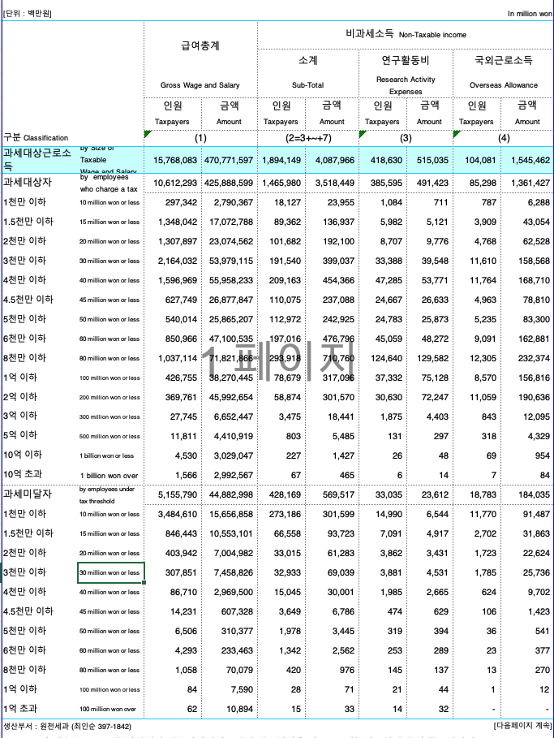

```{r include = FALSE}
library(knitr)
library(magrittr)
library(readxl)
library(extrafont)
knitr::opts_chunk$set(echo = TRUE, highlight = FALSE)
```

## Data

자료 입력

```{r, echo = FALSE, out.width = "67%"}

```

```{r, data, highlight = FALSE}
income_kr_data <- 
  read_excel("../data/Labor_Income_2012.xlsx", 
             range = "A1:E15", 
             col_names = FALSE)
income_kr_data %<>% 
  data.frame
str(income_kr_data)
income_kr_sum <- cbind(income_kr_data[, 2] + income_kr_data[, 4], income_kr_data[, 3] + income_kr_data[, 5]) 
N <- 
  sum(income_kr_sum[, 1]) / 1000000 %>%
  round(1)
(average <- 
  sum(income_kr_sum[, 2]) / 1000000 / N %>%
  round(1))
income_kr <- 
  income_kr_sum %>%
  apply(MARGIN = 2, proportions) %>%
  `*`(100) %>%
  round(2) 
str(income_kr)
dimnames(income_kr) <- list(income_kr_data[, 1], c("Earners(%)", "Income(%)"))
income_kr
```

변수명을 조정하고, 다시 확인.

```{r}
rownames(income_kr) <- sub(pattern = "-", 
                           replacement = " - ", 
                           x = rownames(income_kr))
# kable(income_kr)
```

`barplot()` 을 그리기 위하여 `height`를 설정하려면 `width`를 파악하여야 함. 그러기 위해서
소득 구간을 `rownames`의 구간으로부터 설정. `strsplit()`의 활용방법 확인, 

```{r, strsplit, results = 'hide'}
(r_names_split <- strsplit(rownames(income_kr), 
                           split = " - "))
```

`[]`, `[[]]`의 차이와 `[]`를 함수로 표현하는 방법에 유의(`results = 'hide'`를 지우고 실행).

```{r, results = 'hide'}
r_names_split[1]
r_names_split[1][[1]]
r_names_split[[1]]
r_names_split[[1]][1]
`[`(r_names_split, 1)
`[[`(r_names_split, 1)
```

`anonymous function`과 `sapply()`를 이용하여 긴 character list의 앞 원소만 추출하는 방법을 살필 것.

```{r}
# (r_names_split_first <- sapply(r_names_split, function(x){x[1]}))
(r_names_split_first <- sapply(r_names_split, 
                               FUN = `[`, 1))
(income_breaks <- as.numeric(r_names_split_first))
(income_breaks <- c(income_breaks, 2000))
```

`width`에 해당하는 각 소득구간의 폭을 계산

```{r, widths}
(income_widths <- diff(income_breaks))
```

각 기둥의 면적이 해당 소득구간의 퍼센티지와 같게 해주려면 각 퍼센티지를 `width`로 나눠줘야 함. 다음 각 경우를 비교(`results = 'hide'`를 지우고 실행).

```{r, height, results = 'hide'}
options(digits = 3)
(height_earners <- income_kr[, 1]/income_widths)
(height_earners_2 <- income_kr[, "Earners(%)"]/income_widths)
(height_earners_3 <- income_kr[[1]]/income_widths)
(height_earners_4 <- income_kr[1]/income_widths)
(height_earners_5 <- income_kr["Earners(%)"]/income_widths)
```

<P style = "page-break-before:always">

## Probability Histogram with `barplot()`

아무런 `argument` 도 설정하지 않고 `barplot()` 을 그리면 

```{r, fig.width = 12, fig.height = 4}
barplot(height_earners, 
        width = income_widths)
```

각 막대의 이름을 `rownames`에서 가져오면

```{r, names of bar}
(names_bar <- rownames(income_kr))
```

막대의 이름을 넣어 다시 그리되, 막대 사이의 공간을 없애면
 
```{r, barplot no space, fig.width = 12, fig.height = 4}
barplot(height_earners, 
        width = income_widths, 
        space = 0, 
        names.arg = names_bar)
```

실제 인원은 거의 없는 것처럼 보이는 5억원 이상의 구간을 합쳐야 할 필요. 자료를 재구성하면,

```{r}
income_kr_2 <- income_kr[1:13, ]
income_kr_2[13, ] <- apply(income_kr[13:15, ], 
                           MARGIN = 2, 
                           FUN = sum)
income_kr_2
rownames(income_kr_2)
rownames(income_kr_2)[13] <- "300 -  "
income_kr_2
(income_breaks_2 <- income_breaks[1:14])
income_widths_2 <- diff(income_breaks_2)
height_earners_2 <- income_kr_2[, 1]/income_widths_2
names_bar_2 <- rownames(income_kr_2)
```

다시 `barplot()`을 작동시키되 회색 대신 흰색을 넣고, 막대 사이의 공간을 없애고 제목과 축이름을 붙이면

```{r, fig.width = 12, fig.height = 4}
title_1 <- "Korea Income Wage Earners' Distribution"
xlab_1 <- "Income Class (Million Won)"
ylab_1 <- "% per Million Won"
barplot(height_earners_2, 
        width = income_widths_2, 
        names.arg = names_bar_2, 
        space = 0, 
        col = "white")
title(main = title_1, 
      xlab = xlab_1, 
      ylab = ylab_1)
```

1억 이상의 구간을 합치기 위하여 자료를 다시 손보면,

```{r}
income_kr_3 <- income_kr_2[1:11, ]
income_kr_3[11, ] <- apply(income_kr_2[11:13, ], 2, sum)
rownames(income_kr_3)[9] <- "100 -   "
income_breaks_3 <- income_breaks_2[-(13:14)]
income_widths_3 <- diff(income_breaks_3)
height_earners_3 <- income_kr_3[, 1]/income_widths_3
names_bar_3 <- rownames(income_kr_3)
```

1억 이상의 구간을 합쳐 barplot을 그리면,

```{r, barplot 3, fig.width = 12, fig.height = 4}
barplot(height_earners_3, 
        width = income_widths_3, 
        names.arg = names_bar_3, 
        space = 0, 
        col = "white")
title(main = title_1, 
      xlab = xlab_1, 
      ylab = ylab_1)
```

같은 방법으로 소득규모에 대하여 세 개의 `barplot`을 그리려면, 우선 자료를 정리하고. 

```{r}
height_income <- income_kr[, 2]/income_widths
height_income_2 <- income_kr_2[, 2]/income_widths_2
height_income_3 <- income_kr_3[, 2]/income_widths_3
```

세 개의 barplot을 한 화면에 연속적으로 그리기 위하여 `par(mfrow = c(3, 1))` 설정

```{r, fig.width = 12, fig.height = 10.5}
par(mfrow = c(3, 1))
barplot(height_income, 
        width = income_widths, 
        names.arg = names_bar, 
        space = 0, 
        col = "white")
barplot(height_income_2, 
        width = income_widths_2, 
        names.arg = names_bar_2, 
        space = 0, 
        col = "white")
barplot(height_income_3, 
        width = income_widths_3, 
        names.arg = names_bar_3, 
        space = 0, 
        col = "white")
```

<P style = "page-break-before:always">

## Cumulative distribution

`barplot` 보다 누적도표가 분포의 윤곽을 살피는 데 더 낫다는 점을 상기하면, 누적분포를 구하는 일부터 시작하여야 함. 자료로부터 이미 아는 사실이지만, `cumsum()`함수의 활용겸 확인차 계산해보면 

```{r}
income_kr_cum <- apply(income_kr, 
                       MARGIN = 2, 
                       FUN = cumsum)
```

누적도표를 그리려면 첫 좌표는 `(0, 0)`이어야 함에 유의. 마침 `income_breaks` 와 맞춰보면 `income_kr_cum`의 첫 행을 0으로만 추가해 주면 되는 일임.

```{r}
income_kr_cum <- rbind(rep(0, 2), income_kr_cum)
```

누적분포의 각 계급은  `10 - 20`의 열리고 닫힌 구간이 아니라 한 쪽으로 열린 구간이어야 하고, 누적백분률임을 명시하려면   

```{r}
income_class_cum <- strsplit(rownames(income_kr_cum), 
                             split = " - ")
income_class_cum <- sapply(income_class_cum, 
                           FUN = function(x){x[2]})
income_class_cum <- paste("0 ~", income_class_cum)
income_class_cum[c(1, 16)] <- c("~ 0", "0 ~ 2000")
rownames(income_kr_cum) <- income_class_cum
colnames(income_kr_cum) <- c("Cumulated Wage Earners (%)", "Cumulated Income (%)")
income_kr_cum
earners_kor_cum_df <- data.frame(x = income_breaks, y = income_kr_cum[, 1])
income_kr_cum_df <- data.frame(x = income_breaks, y = income_kr_cum[, 2])
```

 `xlim` 을 좁혀가면서 분포 윤곽 파악.

```{r, fig.width = 12, fig.height = 12}
par(mfrow = c(2, 2))
title_2 <- "Cumulative Income Earners' Distribution"
xlab_2 <- "Income (Million Won)"
ylab_2 <- "Cumulative % of Wage Earners"
plot(earners_kor_cum_df, 
     type = "b", 
     ann = FALSE)
title(main = title_2, 
      xlab = xlab_2, 
      ylab = ylab_2)
plot(earners_kor_cum_df, 
     type = "b", 
     xlim = c(0, 500), 
     ann = FALSE)
title(main = title_2, 
      xlab = xlab_2, 
      ylab = ylab_2)
plot(earners_kor_cum_df, 
     type = "b", 
     xlim = c(0, 200), 
     ann = FALSE)
title(main = title_2, 
      xlab = xlab_2, 
      ylab = ylab_2)
plot(earners_kor_cum_df, 
     type = "b", 
     xlim = c(0, 100), 
     ann = FALSE)
title(main = title_2, 
      xlab = xlab_2, 
      ylab = ylab_2)
```

한가지 기억해 둘 사실은 누적분포의 윗 부분 면적이 바로 평균이라는 점. 누적분포가 히스토그램보다 나은 점 중의 하나가 분위를 찾기 쉬울 뿐 아니라 평균을 비교하는 것도 용이하다는 것임. 중위소득은 바로 $y$축에서 50%에 해당하는 값을 수평으로 그은 후 누적도표와 만나는 점의 $x$좌표이다. 
여기서 계산해 보면 $\frac{x-20}{30-20} = \frac{50 - 30.1}{52.5-30.1}$로부터 $x = 28.9$가 계산된다.

```{r, median}
med <- 20 + 10 * (50 - income_kr_cum[4]) / (income_kr_cum[5] - income_kr_cum[4])
round(med, digits = 3)
```


```{r, fig.width = 6, fig.height = 6}
plot(earners_kor_cum_df, 
     type = "b", 
     xlim = c(0, 200), 
     ann = FALSE, 
     xaxt = "n", 
     yaxt = "n")
axis(side = 1, 
     at = income_breaks, 
     labels = income_breaks)
axis(side = 2, 
     at = seq(0, 100, by = 25), 
     labels = seq(0, 100, by = 25), 
     las = 1)
poly_df <- rbind(earners_kor_cum_df, c(0, 100))
polygon(poly_df, 
        density = 15, 
        angle = 135)
points(earners_kor_cum_df, 
       pch = 21, col = "black", bg = "white")
lines(x = c(0, med), y = rep(50, 2), 
      col = "red", lwd = 2)
arrows(x0 = med, y0 = 50, x1 = med, y1 = 0, 
       length = 0.15, col = "red", lwd = 2)
text(x = 60, y = 25, 
     labels = "Median Income", srt = 30, col = "red")
title(main = title_2, 
      xlab = xlab_2, 
      ylab = ylab_2)
```

소득 자체의 누적분포에 대해서도 같은 방법으로 그려보면 

```{r, fig.width = 12, fig.height = 12}
par(mfrow = c(2, 2))
title_3 <- "Cumulative Income Distribution"
ylab_3 <- "Cumulative % of Income"
plot(income_kr_cum_df, 
     type = "b", 
     ann = FALSE)
title(main = title_3, 
      xlab = xlab_2, 
      ylab = ylab_3)
plot(income_kr_cum_df, 
     type = "b", 
     ann = FALSE, 
     xlim = c(0, 500))
title(main = title_3, 
      xlab = xlab_2, 
      ylab = ylab_3)
plot(income_kr_cum_df, 
     type = "b", 
     ann = FALSE, 
     xlim = c(0, 200))
title(main = title_3, 
      xlab = xlab_2, 
      ylab = ylab_3)
plot(income_kr_cum_df, 
     type = "b", 
     ann = FALSE, 
     xlim = c(0, 100))
abline(h = income_kr_cum[11, 2], 
       lty = 3, col = "red")
axis(side = 2, 
     at = income_kr_cum[11, 2], 
     label = income_kr_cum[11, 2], 
     las = 1)
title(main = title_3, 
      xlab = xlab_2, 
      ylab = ylab_3)
```

<P style = "page-break-before:always">

## Lorenz Curve

이제 두 누적분포를 한 장의 도표로 살피는 방법을 생각해보자. $x$ 축을 사람, $y$ 축을 소득으로 하여 두 점을 이어주면 어떤 결과가 나오는 지 살펴 보자.

```{r, fig.width = 6, fig.height = 6}
earners <- income_kr_cum[, 1] 
income <- income_kr_cum[, 2]
earners_income_df <- data.frame(Earners = earners, Income = income)
plot(earners_income_df, 
     type = "b", 
     ann = FALSE, 
     xaxt = "n", 
     yaxt = "n")
# abline(a = 0, b = 1, xlim = c(0, 100), ylim = c(0, 100))
lines(x = c(0, 100), y = c(0, 100), type = "l")
axis(side = 1, 
     at = earners, 
     labels = earners)
axis(side = 2, 
     at = income, 
     labels = income)
abline(h = c(0, 100), lty = 3)
abline(v = c(0, 100), lty = 3)
title_4 <- "Lorenz Curve of Korea Wage Earners' Income 2012"
xlab_4 <- "Wage Earners Cumulated (%)"
ylab_4 <- "Income Cumulated (%)"
title(main = title_4, 
      xlab = xlab_4, 
      ylab = ylab_4)
```

초승달 부분에 빗금을 치고, 각 축의 눈금을 가능한 많이 표시하려면 `polygon()`과 `axis(..., las = )`을 이용하게 되는 데 이 때 다각형을 구성하는데 필요한 좌표들은 이미 `earners_income_df`에 모두 나와 있음.

```{r, fig.width = 6, fig.height = 6}
plot(earners_income_df, 
     type = "b", 
     ann = FALSE, 
     xaxt = "n", 
     yaxt = "n")
# abline(a = 0, b = 1, xlim = c(0, 100), ylim = c(0, 100))
lines(x = c(0, 100), y = c(0, 100), type = "l")
axis(side = 1, 
     at = earners, 
     labels = format(earners, nsmall = 1))
axis(side = 2, 
     at = income[c(1:10, 14)], 
     labels = format(income[c(1:10, 14)], nsmall = 1), 
     las = 1)
abline(h = c(0, 100), lty = 3)
abline(v = c(0, 100), lty = 3)
title(main = title_4, 
      xlab = xlab_4, 
      ylab = ylab_4)
polygon(earners_income_df, 
        density = 10, 
        angle = 135)
points(earners_income_df, 
       pch = 21, col = "black", bg = "white")
```

이 곡선의 이름은 무엇인가요? [Lorenz Curve](https://en.wikipedia.org/wiki/Lorenz_curve) 참조.

<P style = "page-break-before:always">

### Gini coefficient 

지니계수는 완전평등선과 로렌츠 곡선 사이의 면적을 완전불평등 상황에서의 면적, 즉 1/2로 나눠 준 값이다. 이 값이 클수록 불평등이 심한 것으로 간주할 수 있다. 이 초승달 모양 면적은 삼각형 면적에서 로렌츠 곡선 아래 면적을 뺀 것과 같아지므로 이전에 작성한 `arae_R`함수를 이용할 수 있다.

```{r, gini coefficient}
source("area.R")
gini <- 2 * (1/2 - area_R(x = earners, y = income)/10000)
```

계산된 지니계수를 그림 안에 텍스트로 넣어주려면 `paste()`를 이용하여 입력토록한다.

```{r, fig.width = 7, fig.height = 7}
plot(earners_income_df, 
     type = "b", 
     ann = FALSE, 
     xaxt = "n", 
     yaxt = "n")
lines(x = c(0, 100), y = c(0, 100), type = "l")
axis(side = 1, 
     at = earners, 
     labels = format(earners, nsmall = 1))
axis(side = 2, 
     at = income[c(1:10, 14)], 
     labels = format(income[c(1:10, 14)], nsmall = 1), 
     las = 1)
abline(h = c(0, 100), lty = 3)
abline(v = c(0, 100), lty = 3)
title(main = title_4, 
      xlab = xlab_4, 
      ylab = ylab_4)
polygon(earners_income_df, 
        density = 10, 
        angle = 135)
points(earners_income_df, 
       pch = 21, col = "black", bg = "white")
text(x = 30, y = 60, 
     labels = paste("Gini = ", round(gini, digits = 3)), cex = 1.5)
```

<P style = "page-break-before:always">

## ggplot

단계별로 결과물을 저장하면서 작업할 수 있도록 구성하였으니 `fig.keep = 'none'` 를 `fig.keep = 'all'`로 바꿔서 실행시켜보면 각 단계에서 어떤 점이 추가되는 지 살필 수 있다.

### Cumulative Distribution

```{r, fig.width = 6, fig.height = 6, fig.keep = 'none', warning = TRUE}
library(ggplot2)
(c1 <- ggplot() +
  geom_line(data = earners_kor_cum_df, 
            mapping = aes(x = x, y = y), na.rm = TRUE))
(c2 <- c1 +
  scale_x_continuous(breaks = earners_kor_cum_df$x,
                     labels = earners_kor_cum_df$x,
                     limits = c(0, 200)))
(c3 <- c2 +
  geom_hline(yintercept = c(0, 100), linetype = "dotted")) 
(c4 <- c3 +
  geom_vline(xintercept = c(0, 200), linetype = "dotted")) 
(c5 <- c4 + 
  geom_polygon(data = poly_df[-(13:16), ], 
               mapping = aes(x = x, y = y), 
               alpha = 0.5, fill = "grey")) 
(c6 <- c5 +
  geom_point(data = earners_kor_cum_df, 
             mapping = aes(x = x, y = y), 
             shape = 21, fill = "white", size = 3,
             na.rm = TRUE)) 
(c7 <- c6 +
  ggtitle(title_2) + xlab(xlab_2) + ylab(ylab_2)) 
(c8 <- c7 +
  scale_y_continuous(breaks = seq(0, 100, by = 25), labels = seq(0, 100, by = 25)))
(c9 <- c8 +
    annotate("segment", x = 0, xend = med, y = 50, yend = 50, colour = "red", size = 1))
(c10 <- c9 +
    geom_segment(data = data.frame(x1 = med, x2 = med, y1 = 50, y2 = 0),
                 aes(x = x1, y = y1, xend = x2, yend = y2), 
                 arrow = arrow(),
                 colour = "red",
                 size = 1))
(c11 <- c10 +
  annotate("text", x = 80, y = 25, 
           label = paste("중위 급여 :", format(med, digits = 3, nsmall = 1), "백만 원"), size = 5, color = "red", srt = 0, family = "KoPubWorldDotum Medium") +
  annotate("text", x = 100, y = 75, 
           label = paste("평균 급여 :", format(average, digits = 3, nsmall = 1), "백만 원"), size = 5, color = "red", srt = 0, family = "KoPubWorldDotum Medium"))
(c12 <- c11 +
  theme_bw() +
    theme(plot.title = element_text(hjust = 0.5, size = 15),
          axis.text.x = element_text(angle = 270)))
```


```{r, fig.width = 6, fig.height = 6}
c12
ggsave("../pics/cumulative_plot_wage_kr_2012.png", width = 8, height = 8)
```

<P style = "page-break-before:always">

### Lorenz Curve

```{r, fig.width = 6, fig.height = 6, fig.keep = 'none', warning = FALSE}
(g1 <- ggplot() +
  geom_line(data = earners_income_df, 
            mapping = aes(x = earners, y = income))) 
(g2 <- g1 +
  geom_line(data = data.frame(x = c(0, 100), y = c(0, 100)), 
            mapping = aes(x = x, y = y))) 
(g3 <- g2 +
  geom_hline(yintercept = c(0, 100), linetype = "dotted")) 
(g4 <- g3 +
  geom_vline(xintercept = c(0, 100), linetype = "dotted")) 
(g5 <- g4 + 
  geom_polygon(data = earners_income_df, 
               mapping = aes(x = earners, y = income), 
               alpha = 0.5, fill = "grey")) 
(g6 <- g5 +
  geom_point(data = earners_income_df, 
             mapping = aes(x = earners, y = income), 
             shape = 21, fill = "white", size = 3)) 
(g7 <- g6 +
  labs(title = title_4, x = xlab_4, y = ylab_4))
(g8 <- g7 +
  scale_x_continuous(breaks = earners[c(1:11, 16)], 
                     labels = format(earners[c(1:11, 16)], nsmall = 1))) 
(g9 <- g8 +
  scale_y_continuous(breaks = income[c(1:13, 16)], 
                     labels = format(income[c(1:13, 16)], digits = 2, nsmall = 1)))
#  scale_y_continuous(breaks = seq(0, 100, by = 25))) 
(g10 <- g9 +
  annotate("text", x = 30, y = 60, 
           label = paste("지니계수 :", format(gini, digits = 3, nsmall = 2)), 
           size = 9, color = "red", srt = 15, family = "KoPubWorldDotum Medium")) 
(g11 <- g10 +
  annotate("text", x = 80, y = 20, 
           label = paste(format(N, digits = 2, nsmall = 1), "백만 명"), 
           size = 9, color = "blue", family = "KoPubWorldDotum Medium"))
(g12 <- g11 +
  theme_bw() +
    theme(plot.title = element_text(hjust = 0.5, size = 15),
          axis.text.x = element_text(angle = 270)))
```

```{r, final output, fig.width = 8, fig.height = 8}
g12
ggsave("../pics/lorenz_curve_wage_kr_2012.png", width = 8, height = 8)
```


