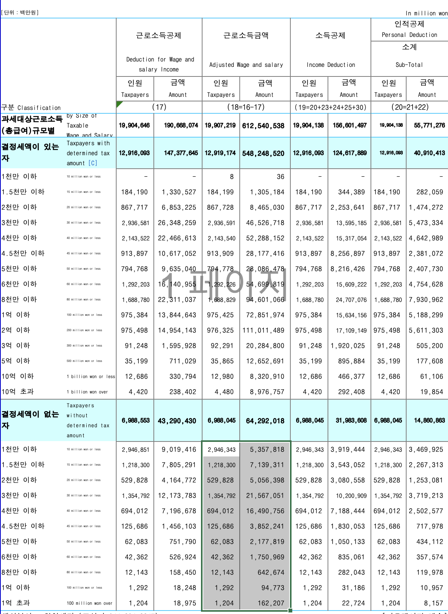

```{r include = FALSE}
library(knitr)
library(magrittr)
library(readxl)
library(extrafont)
library(pander)
knitr::opts_chunk$set(echo = TRUE, highlight = FALSE)
```

## Data

자료 입력

```{r, echo = FALSE, out.width = "67%"}

```

## 분포

```{r, data, echo = FALSE, highlight = FALSE, message = FALSE}
income_kr_data <- 
  read_excel("../data/Labor_Adjusted_Wage_and_Salary_2021.xlsx", 
             range = "A1:E15", 
             col_names = FALSE)
income_kr_data %<>% 
  data.frame
# str(income_kr_data)
income_kr_sum <- cbind(income_kr_data[, 2] + income_kr_data[, 4], income_kr_data[, 3] + income_kr_data[, 5]) 
N <- 
  sum(income_kr_sum[, 1]) / 1000000 %>%
  round(1)
average <- 
  sum(income_kr_sum[, 2]) / 1000000 / N %>%
  round(1)
income_kr <- 
  income_kr_sum %>%
  apply(MARGIN = 2, proportions) %>%
  `*`(100) %>%
  round(2) 
# str(income_kr)
dimnames(income_kr) <- list(income_kr_data[, 1], c("Earners(%)", "Income(%)"))
pander(format(income_kr, digits = 3, nsmall = 2, justify = "right"))
pander(paste("Mean = ", format(average, digits = 2, nsmall = 2)))
```


```{r, strsplit, echo = FALSE, results = 'hide'}
r_names_split <- strsplit(rownames(income_kr), 
                          split = "-")
r_names_split_first <- sapply(r_names_split, FUN = `[`, 1)
income_breaks <- as.numeric(r_names_split_first)
income_breaks <- c(income_breaks, 2000)
```


<P style = "page-break-before:always">

## 누적 분포

`barplot` 보다 누적도표가 분포의 윤곽을 살피는 데 더 낫다는 점을 상기하면, 누적분포를 구하는 일부터 시작하여야 함. 자료로부터 이미 아는 사실이지만, `cumsum()`함수의 활용겸 확인차 계산해보면 

```{r, echo = FALSE, eval = TRUE}
income_kr_cum <- apply(income_kr, 
                       MARGIN = 2, 
                       FUN = cumsum)
```

누적도표를 그리려면 첫 좌표는 `(0, 0)`이어야 함에 유의. 마침 `income_breaks` 와 맞춰보면 `income_kr_cum`의 첫 행을 0으로만 추가해 주면 되는 일임.

```{r, echo = FALSE, eval = TRUE}
income_kr_cum <- rbind(rep(0, 2), income_kr_cum)
```

누적분포의 각 계급은  `10-20`의 열리고 닫힌 구간이 아니라 한 쪽으로 열린 구간이어야 하고, 누적백분률임을 명시하려면   

```{r, echo = FALSE, eval = TRUE}
income_class_cum <- strsplit(rownames(income_kr_cum), 
                             split = "-")
income_class_cum <- sapply(income_class_cum, 
                           FUN = function(x){x[2]})
income_class_cum <- paste(" ~", income_class_cum)
income_class_cum[c(1, 16)] <- c(" ~ 0", " ~ 2000")
rownames(income_kr_cum) <- income_class_cum
colnames(income_kr_cum) <- c("Cumulated Wage Earners (%)", "Cumulated Income (%)")
earners_kor_cum_df <- data.frame(x = income_breaks, y = income_kr_cum[, 1])
income_kr_cum_df <- data.frame(x = income_breaks, y = income_kr_cum[, 2])
pander(format(income_kr_cum, digits = 3, nsmall = 2, justify = "right"))
```

한가지 기억해 둘 사실은 누적분포의 윗 부분 면적이 바로 평균이라는 점. 누적분포가 히스토그램보다 나은 점 중의 하나가 분위를 찾기 쉬울 뿐 아니라 평균을 비교하는 것도 용이하다는 것임. 중위소득은 바로 $y$축에서 50%에 해당하는 값을 수평으로 그은 후 누적도표와 만나는 점의 $x$좌표이다. 
여기서 계산해 보면 $\frac{x-20}{30-20} = \frac{50 - 28.87}{50.43-28.87}$로부터 $x = 29.7$백만 원으로계산된다.

```{r, median, echo = FALSE}
med <- 20 + 10 * (50 - income_kr_cum[4]) / (income_kr_cum[5] - income_kr_cum[4])
pander(paste("Median = ", format(med, digits = 3, nsmall = 1)))
```


## Gini coefficient 

지니계수는 완전평등선과 로렌츠 곡선 사이의 면적을 완전불평등 상황에서의 면적, 즉 1/2로 나눠 준 값이다. 이 값이 클수록 불평등이 심한 것으로 간주할 수 있다. 이 초승달 모양 면적은 삼각형 면적에서 로렌츠 곡선 아래 면적을 뺀 것과 같아지므로 이전에 작성한 `arae_R`함수를 이용할 수 있다.

```{r, gini coefficient, echo = FALSE}
poly_df <- rbind(earners_kor_cum_df, c(0, 100))
earners <- income_kr_cum[, 1] 
income <- income_kr_cum[, 2]
earners_income_df <- data.frame(Earners = earners, Income = income)
source("area.R")
gini <- 2 * (1/2 - area_R(x = earners, y = income)/10000)
pander(paste("Gini =", format(gini, digits = 3, nsmall = 3)))
```

<P style = "page-break-before:always">

# ggplot

단계별로 결과물을 저장하면서 작업할 수 있도록 구성하였으니 `fig.keep = 'none'` 를 `fig.keep = 'all'`로 바꿔서 실행시켜보면 각 단계에서 어떤 점이 추가되는 지 살필 수 있다.

```{r, echo = FALSE}
title_2 <- "Cumulative Income Earners' Distribution"
xlab_2 <- "Income (Million Won)"
ylab_2 <- "Cumulative % of Wage Earners"
title_4 <- "Lorenz Curve of Korea Wage Earners' Income 2020"
xlab_4 <- "Wage Earners Cumulated (%)"
ylab_4 <- "Income Cumulated (%)"
```

## Cumulative Distribution

```{r, fig.width = 7, fig.height = 7, fig.keep = 'none', warning = TRUE}
library(ggplot2)
(c1 <- ggplot() +
  geom_line(data = earners_kor_cum_df, 
            mapping = aes(x = x, y = y), na.rm = TRUE))
(c2 <- c1 +
  scale_x_continuous(breaks = earners_kor_cum_df$x,
                     labels = earners_kor_cum_df$x,
                     limits = c(0, 200)))
(c3 <- c2 +
  geom_hline(yintercept = c(0, 100), linetype = "dotted")) 
(c4 <- c3 +
  geom_vline(xintercept = c(0, 200), linetype = "dotted")) 
(c5 <- c4 + 
  geom_polygon(data = poly_df[-(13:16), ], 
               mapping = aes(x = x, y = y), 
               alpha = 0.5, fill = "grey")) 
(c6 <- c5 +
  geom_point(data = earners_kor_cum_df, 
             mapping = aes(x = x, y = y), 
             shape = 21, fill = "white", size = 3,
             na.rm = TRUE)) 
(c7 <- c6 +
  ggtitle(title_2) + xlab(xlab_2) + ylab(ylab_2)) 
(c8 <- c7 +
  scale_y_continuous(breaks = seq(0, 100, by = 25), labels = seq(0, 100, by = 25)))
(c9 <- c8 +
    annotate("segment", x = 0, xend = med, y = 50, yend = 50, colour = "red", linewidth = 1))
(c10 <- c9 +
    geom_segment(data = data.frame(x1 = med, x2 = med, y1 = 50, y2 = 0),
                 aes(x = x1, y = y1, xend = x2, yend = y2), 
                 arrow = arrow(),
                 colour = "red",
                 linewidth = 1))
(c11 <- c10 +
  annotate("text", x = 80, y = 25, 
           label = paste("중위 급여 :", format(med, digits = 3, nsmall = 1), "백만 원"), size = 5, color = "red", srt = 0, family = "KoPubWorldDotum Medium") +
  annotate("text", x = 100, y = 75, 
           label = paste("평균 급여 :", format(average, digits = 3, nsmall = 1), "백만 원"), size = 5, color = "red", srt = 0, family = "KoPubWorldDotum Medium"))
(c12 <- c11 +
  theme_bw() +
    theme(plot.title = element_text(hjust = 0.5, size = 15),
          axis.text.x = element_text(angle = 90)))
```


```{r, fig.width = 8, fig.height = 8}
c12
ggsave("../pics/cumulative_plot_adjusted_wage_and_salary_kr_2021.png", width = 8, height = 8, dpi = 300)
```

<P style = "page-break-before:always">

## Lorenz Curve

```{r, fig.width = 7, fig.height = 7, fig.keep = 'none', warning = FALSE}
(g1 <- ggplot() +
  geom_line(data = earners_income_df, 
            mapping = aes(x = earners, y = income))) 
(g2 <- g1 +
  geom_line(data = data.frame(x = c(0, 100), y = c(0, 100)), 
            mapping = aes(x = x, y = y))) 
(g3 <- g2 +
  geom_hline(yintercept = c(0, 100), linetype = "dotted")) 
(g4 <- g3 +
  geom_vline(xintercept = c(0, 100), linetype = "dotted")) 
(g5 <- g4 + 
  geom_polygon(data = earners_income_df, 
               mapping = aes(x = earners, y = income), 
               alpha = 0.5, fill = "grey")) 
(g6 <- g5 +
  geom_point(data = earners_income_df, 
             mapping = aes(x = earners, y = income), 
             shape = 21, fill = "white", size = 3)) 
(g7 <- g6 +
  labs(title = title_4, x = xlab_4, y = ylab_4))
(g8 <- g7 +
  scale_x_continuous(breaks = earners[c(1:11, 16)], 
                     labels = format(earners[c(1:11, 16)], nsmall = 1))) 
(g9 <- g8 +
  scale_y_continuous(breaks = income[c(1:13, 16)], 
                     labels = format(income[c(1:13, 16)], digits = 2, nsmall = 1)))
#  scale_y_continuous(breaks = seq(0, 100, by = 25))) 
(g10 <- g9 +
  annotate("text", x = 30, y = 60, 
           label = paste("지니계수 :", format(gini, digits = 3, nsmall = 2)), 
           size = 9, color = "red", srt = 15, family = "KoPubWorldDotum Medium")) 
(g11 <- g10 +
  annotate("text", x = 80, y = 20, 
           label = paste(format(N, digits = 2, nsmall = 1), "백만 명"), 
           size = 9, color = "blue", family = "KoPubWorldDotum Medium"))
(g12 <- g11 +
  theme_bw() +
    theme(plot.title = element_text(hjust = 0.5, size = 15),
          axis.text.x = element_text(angle = 90)))
```

```{r, final output, fig.width = 8, fig.height = 8}
g12
ggsave("../pics/lorenz_curve_adjusted_wage_and_salary_kr_2021.png", width = 8, height = 8, dpi = 300)
```


