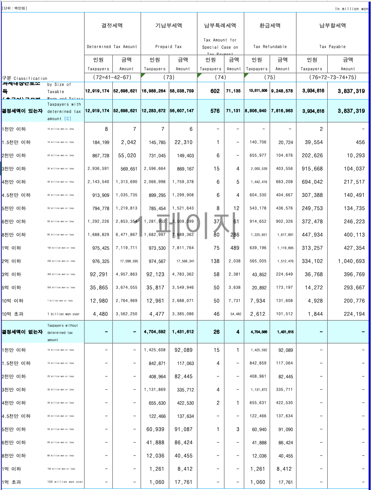

```{r setup, include = FALSE}
library(knitr)
library(readxl)
library(ggplot2)
library(pander)
library(showtext)

# Google Fonts 에서 "Nanum Gothic" 을 내려받아 ggplot/knitr 에서 사용
sysfonts::font_add_google(name = "Nanum Gothic", family = "nanum")
showtext_auto()
showtext_opts(dpi = 300)          # ggsave(dpi = 300) 과 맞춤

knitr::opts_chunk$set(
  echo = FALSE, message = FALSE, warning = FALSE,
  highlight = FALSE, fig.showtext = TRUE
)

source("area.R")
```

## Data

자료 입력

```{r, out.width = "67%"}

```

## 분포

```{r data}
income_kr_data <- as.data.frame(
  read_excel("../data/Labor_after_tax_2021.xlsx",
             range = "A1:E15",
             col_names = FALSE)
)

# 자료구조: 1열 = 구간 라벨, (2열+4열) = 인원수, (3열+5열) = 총소득
income_kr_sum <- cbind(
  income_kr_data[, 2] + income_kr_data[, 4],
  income_kr_data[, 3] + income_kr_data[, 5]
)

# 전체 근로자수(백만명)과 평균 임금(백만원)
# ※ 과거 버전에서 %>% 의 연산자 우선순위 때문에 반올림이 엉뚱한 자리에
#   적용되던 버그를 괄호로 수정.
N       <- round(sum(income_kr_sum[, 1]) / 1e6, 1)
average <- round(sum(income_kr_sum[, 2]) / 1e6 / N, 1)

# 백분율(%)로 환산
income_kr <- round(apply(income_kr_sum, 2, proportions) * 100, 2)
rownames(income_kr) <- income_kr_data[, 1]
colnames(income_kr) <- c("Earners(%)", "Income(%)")

pander(format(income_kr, digits = 3, nsmall = 2, justify = "right"))
pander(paste("Mean = ", format(average, digits = 2, nsmall = 2)))
```

```{r strsplit}
# 구간 경계를 숫자로 변환. 마지막 계급 ">150" 의 상한은 편의상 2000 으로 가정
r_names_split <- strsplit(rownames(income_kr), split = "-")
r_names_first <- sapply(r_names_split, `[`, 1)
income_breaks <- c(as.numeric(r_names_first), 2000)
```

<P style = "page-break-before:always">

## 누적 분포

`barplot` 보다 누적도표가 분포의 윤곽을 살피는 데 더 낫다는 점을 상기하면, 누적분포를 구하는 일부터 시작하여야 한다. 자료로부터 이미 아는 사실이지만, `cumsum()` 함수의 활용겸 확인차 계산해 보면

```{r cumsum}
income_kr_cum <- apply(income_kr, 2, cumsum)
# 반올림 누적오차 보정: 이론상 마지막 누적값은 정확히 100 이어야 함
income_kr_cum[nrow(income_kr_cum), ] <- 100
# 누적도표의 첫 좌표는 (0, 0)
income_kr_cum <- rbind(c(0, 0), income_kr_cum)
```

누적분포의 각 계급은 `10-20` 의 열리고 닫힌 구간이 아니라 한 쪽으로 열린 구간이어야 하고, 누적백분률임을 명시하려면

```{r cum_labels}
income_class_cum <- sapply(
  strsplit(rownames(income_kr_cum), split = "-"),
  function(x) x[2]
)
income_class_cum <- paste(" ~", income_class_cum)
income_class_cum[c(1, length(income_class_cum))] <- c(" ~ 0", " ~ 2000")
rownames(income_kr_cum) <- income_class_cum
colnames(income_kr_cum) <- c("Cumulated Wage Earners (%)",
                             "Cumulated Income (%)")

earners_kor_cum_df <- data.frame(x = income_breaks, y = income_kr_cum[, 1])
income_kr_cum_df   <- data.frame(x = income_breaks, y = income_kr_cum[, 2])

pander(format(income_kr_cum, digits = 3, nsmall = 2, justify = "right"))
```

한가지 기억해 둘 사실은 누적분포의 윗 부분 면적이 바로 평균이라는 점. 누적분포가 히스토그램보다 나은 점 중의 하나가 분위를 찾기 쉬울 뿐 아니라 평균을 비교하는 것도 용이하다는 것임. 중위소득은 바로 $y$ 축에서 50% 에 해당하는 값을 수평으로 그은 후 누적도표와 만나는 점의 $x$ 좌표이다. 처음으로 누적비율이 50% 를 넘는 구간을 찾아 선형보간한다.

```{r median}
cum_earners <- income_kr_cum[, 1]
k  <- which(cum_earners >= 50)[1]            # 처음 50% 를 넘는 행
xL <- income_breaks[k - 1]; xU <- income_breaks[k]
yL <- cum_earners[k - 1];   yU <- cum_earners[k]
med <- xL + (xU - xL) * (50 - yL) / (yU - yL)
pander(paste("Median = ", format(med, digits = 3, nsmall = 1)))
```


## Gini coefficient

지니계수는 완전평등선과 로렌츠 곡선 사이의 면적을 완전불평등 상황에서의 면적, 즉 $1/2$ 로 나눠 준 값이다. 이 값이 클수록 불평등이 심한 것으로 간주할 수 있다. 이 초승달 모양 면적은 삼각형 면적에서 로렌츠 곡선 아래 면적을 뺀 것과 같아지므로 이전에 작성한 `area_R` 함수를 이용할 수 있다. 값의 정확성은 Brown 공식으로 한 번 더 교차검증한다.

```{r gini}
earners <- income_kr_cum[, 1]
income  <- income_kr_cum[, 2]
earners_income_df <- data.frame(Earners = earners, Income = income)

# 누적%(0~100) 좌표에서 계산했으므로 100 * 100 으로 나눠 비율(0~1)화
gini       <- 2 * (0.5 - area_R(x = earners, y = income) / (100 * 100))

# Brown 공식을 이용한 교차검증 (수학적으로 위와 동치)
gini_brown <- 1 - sum(diff(earners) *
                        (head(income, -1) + tail(income, -1))) / (100 * 100)

pander(paste("Gini =", format(gini, digits = 3, nsmall = 3),
             " (Brown 공식:", format(gini_brown, digits = 3, nsmall = 3), ")"))
```

<P style = "page-break-before:always">

# ggplot

단계별로 결과물을 저장하면서 작업할 수 있도록 구성하였으니 `fig.keep = 'none'` 를 `fig.keep = 'all'` 로 바꿔서 실행시켜보면 각 단계에서 어떤 점이 추가되는지 살필 수 있다.

```{r labels}
title_2 <- "Cumulative Income Earners' Distribution"
xlab_2  <- "Income (Million Won)"
ylab_2  <- "Cumulative % of Wage Earners"
title_4 <- "Lorenz Curve of Korea Wage Earners' Income 2021"
xlab_4  <- "Wage Earners Cumulated (%)"
ylab_4  <- "Income Cumulated (%)"
```

## Cumulative Distribution

```{r cum_plot, fig.width = 7, fig.height = 7, fig.keep = 'none', warning = TRUE}
# 누적도표의 "윗 부분 면적 = 평균" 을 시각화하기 위해 곡선 위쪽(곡선 ~ y = 100)
# 영역을 폴리곤으로 칠한다.
#
# 주의 : earners_kor_cum_df 에는 표시범위(0–200) 밖의 좌표(x = 300, 500,
# 1000, 2000) 가 포함돼 있어서, scale_x_continuous(limits = …) 가 이 점들을
# 그리기 직전에 제거하면 폴리곤 정점 순서가 깨져 (0, 100) 꼭지점이 누락된 채
# 닫힘이 일어난다 → 의도와 반대로 곡선 아래쪽이 칠해진다. 이를 막기 위해
# 폴리곤 좌표를 표시범위 안에서 명시적으로 구성한다.
xmax_plot <- 200

in_view       <- earners_kor_cum_df$x <= xmax_plot
visible_curve <- earners_kor_cum_df[in_view, ]
i_last        <- max(which(in_view))
# 표시범위 끝(x = xmax_plot) 너머에 점이 있으면 x = xmax_plot 에서 선형보간한
# 끝점을 곡선 끝에 덧붙여 놓는다(2021 자료에선 x = 200 이 자료점이라 보간 불필요).
if (i_last < nrow(earners_kor_cum_df)) {
  x0 <- earners_kor_cum_df$x[i_last];     y0 <- earners_kor_cum_df$y[i_last]
  x1 <- earners_kor_cum_df$x[i_last + 1]; y1 <- earners_kor_cum_df$y[i_last + 1]
  y_at_xmax <- y0 + (y1 - y0) * (xmax_plot - x0) / (x1 - x0)
  visible_curve <- rbind(visible_curve,
                         data.frame(x = xmax_plot, y = y_at_xmax))
}

# 폴리곤 정점 : (0,0) → 곡선 → (xmax, y_xmax) → (xmax, 100) → (0, 100) → close
poly_df <- rbind(
  visible_curve,
  data.frame(x = xmax_plot, y = 100),
  data.frame(x = 0,          y = 100)
)

(c1 <- ggplot() +
    geom_line(data = earners_kor_cum_df,
              mapping = aes(x = x, y = y), na.rm = TRUE))
(c2 <- c1 +
    scale_x_continuous(breaks = earners_kor_cum_df$x,
                       labels = earners_kor_cum_df$x,
                       limits = c(0, 200)))
(c3 <- c2 +
    geom_hline(yintercept = c(0, 100), linetype = "dotted"))
(c4 <- c3 +
    geom_vline(xintercept = c(0, 200), linetype = "dotted"))
(c5 <- c4 +
    geom_polygon(data = poly_df,
                 mapping = aes(x = x, y = y),
                 alpha = 0.5, fill = "grey"))
(c6 <- c5 +
    geom_point(data = earners_kor_cum_df,
               mapping = aes(x = x, y = y),
               shape = 21, fill = "white", size = 3,
               na.rm = TRUE))
(c7 <- c6 +
    ggtitle(title_2) + xlab(xlab_2) + ylab(ylab_2))
(c8 <- c7 +
    scale_y_continuous(breaks = seq(0, 100, by = 25),
                       labels = seq(0, 100, by = 25)))
(c9 <- c8 +
    annotate("segment", x = 0, xend = med, y = 50, yend = 50,
             colour = "red", linewidth = 1))
(c10 <- c9 +
    geom_segment(data = data.frame(x1 = med, x2 = med, y1 = 50, y2 = 0),
                 aes(x = x1, y = y1, xend = x2, yend = y2),
                 arrow = arrow(), colour = "red", linewidth = 1))
(c11 <- c10 +
    annotate("text", x = 80, y = 25,
             label = paste("중위 급여 :", format(med, digits = 3, nsmall = 1), "백만 원"),
             size = 5, colour = "red", family = "nanum") +
    annotate("text", x = 100, y = 75,
             label = paste("평균 급여 :", format(average, digits = 3, nsmall = 1), "백만 원"),
             size = 5, colour = "red", family = "nanum"))
(c12 <- c11 +
    theme_bw() +
    theme(text = element_text(family = "nanum"),
          plot.title = element_text(hjust = 0.5, size = 15),
          axis.text.x = element_text(angle = 90)))
```


```{r cum_save, fig.width = 8, fig.height = 8}
c12
ggsave("../pics/cumulative_plot_after_tax_income_kr_2021.png",
       width = 8, height = 8, dpi = 300)
```

<P style = "page-break-before:always">

## Lorenz Curve

```{r lorenz_plot, fig.width = 7, fig.height = 7, fig.keep = 'none', warning = FALSE}
(g1 <- ggplot() +
    geom_line(data = earners_income_df,
              mapping = aes(x = Earners, y = Income)))
(g2 <- g1 +
    geom_line(data = data.frame(x = c(0, 100), y = c(0, 100)),
              mapping = aes(x = x, y = y)))
(g3 <- g2 +
    geom_hline(yintercept = c(0, 100), linetype = "dotted"))
(g4 <- g3 +
    geom_vline(xintercept = c(0, 100), linetype = "dotted"))
(g5 <- g4 +
    geom_polygon(data = earners_income_df,
                 mapping = aes(x = Earners, y = Income),
                 alpha = 0.5, fill = "grey"))
(g6 <- g5 +
    geom_point(data = earners_income_df,
               mapping = aes(x = Earners, y = Income),
               shape = 21, fill = "white", size = 3))
(g7 <- g6 +
    labs(title = title_4, x = xlab_4, y = ylab_4))
# 눈금은 10% 간격의 균등 눈금으로 변경 (이전 버전의 하드코딩된
# c(1:11, 16) 스타일은 다른 해 자료에 재사용할 때 라벨이 어긋나는 문제)
(g8 <- g7 +
    scale_x_continuous(breaks = seq(0, 100, by = 10)))
(g9 <- g8 +
    scale_y_continuous(breaks = seq(0, 100, by = 10)))
(g10 <- g9 +
    annotate("text", x = 30, y = 60,
             label = paste("지니계수 :", format(gini, digits = 3, nsmall = 2)),
             size = 9, colour = "red", angle = 15, family = "nanum"))
(g11 <- g10 +
    annotate("text", x = 80, y = 20,
             label = paste(format(N, digits = 2, nsmall = 1), "백만 명"),
             size = 9, colour = "blue", family = "nanum"))
(g12 <- g11 +
    theme_bw() +
    theme(text = element_text(family = "nanum"),
          plot.title = element_text(hjust = 0.5, size = 15),
          axis.text.x = element_text(angle = 90)))
```

```{r lorenz_save, fig.width = 8, fig.height = 8}
g12
ggsave("../pics/lorenz_curve_after_tax_income_kr_2021.png",
       width = 8, height = 8, dpi = 300)
```
