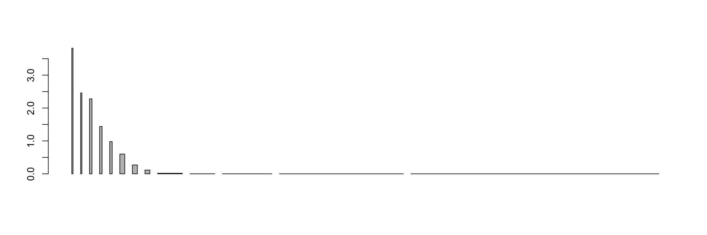
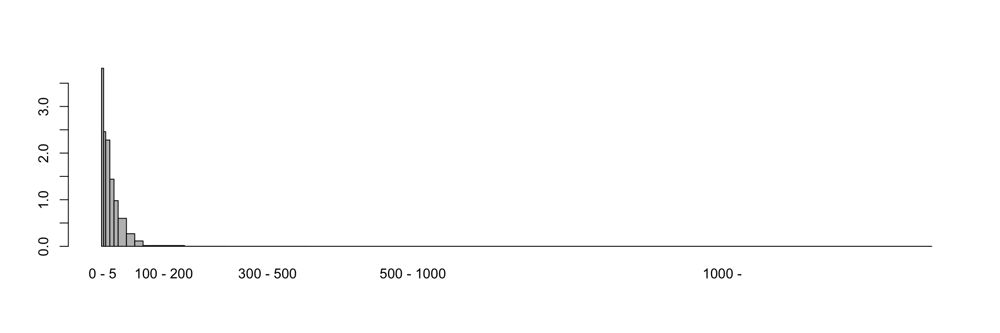
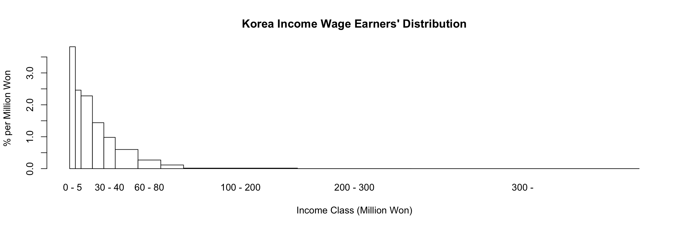
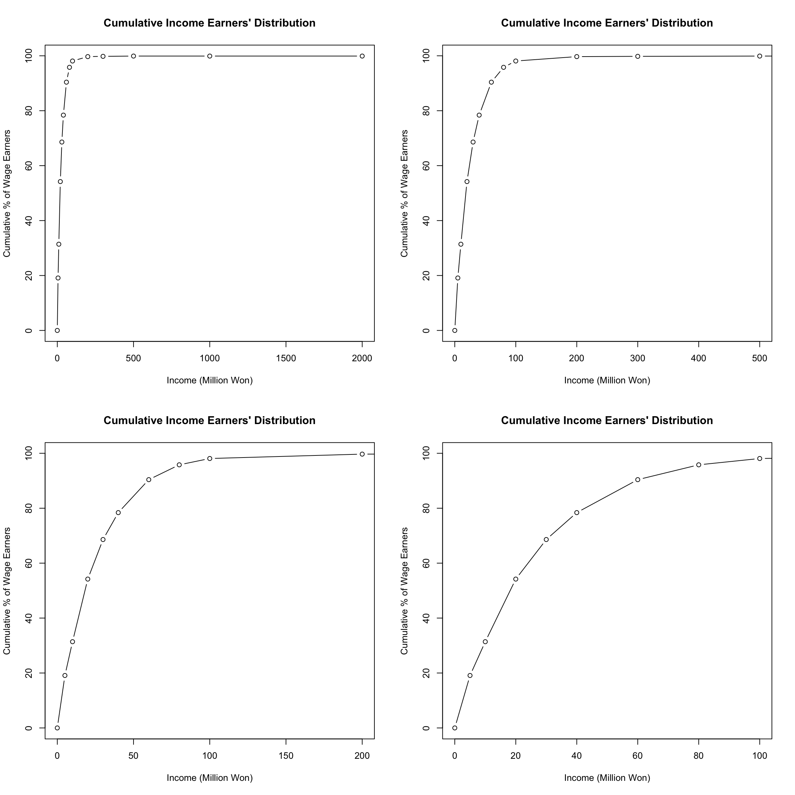
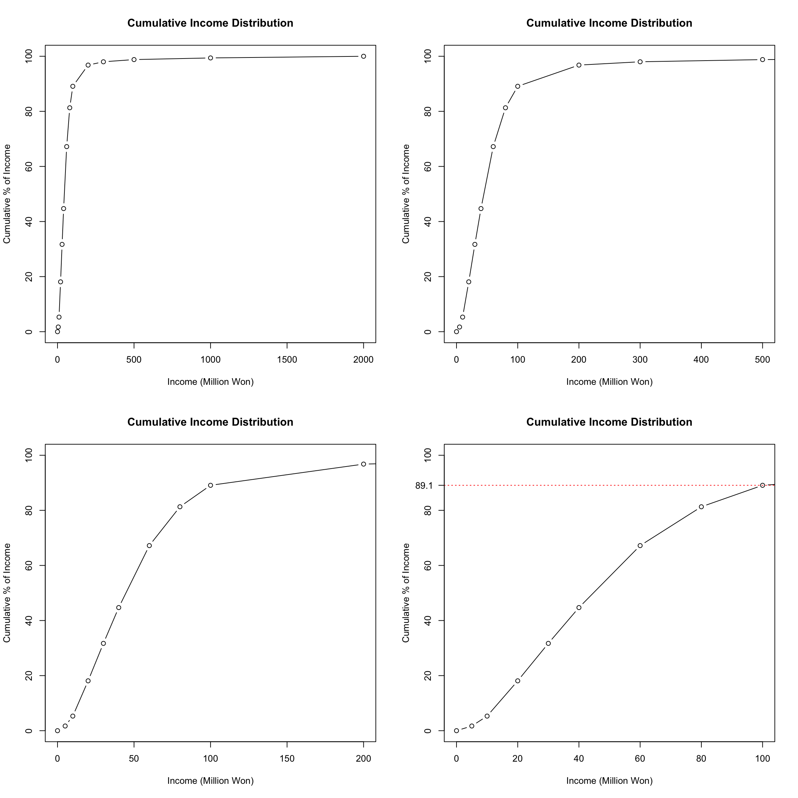
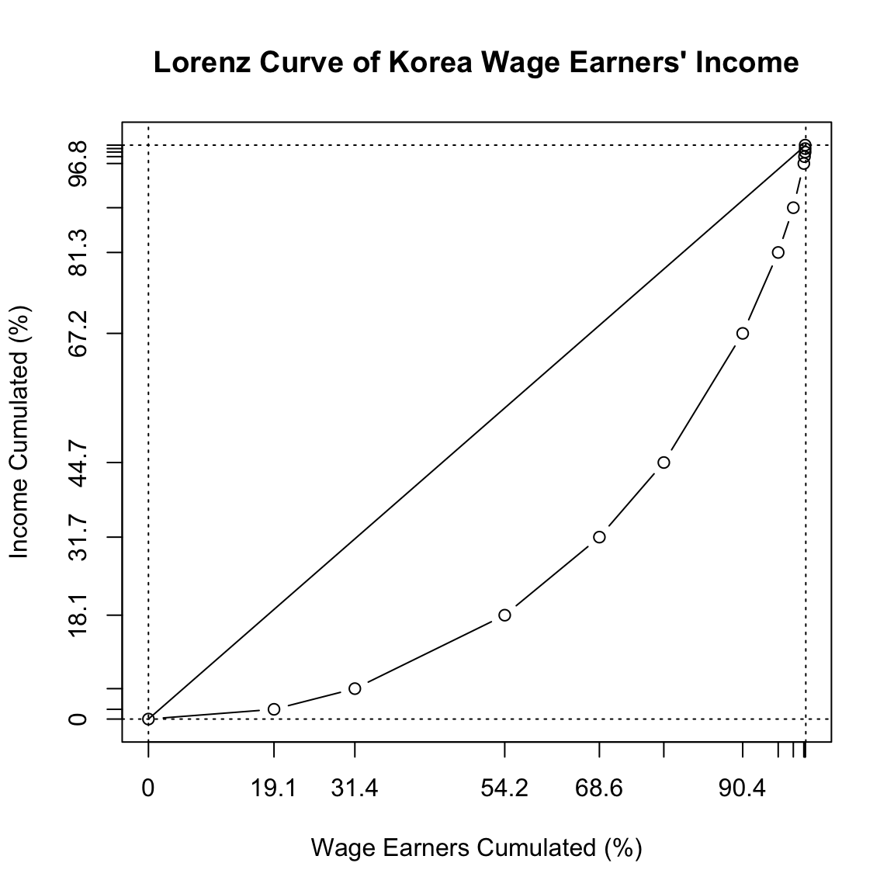
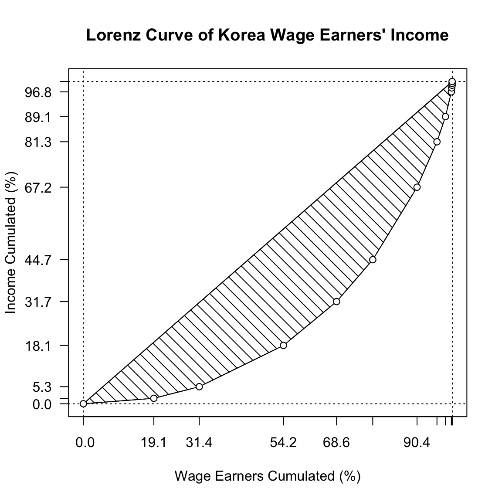
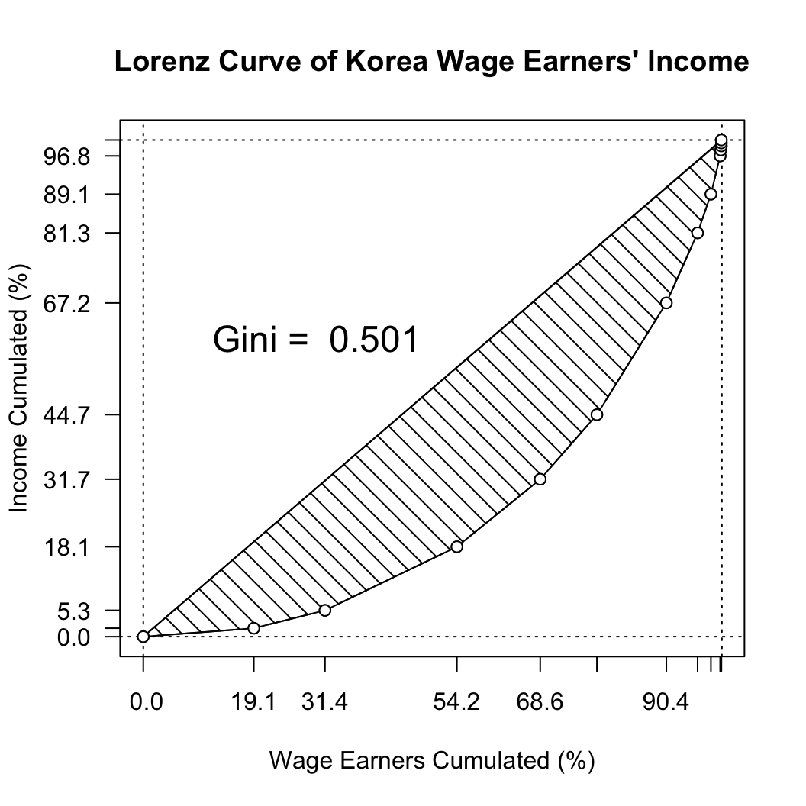
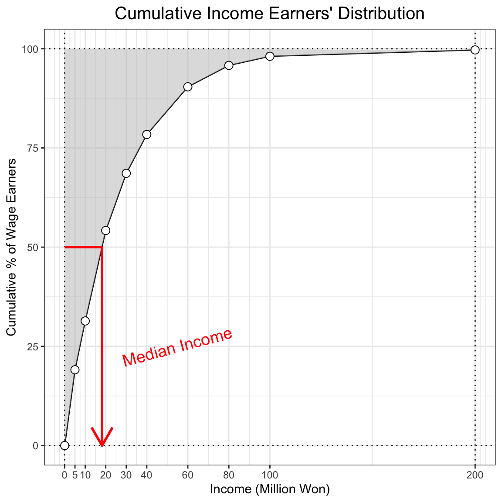

## Data

자료 입력


```text
income_kr <- "../data/labor_income_kor.txt" %>% 
  read.table(header = TRUE, row.names = 1)
income_kr %>% 
  str
```

```
## 'data.frame':	13 obs. of  2 variables:
##  $ Earners...: num  19.1 12.3 22.8 14.4 9.8 12 5.4 2.3 1.6 0.1 ...
##  $ Income... : num  1.7 3.6 12.8 13.6 13 22.5 14.1 7.8 7.7 1.2 ...
```

변수명을 조정하고, 다시 확인.


```text
names(income_kr) <- c("Earners(%)", "Income(%)")
income_kr %>% kable
```


|         | Earners(%)| Income(%)|
|:--------|----------:|---------:|
|0-5      |       19.1|       1.7|
|5-10     |       12.3|       3.6|
|10-20    |       22.8|      12.8|
|20-30    |       14.4|      13.6|
|30-40    |        9.8|      13.0|
|40-60    |       12.0|      22.5|
|60-80    |        5.4|      14.1|
|80-100   |        2.3|       7.8|
|100-200  |        1.6|       7.7|
|200-300  |        0.1|       1.2|
|300-500  |        0.1|       0.8|
|500-1000 |        0.0|       0.6|
|1000-    |        0.0|       0.6|

```text
rownames(income_kr) %<>% 
  sub(pattern = "-", replacement = " - ", x = .)
# income_kr %>% kable
```

`barplot()` 을 그리기 위하여 `height`를 설정하려면 `width`를 파악하여야 함. 그러기 위해서
소득 구간을 `rownames`의 구간으로부터 설정. `strsplit()`의 활용방법 확인, `anonymous function`과 `sapply()`를 이용하여 긴 character list의 앞 원소만 추출하는 방법을 살필 것.


```text
(income_breaks <- rownames(income_kr) %>% 
  strsplit(split = " - ") %>%
  sapply(`[`, 1) %>%
  as.numeric %>%
  c(2000))
```

```
##  [1]    0    5   10   20   30   40   60   80  100  200  300  500 1000 2000
```

`width`에 해당하는 각 소득구간의 폭을 계산


```text
income_widths <- income_breaks %>% 
  diff
```

각 기둥의 면적이 해당 소득구간의 퍼센티지와 같게 해주려면 각 퍼센티지를 `width`로 나눠줘야 함. 다음 각 경우를 비교(`results = 'hide'`를 지우고 실행).


```text
options(digits = 3)
(height_earners <- income_kr[, 1] %>%
    `/`(income_widths))
```

```
##  [1] 3.8200 2.4600 2.2800 1.4400 0.9800 0.6000 0.2700 0.1150 0.0160 0.0010
## [11] 0.0005 0.0000 0.0000
```

<P style = "page-break-before:always">

## Probability Historam with `barplot()`

아무런 `argument` 도 설정하지 않고 `barplot()` 을 그리면 


```text
height_earners %>% 
  barplot(width = income_widths)
```



막대의 이름을 넣어 다시 그리되, 막대 사이의 공간을 없애면
 

```text
height_earners %>% 
  barplot(width = income_widths, 
        space = 0, 
        names.arg = rownames(income_kr))
```



실제 인원은 거의 없는 것처럼 보이는 5억원 이상의 구간을 합쳐야 할 필요. 자료를 재구성하면,


```text
income_kr_2 <- income_kr[1:11, ]
income_kr_2[11, ] <- income_kr[11:13, ] %>%
  apply(MARGIN = 2, FUN = sum)
income_kr_2
```

```
##           Earners(%) Income(%)
## 0 - 5           19.1       1.7
## 5 - 10          12.3       3.6
## 10 - 20         22.8      12.8
## 20 - 30         14.4      13.6
## 30 - 40          9.8      13.0
## 40 - 60         12.0      22.5
## 60 - 80          5.4      14.1
## 80 - 100         2.3       7.8
## 100 - 200        1.6       7.7
## 200 - 300        0.1       1.2
## 300 - 500        0.1       2.0
```

```text
rownames(income_kr_2)
```

```
##  [1] "0 - 5"     "5 - 10"    "10 - 20"   "20 - 30"   "30 - 40"   "40 - 60"  
##  [7] "60 - 80"   "80 - 100"  "100 - 200" "200 - 300" "300 - 500"
```

```text
rownames(income_kr_2)[11] <- "300 -  "
income_kr_2
```

```
##           Earners(%) Income(%)
## 0 - 5           19.1       1.7
## 5 - 10          12.3       3.6
## 10 - 20         22.8      12.8
## 20 - 30         14.4      13.6
## 30 - 40          9.8      13.0
## 40 - 60         12.0      22.5
## 60 - 80          5.4      14.1
## 80 - 100         2.3       7.8
## 100 - 200        1.6       7.7
## 200 - 300        0.1       1.2
## 300 -            0.1       2.0
```

```text
income_breaks_2 <- income_breaks[1:12]
income_widths_2 <- income_breaks_2 %>% diff
height_earners_2 <- income_kr_2[, 1] %>% `/`(income_widths_2)
names_bar_2 <- rownames(income_kr_2)
```

다시 `barplot()`을 작동시키되 회색 대신 흰색을 넣고, 막대 사이의 공간을 없애고 제목과 축이름을 붙이면


```text
title_1 <- "Korea Income Wage Earners' Distribution"
xlab_1 <- "Income Class (Million Won)"
ylab_1 <- "% per Million Won"
height_earners_2 %>% 
  barplot(width = income_widths_2, names.arg = rownames(income_kr_2), space = 0, col = "white")
title(main = title_1, xlab = xlab_1, ylab = ylab_1)
```



1억 이상의 구간을 합치기 위하여 자료를 다시 손보면,


```text
income_kr_3 <- income_kr_2[1:9, ]
income_kr_3[9, ] <- income_kr_2[9:11, ] %>%
  apply(MARGIN = 2, FUN = sum)
rownames(income_kr_3)[9] <- "100 -   "
income_breaks_3 <- income_breaks_2[-(11:12)]
income_widths_3 <- income_breaks_3 %>% diff
height_earners_3 <- income_kr_3[, 1] %>% `/`(income_widths_3)
names_bar_3 <- rownames(income_kr_3)
```

1억 이상의 구간을 합쳐 barplot을 그리면,


```text
height_earners_3 %>% 
  barplot(width = income_widths_3, names.arg = rownames(income_kr_3), space = 0, col = "white")
title(main = title_1, xlab = xlab_1, ylab = ylab_1)
```


같은 방법으로 소득규모에 대하여 세 개의 `barplot`을 그리려면, 우선 자료를 정리하고. 


```text
height_income <- income_kr[, 2] %>% `/`(income_widths)
height_income_2 <- income_kr_2[, 2] %>% `/`(income_widths_2)
height_income_3 <- income_kr_3[, 2] %>% `/`(income_widths_3)
```

세 개의 barplot을 한 화면에 연속적으로 그리기 위하여 `par(mfrow = c(3, 1))` 설정


```text
par(mfrow = c(3, 1))
height_income %>% 
  barplot(width = income_widths, names.arg = rownames(income_kr), space = 0, col = "white")
height_income_2 %>% 
  barplot(width = income_widths_2, names.arg = rownames(income_kr_2), space = 0, col = "white")
height_income_3 %>%
  barplot(width = income_widths_3, names.arg = rownames(income_kr_3), space = 0, col = "white")
```


<P style = "page-break-before:always">

## Cumulative distribution

`barplot` 보다 누적도표가 분포의 윤곽을 살피는 데 더 낫다는 점을 상기하면, 누적분포를 구하는 일부터 시작하여야 함. 누적도표를 그리려면 첫 좌표는 `(0, 0)`이어야 함에 유의. 마침 `income_breaks` 와 맞춰보면 `income_kr_cum`의 첫 행을 0으로만 추가해 주면 되는 일임. 
자료로부터 이미 아는 사실이지만, `cumsum()`함수의 활용겸 확인차 계산해보면


```text
income_kr_cum <- income_kr %>%
  apply(MARGIN = 2, FUN = cumsum) %>%
  rbind(c(0, 0), .)
```

누적분포의 각 계급은  `10 - 20`의 열리고 닫힌 구간이 아니라 한 쪽으로 열린 구간이어야 하고, 누적백분률임을 명시하려면   


```text
rownames(income_kr_cum) %<>% 
  strsplit(., split = " - ") %>%
  sapply(., function(.)`[`(., 2)) %>%
  paste("0 ~", .) %>%
  `[<-`(., c(1, 14), c("0 ~ 0", "0 ~ 2000"))
colnames(income_kr_cum) <- c("Cumulated Wage Earners (%)", "Cumulated Income (%)")
income_kr_cum %>% kable
```


|         | Cumulated Wage Earners (%)| Cumulated Income (%)|
|:--------|--------------------------:|--------------------:|
|0 ~ 0    |                        0.0|                  0.0|
|0 ~ 5    |                       19.1|                  1.7|
|0 ~ 10   |                       31.4|                  5.3|
|0 ~ 20   |                       54.2|                 18.1|
|0 ~ 30   |                       68.6|                 31.7|
|0 ~ 40   |                       78.4|                 44.7|
|0 ~ 60   |                       90.4|                 67.2|
|0 ~ 80   |                       95.8|                 81.3|
|0 ~ 100  |                       98.1|                 89.1|
|0 ~ 200  |                       99.7|                 96.8|
|0 ~ 300  |                       99.8|                 98.0|
|0 ~ 500  |                       99.9|                 98.8|
|0 ~ 1000 |                       99.9|                 99.4|
|0 ~ 2000 |                       99.9|                100.0|

```text
earners_kor_cum_df <- data.frame(x = income_breaks, y = income_kr_cum[, 1])
income_kr_cum_df <- data.frame(x = income_breaks, y = income_kr_cum[, 2])
```

 `xlim` 을 좁혀가면서 분포 윤곽 파악.


```text
par(mfrow = c(2, 2))
title_2 <- "Cumulative Income Earners' Distribution"
xlab_2 <- "Income (Million Won)"
ylab_2 <- "Cumulative % of Wage Earners"
earners_kor_cum_df %>% plot(type = "b", ann = FALSE)
title(main = title_2, xlab = xlab_2, ylab = ylab_2)
earners_kor_cum_df %>% plot(type = "b", xlim = c(0, 500), ann = FALSE)
title(main = title_2, xlab = xlab_2, ylab = ylab_2)
earners_kor_cum_df %>% plot(type = "b", xlim = c(0, 200), ann = FALSE)
title(main = title_2, xlab = xlab_2, ylab = ylab_2)
earners_kor_cum_df %>% plot(type = "b", xlim = c(0, 100), ann = FALSE)
title(main = title_2, xlab = xlab_2, ylab = ylab_2)
```



한가지 기억해 둘 사실은 누적분포의 윗 부분 면적이 바로 평균이라는 점. 누적분포가 히스토그램보다 나은 점 중의 하나가 분위를 찾기 쉬울 뿐 아니라 평균을 비교하는 것도 용이하다는 것임. 중위소득은 바로 $y$축에서 50%에 해당하는 값을 수평으로 그은 후 누적도표와 만나는 점의 $x$좌표이다. 
여기서 계산해 보면 $\frac{x-10}{50 - 31.4} = \frac{54.2 - 31.4}{20 - 10}$로부터 $x = 18.2$가 계산된다.


```text
earners_kor_cum_df %>% 
  plot(type = "b", xlim = c(0, 200), ann = FALSE, xaxt = "n", yaxt = "n")
axis(side = 1, at = income_breaks, labels = income_breaks)
axis(side = 2, at = seq(0, 100, by = 25), labels = seq(0, 100, by = 25), las = 1)
poly_df <- earners_kor_cum_df %>%
  rbind(., c(0, 100))
polygon(poly_df, density = 15, angle = 135)
earners_kor_cum_df %>% points(pch = 21, col = "black", bg = "white")
lines(x = c(0, 18.2), y = rep(50, 2), col = "red", lwd = 2)
arrows(x0 = 18.2, y0 = 50, x1 = 19, y1 = 0, length = 0.15, col = "red", lwd = 2)
text(x = 48, y = 25, labels = "Median Income", srt = 30, col = "red")
title(main = title_2, xlab = xlab_2, ylab = ylab_2)
```


소득 자체의 누적분포에 대해서도 같은 방법으로 그려보면 


```text
par(mfrow = c(2, 2))
title_3 <- "Cumulative Income Distribution"
ylab_3 <- "Cumulative % of Income"
income_kr_cum_df %>% plot(type = "b", ann = FALSE)
title(main = title_3, xlab = xlab_2, ylab = ylab_3)
income_kr_cum_df %>% plot(type = "b", ann = FALSE, xlim = c(0, 500))
title(main = title_3, xlab = xlab_2, ylab = ylab_3)
income_kr_cum_df %>% plot(type = "b", ann = FALSE, xlim = c(0, 200))
title(main = title_3, xlab = xlab_2, ylab = ylab_3)
income_kr_cum_df %>% plot(type = "b", ann = FALSE, xlim = c(0, 100))
abline(h = 89.1, lty = 3, col = "red")
axis(side = 2, at = 89.1, label = 89.1, las = 1)
title(main = title_3, xlab = xlab_2, ylab = ylab_3)
```



<P style = "page-break-before:always">

## Lorenz Curve

이제 두 누적분포를 한 장의 도표로 살피는 방법을 생각해보자. $x$ 축을 사람, $y$ 축을 소득으로 하여 두 점을 이어주면 어떤 결과가 나오는 지 살펴 보자.


```text
earners <- income_kr_cum[, 1] 
income <- income_kr_cum[, 2]
earners_income_df <- data.frame(Earners = earners, Income = income)
earners_income_df %>% plot(type = "b", ann = FALSE, xaxt = "n", yaxt = "n")
# abline(a = 0, b = 1, xlim = c(0, 100), ylim = c(0, 100))
lines(x = c(0, 100), y = c(0, 100), type = "l")
axis(side = 1, at = earners, labels = earners)
axis(side = 2, at = income, labels = income)
abline(h = c(0, 100), lty = 3)
abline(v = c(0, 100), lty = 3)
title_4 <- "Lorenz Curve of Korea Wage Earners' Income"
xlab_4 <- "Wage Earners Cumulated (%)"
ylab_4 <- "Income Cumulated (%)"
title(main = title_4, xlab = xlab_4, ylab = ylab_4)
```



초승달 부분에 빗금을 치고, 각 축의 눈금을 가능한 많이 표시하려면 `polygon()`과 `axis(..., las = )`을 이용하게 되는 데 이 때 다각형을 구성하는데 필요한 좌표들은 이미 `earners_income_df`에 모두 나와 있음.


```text
earners_income_df %>% plot(type = "b", ann = FALSE, xaxt = "n", yaxt = "n")
# abline(a = 0, b = 1, xlim = c(0, 100), ylim = c(0, 100))
lines(x = c(0, 100), y = c(0, 100), type = "l")
axis(side = 1, at = earners, labels = format(earners, nsmall = 1))
axis(side = 2, at = income[c(1:10, 14)], 
     labels = format(income[c(1:10, 14)], nsmall = 1), las = 1)
abline(h = c(0, 100), lty = 3)
abline(v = c(0, 100), lty = 3)
title(main = title_4, xlab = xlab_4, ylab = ylab_4)
earners_income_df %>% 
  polygon(density = 10, angle = 135)
earners_income_df %>% 
  points(pch = 21, col = "black", bg = "white")
```



이 곡선의 이름은 무엇인가요? [Lorenz Curve](https://en.wikipedia.org/wiki/Lorenz_curve) 참조.

<P style = "page-break-before:always">

### Gini coefficient 

지니계수는 완전평등선과 로렌츠 곡선 사이의 면적을 완전불평등 상황에서의 면적, 즉 1/2로 나눠 준 값이다. 이 값이 클수록 불평등이 심한 것으로 간주할 수 있다. 이 초승달 모양 면적은 삼각형 면적에서 로렌츠 곡선 아래 면적을 뺀 것과 같아지므로 이전에 작성한 `arae.R`함수를 이용할 수 있다.


```text
source("area.R")
gini <- 2 * (1/2 - area_R(x = earners, y = income)/10000)
```

계산된 지니계수를 그림 안에 텍스트로 넣어주려면 `paste()`를 이용하여 입력토록한다.


```text
earners_income_df %>%
  plot(type = "b", ann = FALSE, xaxt = "n", yaxt = "n")
lines(x = c(0, 100), y = c(0, 100), type = "l")
axis(side = 1, at = earners, labels = format(earners, nsmall = 1))
axis(side = 2, at = income[c(1:10, 14)], 
     labels = format(income[c(1:10, 14)], nsmall = 1), las = 1)
abline(h = c(0, 100), lty = 3)
abline(v = c(0, 100), lty = 3)
title(main = title_4, xlab = xlab_4, ylab = ylab_4)
earners_income_df %>% 
  polygon(density = 10, angle = 135)
earners_income_df %>% 
  points(pch = 21, col = "black", bg = "white")
text(x = 30, y = 60, 
     labels = paste("Gini = ", round(gini, digits = 3)), cex = 1.5)
```



<P style = "page-break-before:always">

## ggplot

단계별로 결과물을 저장하면서 작업할 수 있도록 구성하였으니 `fig.keep = 'none'` 를 `fig.keep = 'all'`로 바꿔서 실행시켜보면 각 단계에서 어떤 점이 추가되는 지 살필 수 있다.

### Cumulative Distribution


```text
library(ggplot2)
(c1 <- ggplot() +
  geom_line(data = earners_kor_cum_df, 
            mapping = aes(x = x, y = y), na.rm = TRUE))
(c2 <- c1 +
  scale_x_continuous(breaks = earners_kor_cum_df$x,
                     labels = earners_kor_cum_df$x,
                     limits = c(0, 200)))
(c3 <- c2 +
  geom_hline(yintercept = c(0, 100), linetype = "dotted")) 
(c4 <- c3 +
  geom_vline(xintercept = c(0, 200), linetype = "dotted")) 
(c5 <- c4 + 
  geom_polygon(data = poly_df[-(11:14), ], 
               mapping = aes(x = x, y = y), 
               alpha = 0.5, fill = "grey")) 
(c6 <- c5 +
  geom_point(data = earners_kor_cum_df, 
             mapping = aes(x = x, y = y), 
             shape = 21, fill = "white", size = 3,
             na.rm = TRUE)) 
(c7 <- c6 +
  ggtitle(title_2) + xlab(xlab_2) + ylab(ylab_2)) 
(c8 <- c7 +
  scale_y_continuous(breaks = seq(0, 100, by = 25), labels = seq(0, 100, by = 25)))
(c9 <- c8 +
    annotate("segment", x = 0, xend = 18.2, y = 50, yend = 50, colour = "red", size = 1))
(c10 <- c9 +
    geom_segment(data = data.frame(x1 = 18.2, x2 = 18.2, y1 = 50, y2 = 0),
                 aes(x = x1, y = y1, xend = x2, yend = y2), 
                 arrow = arrow(),
                 colour = "red",
                 size = 1))
(c11 <- c10 +
  annotate("text", x = 55, y = 25, label = "Median Income", size = 5, color = "red", srt = 15)) 
(c12 <- c11 +
  theme_bw() +
    theme(plot.title = element_text(hjust = 0.5, size = 15)))
```


```text
c12
```



```text
ggsave("../pics/cumulative_plot_wage_kr.png", width = 9, height = 9)
```

<P style = "page-break-before:always">

### Lorenz Curve


```text
(g1 <- ggplot() +
  geom_line(data = earners_income_df, 
            mapping = aes(x = earners, y = income))) 
(g2 <- g1 +
  geom_line(data = data.frame(x = c(0, 100), y = c(0, 100)), 
            mapping = aes(x = x, y = y))) 
(g3 <- g2 +
  geom_hline(yintercept = c(0, 100), linetype = "dotted")) 
(g4 <- g3 +
  geom_vline(xintercept = c(0, 100), linetype = "dotted")) 
(g5 <- g4 + 
  geom_polygon(data = earners_income_df, 
               mapping = aes(x = earners, y = income), 
               alpha = 0.5, fill = "grey")) 
(g6 <- g5 +
  geom_point(data = earners_income_df, 
             mapping = aes(x = earners, y = income), 
             shape = 21, fill = "white", size = 3)) 
(g7 <- g6 +
  labs(title = title_4, x = xlab_4, y = ylab_4))
(g8 <- g7 +
  scale_x_continuous(breaks = earners[c(1:8, 14)], 
                     labels = format(earners[c(1:8, 14)], nsmall = 1))) 
(g9 <- g8 +
  scale_y_continuous(breaks = income[c(1:8, 14)], 
                     labels = format(income[c(1:8, 14)], nsmall = 1)))
#  scale_y_continuous(breaks = seq(0, 100, by = 25))) 
(g10 <- g9 +
  annotate("text", x = 30, y = 60, 
           label = paste("Gini = ", format(gini, digits = 3, nsmall = 2)), 
           size = 9, color = "red", srt = 15)) 
(g11 <- g10 +
  annotate("text", x = 80, y = 20, 
           label = "15 Million", 
           size = 9, color = "blue"))
(g12 <- g11 +
  theme_bw() +
    theme(plot.title = element_text(hjust = 0.5, size = 15)))
```


```text
g12
```


```text
ggsave("../pics/lorenz_curve_wage_kr.png", width = 9, height = 9)
```


