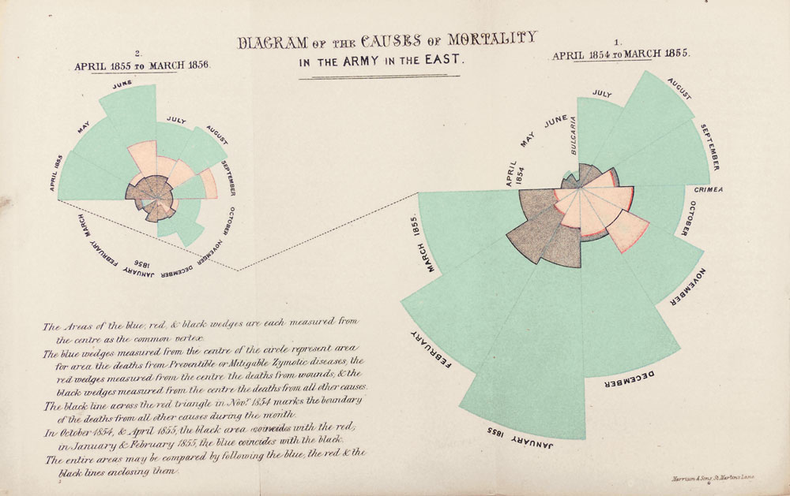

```{r setup, include = FALSE}
knitr::opts_chunk$set(
  echo = TRUE, message = FALSE, warning = FALSE,
  fig.align = "center", dpi = 150,
  fig.path = "../pics/", out.width = "100%"
)

# 한글 폰트 (있을 때만 활성화)
if (requireNamespace("showtext", quietly = TRUE)) {
  showtext::showtext_auto()
  sysfonts::font_add_google("Noto Sans KR", "noto_kr")
}
```

# 1. 배경: 나이팅게일과 크림 전쟁

> "통계는 신의 마음을 읽는 학문이다." — Florence Nightingale

플로렌스 나이팅게일(Florence Nightingale, 1820–1910)은 크림 전쟁(1854–1856) 당시
**슈코더르(Scutari, 현 위스퀴다르)** 야전 병원에서 38명의 잉글랜드 성공회 수녀와 함께
일하며 **위생 관리·물자 관리·기록 관리**의 근대적 시스템을 도입했다.

도착 직후 1854년 겨울에는 전체 사망의 80% 이상이 **부상이 아닌 감염성 질병**(장티푸스·콜레라·이질·티푸스 등)에서 비롯되었다.
1855년 3월 위생 위원회(Sanitary Commission)의 환기·배수 개선과 함께 사망률은 급격히 떨어졌다.
나이팅게일은 이 변화를 **숫자가 아닌 그림**으로 의회와 빅토리아 여왕에게 전하기 위해
"동부 군대 사망 원인 다이어그램"을 제작했다. 오늘날 이 그림은
**Rose Diagram / Coxcomb Plot / Polar Area Chart**로 불린다.

```{r original-figure, echo = FALSE, fig.cap = "Nightingale의 원본 Coxcomb (1858)"}

```

---

# 2. 패키지와 데이터

## 2.1 패키지

```{r packages}
# install.packages(c("tidyverse", "HistData", "knitr", "scales", "here"))
library(tidyverse)   # dplyr, tidyr, ggplot2, ...
library(HistData)    # Nightingale 데이터
library(knitr)       # kable
library(scales)      # 축 포매팅
library(here)        # 프로젝트 상대경로
```

## 2.2 원자료 살펴보기

`HistData::Nightingale`은 24개월(1854-04 ~ 1856-03), 10개 변수를 포함한다.
이 가운데 **사망률(rate, per 1,000 per year)** 컬럼 3개와 날짜를 사용한다.

```{r raw-data}
data("Nightingale", package = "HistData")
glimpse(Nightingale)
```

## 2.3 데이터 정제 — tidy 형태로

**개선 포인트**

* `gather()` → `pivot_longer()` (tidyr 1.0+ 표준)
* `gl(12, 1, 72, ...)`처럼 행 개수에 의존하는 코드 제거 → **Date에서 직접 추출**
* `magrittr` `%>%` / `%<>%` → 네이티브 파이프 `|>`
* 모든 변환을 **하나의 파이프라인**으로 통합 → 가독성↑

```{r tidy-data}
Night <- Nightingale |>
  as_tibble() |>
  select(Date, Disease = Disease.rate,
         Wounds  = Wounds.rate,
         Other   = Other.rate) |>
  pivot_longer(
    cols      = -Date,
    names_to  = "Cause",
    values_to = "Deaths"
  ) |>
  mutate(
    # 월 이름(영문). 원본 차트의 시계 방향 흐름을 유지하기 위해 levels를 4월부터로 지정.
    Month  = factor(month.name[month(Date)],
                    levels = month.name[c(4:12, 1:3)]),
    # 위생 위원회(1855-04) 전/후. 정확한 분기점으로 절단.
    Regime = factor(if_else(Date < as.Date("1855-04-01"), "Before", "After"),
                    levels = c("Before", "After")),
    # 사망 원인 순서 고정 (원본과 동일: Disease 가장 안쪽 X, 바깥쪽 O 등은 stack 순서로)
    Cause  = factor(Cause, levels = c("Disease", "Wounds", "Other"))
  )

Night
```

## 2.4 요약 통계 — 학생용 사이드퀘스트

위생 개혁 전후의 평균 사망률 차이를 한눈에 보자.

```{r summary-stats}
Night |>
  group_by(Regime, Cause) |>
  summarise(mean_rate = mean(Deaths), .groups = "drop") |>
  pivot_wider(names_from = Cause, values_from = mean_rate) |>
  mutate(across(where(is.numeric), ~ round(.x, 1))) |>
  kable(caption = "위생개혁 전후 월평균 사망률 (per 1,000/year)")
```

---

# 3. 시각화

## 3.1 색상 & 테마 (한 번 정의해 재사용)

**개선 포인트**: 원본 다이어그램의 범례는 **파랑(질병)·빨강(부상)·검정(기타)** 세 색으로 구분했다
(이 인쇄본에서는 파랑이 청록/초록, 빨강이 분홍, 검정이 회색에 가깝게 보인다 — 가장 큰 영역인 질병이 청록색이다).
다만 현대 강의자료에서는 **색맹 친화**가 더 중요하므로 `viridis` 또는 명도 차이가 큰 정성 색을 사용한다.

```{r theme}
cause_colors <- c(
  Disease = "#2A9D8F",   # 청록  — 원본의 '파랑'(질병) 영역에 대응
  Wounds  = "#E76F51",   # 붉은색 — 원본의 '빨강'(부상) 영역에 대응
  Other   = "#3D3B40"    # 짙은 회색~검정 — 원본의 '검정'(기타) 영역에 대응
)

theme_coxcomb <- function(base_size = 12) {
  theme_minimal(base_size = base_size) +
    theme(
      panel.grid.minor = element_blank(),
      panel.grid.major.x = element_blank(),
      plot.title    = element_text(face = "bold", size = rel(1.2)),
      plot.subtitle = element_text(color = "grey30"),
      plot.caption  = element_text(color = "grey50", hjust = 0),
      legend.position = "right",
      strip.text = element_text(face = "bold")
    )
}
```

## 3.2 누적 막대그래프 — "있는 그대로"의 모습

```{r barplot, fig.width = 11, fig.height = 6}
cxc_b <- Night |>
  ggplot(aes(x = Date, y = Deaths, fill = Cause)) +
  geom_col(width = 25, colour = "black", linewidth = 0.2) +
  geom_vline(xintercept = as.numeric(as.Date("1855-04-01")),
             linetype = "dashed", colour = "grey30") +
  annotate("label", x = as.Date("1855-04-01"),
           y = max(Night |> group_by(Date) |> summarise(s = sum(Deaths)) |> pull(s)) * 0.95,
           label = "위생 개혁 시작\n(1855-04)", size = 3, hjust = 0.5) +
  scale_fill_manual(values = cause_colors, name = "사망 원인") +
  scale_x_date(date_labels = "%Y-%m", date_breaks = "2 months") +
  scale_y_continuous(labels = label_comma()) +
  labs(
    title = "크림전쟁 영국군 월별 사망률",
    subtitle = "1,000명당 연간 사망률 — 원인별 누적",
    x = NULL, y = "사망률 (per 1,000/yr)",
    caption = "데이터: HistData::Nightingale  ·  Florence Nightingale (1858)"
  ) +
  theme_coxcomb() +
  theme(axis.text.x = element_text(angle = 45, hjust = 1))

cxc_b
ggsave(here("pics", "cxc_b.png"), cxc_b, width = 11, height = 6, dpi = 200)
```

**관전 포인트**

* 1855년 1~2월 **질병(청록)** 사망률이 압도적이다.
* 위생 개혁(점선) 이후 막대가 급격히 짧아진다.

## 3.3 단일 Coxcomb (Before / After)

`coord_polar()`는 데카르트 좌표를 극좌표로 바꾼다.
`x`는 **각도**, `y`는 **반지름**, 누적된 fill은 **부채꼴의 띠**가 된다.
`scale_y_sqrt()`를 쓰는 이유는 **반지름이 √값에 비례할 때 부채꼴의 면적이 값에 비례**하기 때문이다.
(나이팅게일 원본도 면적-비례)

```{r coxcomb-pair, fig.width = 12, fig.height = 6}
make_coxcomb <- function(df, title) {
  ggplot(df, aes(x = Month, y = Deaths, fill = Cause)) +
    geom_col(width = 1, colour = "white", linewidth = 0.3) +
    scale_y_sqrt(name = NULL) +                   # 반지름 ∝ √값 → 면적 ∝ 값
    scale_fill_manual(values = cause_colors) +
    coord_polar(start = 3 * pi / 2, clip = "off") + # 4월을 3시 방향에 두고 시계방향
    labs(title = title, x = NULL) +
    theme_coxcomb() +
    theme(panel.grid.major.y = element_line(colour = "grey85"),
          axis.text.y = element_blank())
}

cxc1 <- make_coxcomb(filter(Night, Regime == "Before"),
                     "Before: 1854-04 ~ 1855-03")
cxc2 <- make_coxcomb(filter(Night, Regime == "After"),
                     "After:  1855-04 ~ 1856-03")

# patchwork로 나란히 배치 (gridExtra보다 ggplot 친화적)
if (requireNamespace("patchwork", quietly = TRUE)) {
  library(patchwork)
  cxc1 + cxc2 +
    plot_annotation(
      title = "Nightingale Rose Diagram (재현)",
      subtitle = "면적이 사망 원인별 사망률에 비례한다",
      caption = "© 2026 데이터과학입문"
    )
}
```

## 3.4 동일 스케일의 facet 버전

두 그림을 직접 비교하려면 **공유 스케일** Facet이 더 정직하다.

```{r coxcomb-facet, fig.width = 12, fig.height = 6}
cxc_f <- Night |>
  ggplot(aes(x = Month, y = Deaths, fill = Cause)) +
  geom_col(width = 1, colour = "white", linewidth = 0.3) +
  scale_y_sqrt(name = NULL) +
  scale_fill_manual(values = cause_colors, name = "사망 원인") +
  coord_polar(start = 3 * pi / 2, clip = "off") +
  facet_wrap(~ Regime, nrow = 1,
             labeller = as_labeller(c(Before = "위생 개혁 이전 (1854-04 ~ 1855-03)",
                                      After  = "위생 개혁 이후 (1855-04 ~ 1856-03)"))) +
  labs(
    title = "Florence Nightingale의 Coxcomb 다이어그램 재현",
    subtitle = "각 부채꼴의 면적 ∝ 월별 사망률 (per 1,000/yr)",
    caption = "데이터: HistData::Nightingale  ·  코드: DS2601-13주차"
  ) +
  theme_coxcomb() +
  theme(strip.text = element_text(size = 12, face = "bold"),
        axis.text.y = element_blank(),
        panel.spacing = unit(1.5, "lines"))

cxc_f
ggsave(here("pics", "cxc_f.png"), cxc_f, width = 12, height = 6, dpi = 200)
```

---

# 4. 한 걸음 더 — 학생 실습 과제

1. **색상 바꿔보기** — `cause_colors`를 `viridis::viridis(3)`로 교체하면 어떻게 보일까?
2. **로그 스케일** — `scale_y_sqrt()` 대신 `scale_y_continuous()` (선형) / `scale_y_log10()`로
   바꿔보고, 어떤 시각적 메시지가 달라지는지 토론하라.
3. **연 평균 군 규모** 변수 `Army`를 활용해 "단순 사망자 수"와 "사망률"의 그림이
   왜 달라 보이는지 두 장의 Coxcomb로 비교하라.
4. **인터랙티브** — `plotly::ggplotly(cxc_f)`를 시도해 보고, 극좌표 그래프에서 무엇이
   잘되고 무엇이 깨지는지 정리하라.

---

# 5. 코멘트 — 나이팅게일이 통계학에 끼친 영향

* 1858년 **왕립통계학회(RSS)의 최초 여성 회원**으로 선출되었다.
* 1874년 미국 통계학회 명예회원이 되었다.
* "데이터 시각화로 정책을 움직인 최초의 인물"로 평가된다.
* 그녀의 통찰: **"청중이 들을 준비가 되어 있지 않은 숫자는 그림이 되어야 한다."**

```{r session-info}
sessionInfo()
```
