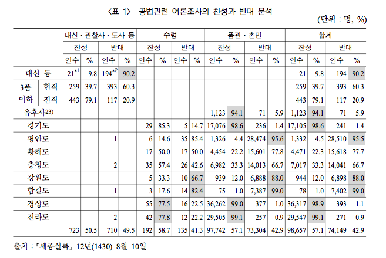

## Data

### Reading Data 

Original data came from intenet version of Sejong silok, summarized by Oh, Ki-Soo.




```{r, setup, echo = FALSE}
knitr::opts_chunk$set(echo = TRUE)
# library(pander)
library(knitr)
options(width = 180)
```

```{r, reading data}
sejong_poll <- read.table("../data/sejong_poll.txt", header = TRUE, stringsAsFactors = FALSE)
str(sejong_poll)
# pander(sejong_poll)
kable(sejong_poll[4:1])
```

### Factor conversion

We need vote, class, region as `factor`s. If you leave them as `chr`, it will be coerced to factor when you tabulate it according to alphabetical order, which is not what you want. So, use `factor()` to convert them. First, make a working copy vesion of `sejong_poll`

```{r, duplicate}
sejong_poll_2 <- sejong_poll
```

```{r, vote as factor}
sejong_poll_2$vote <- factor(sejong_poll_2$vote, levels = c("yes","no"), labels = c("Yes", "No"))
```

You can check that `labels = ` is not necessary if same as levels. Continue with class and region_

```{r, class as factor}
class_levels <- c("high","third.current", "third.ex", "chief", "ordinary")
class_labels <- c("High","3rd_current", "3rd_former", "Chief", "Commons")
sejong_poll_2$class <- factor(sejong_poll_2$class, levels = class_levels, labels = class_labels)
```

```{r, region as factor}
region_levels <- c("Seoul","yuhu", "gyunggi", "pyungan", "hwanghae", "chungcheong", "kangwon", "hamgil", "gyungsang", "jeolla")
# region_labels <- c("Seoul","Yuhu", "Gyunggi", "Pyungan", "Hwanghae", "Chungcheong", "Kangwon", "Hamgil", "Gyungsang", "Jeolla")
region_labels <- c("SL","YH", "GG", "PA", "HH", "CC", "KW", "HG", "GS", "JL")
sejong_poll_2$region <- factor(sejong_poll_2$region, levels = region_levels, labels = region_labels)
```

```{r, data in dataframe}
str(sejong_poll_2)
kable(sejong_poll_2[4:1])
```

### Array

We can set up the data as an array

```{r, array structure}
sejong_poll_array <- xtabs(counts ~ vote + class + region, 
                           data = sejong_poll_2)
str(sejong_poll_array)
sejong_poll_array
```

## Votes

### Total

Check the total vote with xtabs()

```{r, total yes or no}
vote_total <- xtabs(counts ~ vote, 
                    data = sejong_poll_2)
kable(t(as.matrix(vote_total)), 
      caption = "Total")
# format(prop.table(vote_total)*100, digits = 3, nsmall = 1)
kable(t(as.matrix(format(prop.table(vote_total) * 100, 
                         digits = 3, 
                         nsmall = 1))), 
      caption = "Percentage", 
      align = rep("r", 2))
vote_total.2 <- apply(sejong_poll_array, 1, sum)
# kable(t(as.matrix(vote_total.2)))
kable(t(as.matrix(vote_total.2)), 
      caption = "Total")
```

### Vote by class

```{r, by class}
vote_class <- xtabs(counts ~ vote + class, 
                    data = sejong_poll_2)
kable(vote_class, 
      caption = "By Class")
vote_class_a <- apply(sejong_poll_array, 1:2, sum)
kable(vote_class_a, 
      caption = "By Class")
```

### Commons vs Bureaucrats

We need to analyse Commons separately. 

```{r, commons vs bureaus}
sejong_poll_2$class_2 <- factor(ifelse(sejong_poll_2$class == "Commons", 
                                       "Commons", "Bureaus"), 
                                levels = c("Bureaus", "Commons"))
kable(sejong_poll_2[c(4, 3, 5, 2, 1)])
str(sejong_poll_2)
```

Compare the votes by `class_2`,  (Bureaucrats vs Commons)

```{r, vote by class_2}
vote_class_2 <- xtabs(counts ~ vote + class_2, 
                      data = sejong_poll_2)
kable(vote_class_2, caption = "By Bureaus and Commons")
vote_class_2_a <- cbind("Bureaus" = rowSums(vote_class_a[, -5]), "Commons" =  vote_class_a[, 5])
kable(vote_class_2_a, caption = "By Bureaus and Commons")
```

Add subtotals to the margins, 

```{r, subtotals}
vote_class_2_am <- addmargins(vote_class_2)
kable(vote_class_2_am)
```

Compute the marginal proportions. Note the use of `digits = 3` and `nsmall = 1`.

```{r, proportions}
kable(format(prop.table(vote_class_2, margin = 2)*100, digits = 3, nsmall = 1), caption = "Bureaus and Commons", align = rep("r", 2))
```

### Votes by region with respect to class_2 

Count the vote by region class_2 wise.

```{r, region w.r.t class_2}
class_2 <- sejong_poll_2$class_2
vote_region_bureaus <- xtabs(counts ~ vote + region, 
                             data = sejong_poll_2, 
                             class_2 == "Bureaus", 
                             drop = TRUE)
kable(vote_region_bureaus, caption = "Votes(Bureaus)")
# xtabs(counts ~ vote + region, data = sejong_poll_2[class_2 == "Bureaus", ], drop = TRUE)
vote_region_commons <- xtabs(counts ~ vote + region, data = sejong_poll_2, class_2 == "Commons", drop = TRUE)
kable(vote_region_commons, caption = "Votes(Commons)")
```

Seoul has three times more Bureaucrats than other regions, so analyse further.

```{r, Seoul}
region <- sejong_poll_2$region
vote_seoul_class <- xtabs(counts ~ vote + class, data = sejong_poll_2, region == "SL", drop = TRUE)
kable(vote_seoul_class, caption = "Seoul")
kable(format(prop.table(vote_seoul_class, margin = 2)*100, digits  = 3, nsmall = 1), caption = "SL", align = rep("r", 3))
```

Chungcheong's case.

```{r, Chungcheong}
vote_chung_class <- xtabs(counts ~ vote + class, data = sejong_poll_2, region == "CC", drop = TRUE)
kable(format(prop.table(vote_chung_class, margin = 2)*100, digits = 3, nsmall = 1), caption = "CC", align = rep("r", 3))
```

- Save the working directory image.

```{r, save}
save.image(file = "sejong_poll_data.RData")
```


