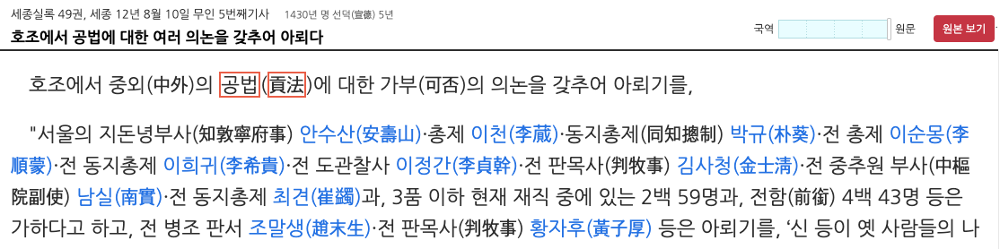

## Data

### Reading Data 

원본 자료는 세종실록 인터넷 판에 기록으로 있는데(세종12년 8월10일, 호조에서 공법에 대한 여러 의논을 갖추어 아뢰다) 3-4명이 팀을 이루어 요약할 때 1-2시간 정도 걸린다.

```{r, out.width = "90%"}

```

아래 <표 1>은 오기수 교수님의 요약본을 옮긴 것이다. 전형적인 테이블 구조이나 아직 깔끔한(tidy) 데이터로 정리하지 않은 상태이다. 찬반 집계를 value 로 간주할 때, 각 value 들은 어느 지역, 어떤 계급의 사람들이 찬성이나 반대를 한 결과를 합산한 것이다. 지역, 계급, 찬반, 집계의 네 가지 변수가 등장하는 데 이를 집계에 대하여 정리하면 깔끔한 데이터가 된다. 

```{r, out.width = "75%"}
knitr::include_graphics("../pics/sejong_ref_data.png")
```


```{r, setup, echo = FALSE}
knitr::opts_chunk$set(echo = TRUE)
library(knitr)
options(width = 180)
```

`sejong_ref.txt` 는 위의 표를 깔끔한 구조로 정리한 텍스트 파일이다.

```{r, reading data}
sejong_ref <- read.table("../data/sejong_ref.txt", 
                         header = TRUE, 
                         stringsAsFactors = FALSE)
str(sejong_ref)
kable(sejong_ref[4:1])
```

### Factor conversion

Vote, Class, Region 은 `factor`로 전환하여야 한다. 이들을 `character`로 놓아 두면, `table()` 로 요약할 때  알파벳 순, 가나다 순으로 하기 때문이다.  다음을 실행해 보면 쉽게 알 수 있다.

```{r}
table(sejong_ref$Vote)
table(sejong_ref$Class)
table(sejong_ref$Region)
```

따라서 `factor()`를 활용하여 변환한다. `Vote`는 "찬성", "반대"의 순으로 `level`을 설정한다. 

```{r, Vote as factor}
sejong_ref$Vote <- factor(sejong_ref$Vote, 
                          levels = c("찬성","반대"))
```

`Class`는 중앙관료, 지방관료, 품관촌민의 순으로 `levels`를 설정한다. 단, "대신_등"을 "대신 등"으로 표시하기 위하여 `labels`도 설정한다.

```{r, Class as factor}
Class_levels <- c("대신_등","3품이하현직", "3품이하전직", "수령", "품관촌민")
Class_labels <- c("대신 등","3품이하현직", "3품이하전직", "수령", "품관촌민")
sejong_ref$Class <- factor(sejong_ref$Class, 
                           levels = Class_levels, 
                           labels = Class_labels)
```

`Region`은 다음 순서대로 `levels`를 설정한다.  

```{r, Region as factor}
Region_levels <- c("서울", "유후사", "경기", "평안", "황해", "충청", "강원", "함길", "경상", "전라")
sejong_ref$Region <- factor(sejong_ref$Region, 
                            levels = Region_levels)
```

구조를 살피고, 'Region`, 'Class`, `Vote`, `Counts` 순으로 출력한다. 맨 처음 줄을 해석하면  서울의 대신 등은 21명이 찬성하였고, 194명이 반대하였다 라고 읽을 수 있다. 이 숫자가 매우 중요하다. 분명히 세종대왕이 임명한 최고급관료 중 90%이상이 세종대왕의 개혁 정책에 반대하고 있는 것이다. 21이라는 값은 "서울", "대신 등", "찬성" 이라는 key 값에 대응한다. 

```{r, data in dataframe}
str(sejong_ref)
kable(sejong_ref[4:1])
```

- Save the working directory image.

```{r, save}
save.image(file = "sejong_ref_data.RData")
```
