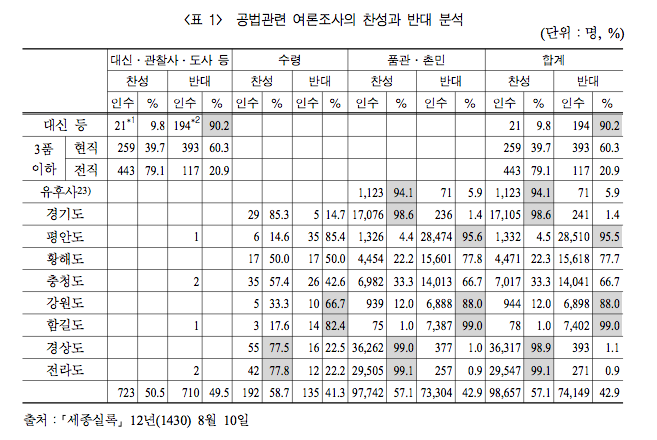

```{r setup, include = FALSE}
knitr::opts_chunk$set(echo = TRUE, message = FALSE, warning = FALSE)
library(knitr)

## v3 헬퍼: showtext + Nanum Gothic 자동 다운로드 + 전역 테마 설정
##   pos(), fill_vote(), pie_vote(), bar_vote(), mosaic_vote()
##   theme_sejong() 은 v2 호환용 별칭으로 남겨 두었음
source("sejong_helpers_v3.R")

## 분할표 객체들이 저장된 RData
##   sejong_ref, Vote_Class, Vote_Class_2,
##   Vote_Region_bureaus, Vote_Region_commons,
##   Vote_seoul_Class, Vote_chung_Class
load("sejong_ref_tbl.RData")
```

## 들어가며 — 데이터의 역사적 무게

이 자료는 단순한 ggplot 실습용 표가 아니다. 세종 12년(1430) 호조가 공법(貢法)
도입에 관해 시행한 국민투표 결과로, 알려진 한 세계 최초의 전국 단위
정책 찬반 조사이다. 주먹구구로 거두던 세금을 토지 조건과 작황에 맞게
공평하게 매기려 했던 세종의 고민이 17만 명이 넘는 응답에 담겨 있다.

데이터에서 가장 먼저 눈에 띄는 것은 세종이 직접 임명한 최고위 관료
(대신 등)의 90% 이상이 개혁에 반대했다는 사실이다. 자신이 신임해야 할
사람들로부터의 압도적 반대 — 이것이 600년 전 한 군주가 마주한 데이터였다.
지역별로는 토지가 척박한 곳과 윤택한 곳에서 찬반이 극단으로 갈리고,
같은 지역 안에서도 지방 관료들의 응답이 품관촌민보다 한쪽으로 훨씬 더
강하게 쏠려 있다. 같은 정보 환경에서 비슷한 사람들끼리 의견이 강화되는,
오늘날 에코 체임버(echo chamber)라 부르는 현상의 흔적을 1430년 데이터에서
이미 볼 수 있다. 게다가 글을 모르는 백성의 답을 한 다리 건너 아전이
받아 적었다는 사실까지 고려하면 그 극단성은 한 번 더 눈여겨봐야 한다.

세종이 이 결과를 받아들고 어떤 답을 준비했는지 보면 더 흥미롭다.
1444년경 본격화한 연분9등·전분6등의 차등 과세, 그리고 거의 같은 시기에
가족 단위 비밀 프로젝트로 진행된 훈민정음 창제(1443–1446) — 토지 조건에
맞춘 세제와, 백성이 자기 뜻을 직접 적을 수 있는 문자가 함께 등장한 것은
우연이 아닐지 모른다. 세종실록이 한글로 번역되어 있지 않았다면 우리 역시
이 숫자들에 닿을 수 없었을 것이다. 이제 그래프를 한 장씩 그릴 때마다
600년 전의 정치 지형이 어떻게 데이터에 새겨져 있는지 잠깐씩 멈춰서
읽어보기로 한다.

> **v3 노트**: 한글 폰트는 Google Fonts 의 *Nanum Gothic* 을 `showtext` 로
> 자동 다운로드해 사용한다. 시스템에 별도 폰트를 설치할 필요가 없고,
> `theme_set()` 한 번으로 모든 그래프에 동일한 한글 테마가 자동 적용된다.

<P style = "page-break-before:always">

## 데이터

원자료는 [세종실록](http://sillok.history.go.kr/id/kda_11208010_005),
요약표는 오기수 교수의 논문에서 가져왔다.

```{r data-img, echo = FALSE, out.width = "80%", fig.align = "center"}

```

```{r data-glance}
str(sejong_ref)
vnames_kr <- c("지역", "계급", "신분", "찬반", "집계")
kable(sejong_ref[, c(2, 3, 5, 1, 4)],
      col.names = vnames_kr, align = "r")
```

<P style = "page-break-before:always">

# 1. 전체 찬반

```{r vote-total}
Vote_df <- aggregate(Counts ~ Vote, data = sejong_ref, FUN = sum)
kable(Vote_df, align = "r", caption = "전체 집계")
```

## 1-1. 막대그래프 — 단계별 빌드업

ggplot 객체에 `+`로 레이어를 한 단계씩 더하는 흐름을 한 번만 시범한다.
전역 테마(나눔고딕 + 가운데 굵은 제목)는 `theme_set()` 으로 이미 적용되어
있으므로, 첫 그림부터 한글 축이 깔끔하게 나온다. 이후 모든 그래프는
헬퍼 함수 호출로 압축한다.

```{r bar-step1, fig.width = 3.2, fig.height = 3.2}
p1 <- ggplot(Vote_df, aes(x = "", y = Counts, fill = Vote)) +
  geom_bar(width = 1, stat = "identity",
           position = position_stack(reverse = TRUE))
p1
```

축 눈금에 콤마, 색상 지정.

```{r bar-step2, fig.width = 3.2, fig.height = 3.2}
p2 <- p1 +
  scale_x_discrete(name = "찬반") +
  scale_y_continuous(name = "집계",
                     breaks = cumsum(Vote_df$Counts),
                     labels = format(cumsum(Vote_df$Counts), big.mark = ",")) +
  fill_vote()
p2
```

집계값 라벨을 막대 가운데에 표시.

```{r bar-step3, fig.width = 3.2, fig.height = 3.2}
p3 <- p2 +
  geom_text(aes(y = pos(Counts)),
            label = format(Vote_df$Counts, big.mark = ","))
p3
```

<P style = "page-break-before:always">

## 1-2. 원형그래프

위 막대를 `coord_polar()`로 돌리면 원형이 된다.
`pie_vote()` 한 줄로 같은 결과를 얻는다.

```{r pie-total, fig.width = 4, fig.height = 4}
pie_total <- pie_vote(Vote_df, title = "전체 찬반")
pie_total
ggsave("../pics/sejong_total_pie_ggplot.png",
       pie_total, width = 4, height = 4, dpi = 72)
```

<P style = "page-break-before:always">

# 2. 계급별 찬반

```{r class-tables}
kable(format(Vote_Class, big.mark = ","),
      align = "r", caption = "계급별 찬반")
kable(format(prop.table(Vote_Class, margin = 2) * 100,
             digits = 3, nsmall = 1),
      align = "r", caption = "계급별 찬반(%)")
```

## 2-1. 관료 vs 품관촌민

품관촌민의 수가 압도적으로 많아 분리해서 본다.

```{r class2-tables}
kable(format(addmargins(Vote_Class_2), big.mark = ","),
      align = "r", caption = "관료와 품관촌민 (소계 포함)")
kable(format(prop.table(Vote_Class_2, margin = 2) * 100,
             digits = 3, nsmall = 1),
      align = "r", caption = "관료와 품관촌민 (%)")
```

데이터프레임으로 변환 후 두 집단의 원형그래프를 나란히 배치.

```{r pie-bureaus-commons, fig.width = 8, fig.height = 4}
Vote_Class_2_df <- aggregate(Counts ~ Vote + Class_2,
                             data = sejong_ref, FUN = sum)
Vote_bureaus_df <- subset(Vote_Class_2_df, Class_2 == "관료",
                          select = c("Vote", "Counts"))
Vote_commons_df <- subset(Vote_Class_2_df, Class_2 == "품관촌민",
                          select = c("Vote", "Counts"))

pie_b <- pie_vote(Vote_bureaus_df, title = "관료의 찬반")
pie_c <- pie_vote(Vote_commons_df, title = "품관촌민의 찬반")

pies <- grid.arrange(pie_b, pie_c, ncol = 2)
ggsave("../pics/sejong_bureaus_commons_pie_ggplot.png",
       pies, width = 8, height = 4, dpi = 72)
```

<P style = "page-break-before:always">

# 3. 서울의 찬반 (계급 × 찬반)

```{r seoul-table}
kable(Vote_seoul_Class, caption = "서울의 찬반")
kable(format(prop.table(Vote_seoul_Class, margin = 2) * 100,
             digits = 1, nsmall = 1),
      align = "r", caption = "서울의 찬반(%)")
```

```{r seoul-df}
Vote_seoul_df <- aggregate(
  Counts ~ Vote + Class,
  data = subset(sejong_ref, Region == "서울"),
  FUN = sum)
```

## 3-1. Stack

```{r seoul-stack, fig.width = 6, fig.height = 4.5}
b_stack <- bar_vote(Vote_seoul_df, position = "stack",
                    xlab = "계급", title = "서울의 찬반")
b_stack
ggsave("../pics/sejong_seoul_barplot_stack_ggplot.png",
       b_stack, width = 6, height = 4.5, dpi = 72)
```

## 3-2. Dodge

```{r seoul-dodge, fig.width = 6, fig.height = 4.5}
b_dodge <- bar_vote(Vote_seoul_df, position = "dodge",
                    xlab = "계급", title = "서울의 찬반")
b_dodge
```

## 3-3. Fill

```{r seoul-fill, fig.width = 6, fig.height = 4.5}
b_fill <- bar_vote(Vote_seoul_df, position = "fill",
                   xlab = "계급", ylab = "집계(%)",
                   title = "서울의 찬반")
b_fill
```

<P style = "page-break-before:always">

## 3-4. 모자이크 그래프

너비는 계급별 비중, 높이는 그룹 안의 찬반 비율이다.

```{r seoul-mosaic, fig.width = 6, fig.height = 4.5}
Vote_seoul_Class_df <- as.data.frame(Vote_seoul_Class)
m_seoul <- mosaic_vote(Vote_seoul_Class_df,
                       xlab = "계급(누적 %)",
                       title = "서울의 찬반")
m_seoul
ggsave("../pics/sejong_seoul_mosaic_ggplot.png",
       m_seoul, width = 6, height = 4.5, dpi = 72)
```

<P style = "page-break-before:always">

# 4. 지역별 찬반 (서울 제외)

## 4-1. 지방 관료

```{r region-bureaus-tables}
kable(Vote_Region_bureaus[, -1],
      caption = "지방 관료의 지역별 찬반 (서울 제외)")
kable(format(prop.table(Vote_Region_bureaus[, -1], margin = 2) * 100,
             digits = 1, nsmall = 1),
      align = "r",
      caption = "지방 관료의 지역별 찬반 (%, 서울 제외)")
```

```{r region-bureaus-bar, fig.width = 9, fig.height = 4.5}
Vote_Region_bureaus_df <- aggregate(
  Counts ~ Vote + Region,
  data = subset(sejong_ref, Class_2 == "관료" & Region != "서울"),
  FUN = sum)
Vote_Region_bureaus_df$Region <- factor(Vote_Region_bureaus_df$Region)

bar_vote(Vote_Region_bureaus_df, position = "stack",
         xlab = "지역", title = "지방 관료의 찬반")
ggsave("../pics/sejong_bureaus_barplot_stack_ggplot.png",
       width = 9, height = 4.5, dpi = 72)
```

```{r region-bureaus-mosaic, fig.width = 9, fig.height = 4.5}
mosaic_vote(Vote_Region_bureaus_df,
            xlab = "지역별 관료의 비중(누적 %)",
            title = "지방 관료의 찬반")
ggsave("../pics/sejong_bureaus_mosaic_ggplot.png",
       width = 9, height = 4.5, dpi = 72)
```

<P style = "page-break-before:always">

## 4-2. 품관촌민

```{r region-commons-tables}
kable(format(Vote_Region_commons, big.mark = ","),
      align = "r", caption = "품관촌민의 지역별 찬반")
kable(format(prop.table(Vote_Region_commons, margin = 2) * 100,
             digits = 1, nsmall = 1),
      align = "r", caption = "품관촌민의 지역별 찬반(%)")
```

```{r region-commons-bar, fig.width = 10, fig.height = 4.5}
Vote_Region_commons_df <- aggregate(
  Counts ~ Vote + Region,
  data = subset(sejong_ref, Class_2 == "품관촌민"),
  FUN = sum)
Vote_Region_commons_df$Region <- factor(Vote_Region_commons_df$Region)

bar_vote(Vote_Region_commons_df, position = "stack",
         xlab = "지역", title = "품관촌민의 찬반")
ggsave("../pics/sejong_commons_barplot_stack_ggplot.png",
       width = 9, height = 4.5, dpi = 72)
```

```{r region-commons-mosaic, fig.width = 12, fig.height = 4.5}
mosaic_vote(Vote_Region_commons_df,
            xlab = "지역별 품관촌민의 비중(누적 %)",
            title = "품관촌민의 찬반")
ggsave("../pics/sejong_commons_mosaic_ggplot.png",
       width = 12, height = 4.5, dpi = 72)
```

<P style = "page-break-before:always">

# 5. 충청도 — 관료와 품관촌민이 갈린 사례

```{r chung-tables}
kable(format(Vote_chung_Class, big.mark = ","),
      align = "r", caption = "충청도 사례")
kable(format(prop.table(Vote_chung_Class, margin = 2) * 100,
             digits = 3, nsmall = 1),
      align = "r", caption = "충청도 사례(%)")
```

```{r chung-bar, fig.width = 6, fig.height = 4.5}
Vote_chung_Class_df <- aggregate(
  Counts ~ Vote + Class,
  data = subset(sejong_ref, Region == "충청"),
  FUN = sum)

bar_vote(Vote_chung_Class_df, position = "fill",
         xlab = "계급", ylab = "집계(%)",
         title = "충청도의 찬반")
ggsave("../pics/sejong_chungcheong_barplot_fill_ggplot.png",
       width = 6, height = 4.5, dpi = 72)
```

```{r chung-mosaic, fig.width = 12, fig.height = 4.5}
mosaic_vote(as.data.frame(Vote_chung_Class[, -1]),
            xlab = "계급(누적 %)",
            title = "충청도의 찬반")
ggsave("../pics/sejong_chungcheong_mosaic_ggplot.png",
       width = 12, height = 4.5, dpi = 72)
```

<P style = "page-break-before:always">

# 6. 작업 디렉토리 저장

```{r save}
save.image(file = "./sejong_ggplot.RData")
```
