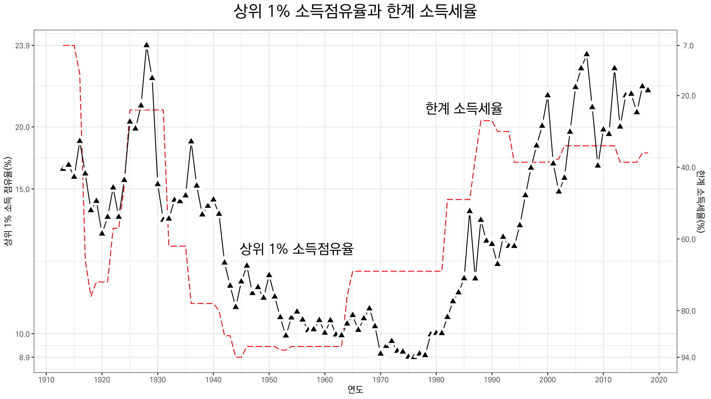

## Data Preparation

준비한 자료는  [E. Saez 교수의 홈페이지](http://elsa.berkeley.edu/~saez/)에 있는 `TabFig2018prel.xls` 와 [Tax Foundation](http://taxfoundation.org/)에서 제공하는 자료를 손봐서 불러들인 것이다. 
연도를 공통으로 수평축에 놓고, 상위 1%의 소득점유율과 한계소득세율, 또는 상위1%와 하위 99%의 소득 기준년도 대비 소득(%) 등, 서로 다른 범위를 가진 변수들을 한 화면에 함께 표현해야 하기 때문에 선형변환을 이용하여 범위를 0에서 1사이로 맞추고, 각 변수의 변환하기 전 원시 값은 좌측 수직축과 우측 수직축에 표현하는 트릭을 써 보자. 이 작업에서 반복되는 선형 변환은 사용자 정의 함수를 작성하여 활용한다.


```
## Warning: package 'knitr' was built under R version 4.2.2
```

이 중에서 상위 1%의 소득 점유율(`P99_100`)과 한계 소득세율(Marginal Tax Rates) 간의 관계를 살펴보자


위의 그림으로부터 한계소득세율이 높을 때 상위1%의 소득점유율이 낮고, 한계소득세율이 낮을 때는 반대로 상위1%의 소득점유율이 높은 것을 관찰할 수 있다. 이를 보다 명확히 파악하기 위하여 한계소득세율을 뒤집어 보면, 즉 `u`를 변환한 한계소득세율이라 할 때  `1 - u`를 비교 대상으로 그려보면, 



상위 1%의 소득 증가폭과 하위 99%의 소득 증가폭(자본소득 제외)을 최고한계세율의 변화와 함께 비교


상위 1%의 소득 증가폭과 하위 99%의 소득 증가폭(자본소득 포함)을 최고세율의 변화와 함께 비교


