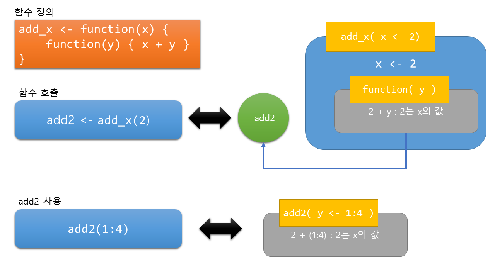

```{r setup, include=FALSE}
knitr::opts_chunk$set(echo = TRUE)
```

## Closure
JavaScript 를 개발한 넷스케이프 커뮤니케이션스를 이어 받은 모질라 재단의 문서에 의하면 **클로져(closure)** 는 

> 독립적인 (자유) 변수 (지역적으로 사용되지만, 둘러싼 범위 안에서 정의된 변수)를 참조하는 함수들이다. 다른 말로 하면, 이 함수들은 그들이 생성된 환경을 '기억'한다.

으로 정의하고 있습니다. 개발자들의 언어로 조금 어려운 점이 있으나, 간단하게 함수가 만들어진 환경(이 말 또한 어려운 말이지만, 메모리로 만든 함수가 살고 있는 공간으로 보시면 좋을 것 같습니다.)하의 자원(각종 변수 등)들을 잃어버리지 않고 기억하고 있는 것을 말합니다.

* 다음의 예를 통해 살펴 보겠습니다.[^1]

`add_2()`는 전달된 임의의 숫자 혹은 벡터에 2를 더하는 함수로 다음과 같습니다.

```{r}
add2 <- function(x) {
  x + 2
}
```

이 함수는 다음과 같이 임의의 값을 전달받아 각 값에 2를 더한 값을 반환해 줍니다.

```{r}
add2(1:4)
```

그런데 만일 2를 더하는 함수가 아닌 5를 더하는 함수가 추가로 필요하다고 하면, 다음과 같이 새로운 함수를 하나 더 만드는 것을 생각해 볼 수 있습니다.

```{r}
add5 <- function(x) {
  x + 5
}

add5(1:4)
```

물론 이와같이 작성해도 되지만, 다음의 코드를 작동해 보겠습니다.
```{r}
add_x <- function(x) {
    function(y) { x + y }
}
```

약간 이상한 느낌이 드는 코드입니다.
함수 정의부에서 작성한 함수를 별도의 이름없이 바로 `function` 지시어를 이용하여 **이름없는** 함수를 만들었습니다.

이 코드를 조금 살펴보기 위해 다음과 같이 명령을 내려보겠습니다.

```{r}
add_x
add2 <- add_x(2)
typeof(add2)
str(add2)
```

`str()` 결과를 보면 눈치채시겠지만, 위에서 정의한 함수 `add_x()` 2를 전달한 함수를 add2란 이름으로 저장하면 `add2()`는 하나의 함수가 됩니다.

다음과 같이 사용해 보겠습니다.

```{r}
add2(1:4)
```

앞서 `add_x()` 정의시 함수에 전달해 주는 값을 `x`로 하였는데 바로 위에서 `add_x(2)` 를 통해 `add_x()` 함수가 생성되는 곳에 변수 `x`의 값을 2로 하였고, `add_x()` 정의시 정의한 이름없는 함수는 `y`를 전달받아 기존 `x` 값에 전달된 `y` 값을 더한 결과를 가져옵니다.

이 과정을 정리하면 다음 그림과 같습니다.



위의 그림에서 함수 호출시 `add_x(2)` 함수 호출을 통해 함수인 `function( y )` 를 받아 이를 `add2` 로 저장하여 `add2`가 함수의 역할을 하도록 합니다.
여기서 중요한 것이 `function(y)` 정의에 있는 `x`는 `function(y)`를 정의한 `add_x()` 함수의 `x` 값을 사용하는 것입니다.

클로져는 이렇게 해당 함수가 만들어졌을 때 사용된 자원을 기억하고 있다가 사용할 때 이를 사용함수를 뜻합니다.

교재에 사용된 예는 이런 클로져의 기능을 이용하여, 객체 지향 프로그래밍 언어에서 사용하는 접근 레벨 중 하나인 private을 구현한 것으로 보입니다.

```{r}
setup <- function(deck) {
  DECK <- deck
  DEAL <- function() {
    card <- deck[1, ]
    assign("deck", deck[-1, ], envir = parent.env(environment()))
    card
  }

  SHUFFLE <- function(){
    random <- sample(1:52, size = 52)
    assign("deck", DECK[random, ], envir = parent.env(environment()))
  }

  list(deal = DEAL, shuffle = SHUFFLE)
}
```

객체지향에서 사용하는 관점에서 위의 코드 `deal()`, `shuffle()` 은 기능을 수행하는 메소드이며, 속성 `DECK`으로 구성되어 있으며 `DECK`은 함수 외부에서는 접근할 수 없으며 `setup` 객체 내의 메소드와 속성에서만 접근할 수 있습니다.

이를 통해 데이터를 보호하는 기능을 수행하여, 보다 안전하게 사용할 수 있으며(이 때문에 교재에서는 deck이 global environment에 있어 다른 함수 및 코드에 의해 훼손될 수 있음을 나타내고 있습니다) 

마지막으로 이와 같은 과정은 객체 지향의 추상화 과정 중 하나로 프로그래밍 하고자 하는 대상을 잘 표현하여, 안전하고, 확장가능하고 유지보수에 더 유리한 이점을 제공합니다.


[^1]:<https://www.r-bloggers.com/closures-in-r-a-useful-abstraction/> 을 참고하였습니다.
