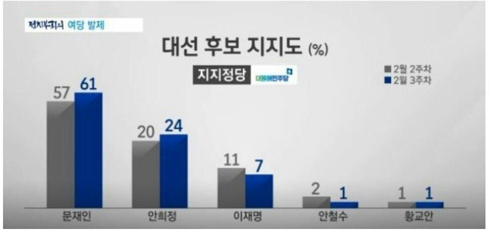

## Problem

JTBC 정치부회의에서는 다음과 같은 도표의 민주당 지지자 중 후보지지도 여론조사 결과를 보도. 



막대의 높이에 의구심을 표한 시청자들의 항의에 직면함. 

제대로 된 막대그래프를 그리면서 R Base plot과 ggplot에 대하여 학습.


## Data Setup

```{r, data}
library(magrittr)
candidates <- c("문재인", "안희정", "이재명", "안철수", "황교안")
candidates %<>% factor(levels = candidates)
week2 <- c(57, 20, 11, 2, 1)
week3 <- c(61, 24, 7, 1, 1)
rates_df <- data.frame(candidates, week2, week3, 
                       stringsAsFactors = FALSE)
rates_df
```

<P style = "page-break-before:always">

## Barplot(R Base)

```{r, fig.width = 8, fig.height = 4}
par(family = "KoPubWorldDotum Medium")
b1 <- barplot(t(as.matrix(rates_df[, 2:3])), 
              axes = FALSE, 
              ylim = c(0, 65), 
              beside = TRUE, 
              names.arg = rates_df[, 1], 
              legend.text = c("2주차", "3주차"), 
              col = c("darkgrey", "blue"))
# axis(side = 2, 
#     at = as.vector(as.matrix(rates_df[, 2:3])), 
#     labels =  as.vector(as.matrix(rates_df[, 2:3])), las = 1)
text(x = b1[1, ], 
     y = week2 + 2, 
     labels = week2, 
     col = "darkgrey")
text(x = b1[2, ], 
     y = week3 + 2, 
     labels = week3, 
     col = "blue")
main_title <- "대선후보 지지도(%)"
sub_title <- "JTBC 정치부회의, 한국갤럽 2017. 2월 7-9일, 14-16일"
main_text <- "지지정당 : 더불어민주당"
title(main = main_title, 
      sub = sub_title, 
      cex.main = 2)
text(x = 8, y = 60, 
     main_text, 
     cex = 1.2)
box(which = "figure", lwd = 3)
dev.copy(png, "../pics/jtbc170216.png", width = 640, height = 320)
dev.off()
```

<P style = "page-break-before:always">

## ggplot

### Data for `ggplot()`

```{r, data reshaping, eval = FALSE}
library(reshape2)
# (rates_df$candidates_f <- factor(candidates, 
#                                 levels = candidates))
str(rates_df)
(rates_df_melt <- melt(rates_df, 
                      id.vars = "candidates", 
                      measure.vars = c("week2", "week3"), 
                      variable.name = "week", 
                      value.name = "rates"))
str(rates_df_melt)
```

```{r, dplyr}
library(tidyverse)
rates_tbl <- rates_df %>%
  as_tibble %>%
  gather(key = "week", value = "rates", - candidates) 
str(rates_tbl)
```


<P style = "page-break-before:always">

### `geom_bar()`

```{r, fig.width = 8, fig.height = 4}
# library(ggplot2)
source("theme_kr.R")
g0 <- ggplot(data = rates_tbl, 
             mapping = aes(x = candidates, 
                           y = rates, 
                           fill = week)) 
(g1 <- g0 + 
  geom_bar(stat = "identity", 
           position = position_dodge())) 
```

<P style = "page-break-before:always">

```{r, fig.height = 4, fig.width = 8}
(g2 <- g1 +
  geom_text(mapping = aes(x = candidates, 
                          y = rates + 2, 
                          label = rates,
                          colour = week), 
            position = position_dodge(width = 1), 
            size = 5))
```

<!--
<P style = "page-break-before:always">
-->

```{r, fig.height = 4, fig.width = 8}
(g3 <- g2 +
  theme_bw() +
  theme_kr)
```

<P style = "page-break-before:always">

```{r, fig.height = 4, fig.width = 8}
(g4 <- g3 + 
    scale_fill_manual(name = "", 
                      values = c("darkgrey", "blue"), 
                      labels = c("2월 2주차", "2월 3주차")) +
    scale_colour_manual(name = "",
                        values = c("darkgrey", "blue"), 
                        labels = c("2월 2주차", "2월 3주차")))
```

<!--
<P style = "page-break-before:always">
-->

```{r, fig.height = 4, fig.width = 8}
(g5 <- g4 + 
    scale_x_discrete(name = "대선후보"))
```

<P style = "page-break-before:always">

```{r, fig.height = 4, fig.width = 8}
(g6 <- g5 +
    scale_y_continuous(name = "지지도", 
                       breaks = as.vector(as.matrix(rates_df[, 2:3])), 
                       labels = as.vector(as.matrix(rates_df[, 2:3]))))
```

<!--
<P style = "page-break-before:always">
-->

```{r, fig.height = 4, fig.width = 8}
(g7 <- g6 +
    labs(title = main_title, 
         subtitle = sub_title))
```

<P style = "page-break-before:always">

```{r, fig.height = 4, fig.width = 8}
(g8 <- g7 +
  theme(plot.title = element_text(hjust = 0.5), 
        plot.subtitle = element_text(family = "KoPubWorldDotum Medium"),
        legend.position = c(0.9, 0.7)))
```
