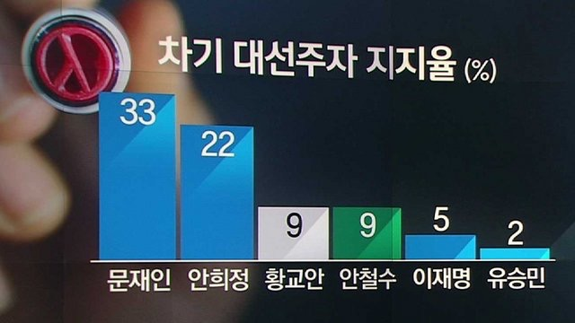

```{r setup, include = FALSE}
knitr::opts_chunk$set(echo = TRUE, message = FALSE, warning = FALSE)
library(ggplot2)
library(dplyr)
library(showtext)
font_add_google("Nanum Gothic", "nanum")
showtext_auto()
```

## Problem

JTBC 뉴스룸에서는 다음과 같은 도표의 후보지지도 여론조사 결과를 보도. 

```{r, echo = TRUE, out.width = "67%", fig.align = "center"}

```

<!--

-->

막대의 높이에 의구심을 표한 시청자들의 항의에 직면함. 

제대로 된 막대그래프를 그리면서 R Base plot과 ggplot에 대하여 학습.


## Data 

```{r, data, message = FALSE}
# 데이터 생성
df <- data.frame(
  candidate = c("문재인", "안희정", "황교안", "안철수", "이재명", "유승민"),
  rate = c(33, 22, 9, 9, 5, 2),
  party = c("더불어민주당", "더불어민주당", "자유한국당", "국민의당", "더불어민주당", "바른정당")
)

# 정당별 색상 정의 
party_colors <- c(
  "더불어민주당" = "skyblue", 
  "자유한국당" = "lightgrey", 
  "국민의당" = "darkgreen", 
  "바른정당" = "darkblue"
)

# 후보 정렬 (지지율 순서 유지)
df$candidate <- factor(df$candidate, levels = df$candidate)

# 1. 정당 순서 정의 
party_levels <- c("더불어민주당", "자유한국당", "국민의당", "바른정당")

# 2. factor 변환 (levels 설정을 통해 가나다순 정렬 방지)
df$party <- factor(df$party, levels = party_levels)
```

<P style = "page-break-before:always">

## Barplot (R Base)

<P style = "page-break-before:always">

```{r, fig.width = 8, fig.height = 4}
# 1. 색상 매핑을 df에 미리 넣어두면 더 편리합니다.
# (이전 단계에서 정의한 party_colors 활용)
df$color <- party_colors[df$party]

# 2. 마진 및 기본 설정
par(mar = c(5, 4, 4, 2) + 0.1, family = "nanum")

# 3. barplot 실행: df의 컬럼을 직접 참조
# df$rate와 df$candidate를 사용하여 데이터 간의 연결성을 보여줍니다.
# 메인 타이틀 설정
main_title <- "대선주자 지지도 (2017. 2월)"
bp <- barplot(df$rate, 
              names.arg = df$candidate, 
              col = df$color,
              main = main_title,
              ylab = "지지율 (%)",
              ylim = c(0, 40),        # 정직한 그래프의 핵심!
              border = "white",
              las = 1,
              cex.main = 1.8,
              font.main = 2, 
              cex.names = 1.2)

# 4. 수치 레이블 추가: df$rate 활용
text(x = bp, y = df$rate, label = paste0(df$rate), 
     pos = 3, cex = 1.3, font = 1)

# 5. 기준선 추가
abline(h = 0, col = "darkgrey")
```

<P style = "page-break-before:always">

## ggplot

```{r, ggplot, fig.width = 8, fig.height = 4}
p <- ggplot(df, aes(x = candidate, y = rate, fill = party)) +
  geom_bar(stat = "identity", width = 0.7) +
  # 정당별 색상 적용
  scale_fill_manual(values = party_colors, breaks = party_levels) +
  # y축 0점 기준 설정 및 눈금 표시
  scale_y_continuous(limits = c(0, 40), breaks = seq(0, 40, 5)) +
  # 레이블 추가 (막대 위 수치 표시)
  geom_text(aes(label = rate), vjust = -0.5, size = 5, fontface = "plain") +
  # 테마 및 한글 폰트 설정
  theme_minimal(base_family = "nanum") + # 윈도우 환경에선 "Malgun Gothic" 권장
  labs(
    title = main_title,
    x = NULL,
    y = "지지율 (%)",
    fill = "소속 정당"
  ) +
  theme(
    plot.title = element_text(size = 18, face = "bold", hjust = 0.5),
    axis.text.x = element_text(size = 12, face = "bold"),
    legend.position = "bottom"
  )

print(p)
```

## Comments

막대그래프를 이용한 눈속임에 대하여 느낀 바를 간단히 기술하세요. 
한글 폰트가 경고(Warning!)를 