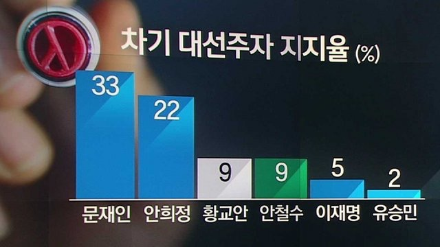

## Problem

JTBC 뉴스룸에서는 다음과 같은 도표의 후보지지도 여론조사 결과를 보도. 

```{r, echo = TRUE, out.width = "67%", fig.align = "center"}

```

<!--

-->

막대의 높이에 의구심을 표한 시청자들의 항의에 직면함. 

제대로 된 막대그래프를 그리면서 R Base plot과 ggplot에 대하여 학습.


## Data Setup

```{r, data, message = FALSE}
# library(extrafont)
candidates <- c("문재인", "안희정", "황교안", "안철수", "이재명", "유승민") 
rates <- c(33, 22, 9, 9, 5, 2)
party <- c("더불어민주당", "자유한국당", "국민의당", "바른정당")
colour_party <- c("skyblue", "lightgrey", "darkgreen", "darkblue")
candidates_party <-  c("더불어민주당", "더불어민주당", "자유한국당", 
                       "국민의당", "더불어민주당", "바른정당")
match(candidates_party, party)
candidates_colour <- colour_party[match(candidates_party, party)]
```

<P style = "page-break-before:always">

## Barplot (R Base)

```{r, fig.width = 8, fig.height = 4}
barplot(rates)
```

<P style = "page-break-before:always">

```{r, fig.width = 8, fig.height = 4}
par(family = "")
# par(family = "AppleGothic")
b1 <- barplot(rates, 
              axes = FALSE, 
              col = candidates_colour, 
              names.arg = NULL,
              cex.names = 1.5)
mtext(side = 1, at = b1, line = 0.5, text = candidates, cex = 1.5)
text(x = b1, y = rates + c(rep(-3, 4), rep(1.5, 2)), 
     labels = rates, 
     col = c("black", "black", "black", "white", "black", "black"),
     cex = 1.5)
main_title <- "차기 대선주자 지지율(%)"
title(main = main_title, 
      cex.main = 2)
box(which = "figure", lwd = 3)
dev.copy(png, "../pics/jtbc1702.png", width = 640, height = 320)
dev.off()
```

<P style = "page-break-before:always">

## ggplot

```{r, ggplot, fig.width = 8, fig.height = 4}
library(ggplot2)
candidates <- factor(candidates, levels = candidates)
rates_df <- data.frame(candidates, 
                       candidates_party, 
                       candidates_colour,
                       rates)
g0 <- ggplot(data = rates_df, 
             mapping = aes(x = candidates, 
                           y = rates))
(g1 <- g0 +
  geom_bar(stat = "identity"))
```

<P style = "page-break-before:always">

```{r, fig.height = 4, fig.width = 8}
(g2 <- g0 +
  geom_bar(stat = "identity", 
           fill = candidates_colour))
(g3 <- g2 +
    theme_bw(base_family = ""))
#   theme_bw(base_family = "AppleGothic"))
(g4 <- g3 +
  geom_text(mapping = aes(x = candidates, 
                          y = rates + c(rep(-3, 4), rep(2, 2)), 
                          label = rates), 
            colour = c(rep("black", 3), "white", rep("black", 2)),
            size = 6))
(g5 <- g4 +
  labs(title = main_title))
```

<P style = "page-break-before:always">

```{r, fig.height = 4, fig.width = 8}
(g6 <- g5 +
   theme(plot.title = element_text(family = "",    
#   theme(plot.title = element_text(family = "AppleGothic", 
                                  size = 15, 
                                  hjust = 0.5)))
(g7 <- g6 +
  scale_y_continuous(breaks = rates, labels = rates))
```

<P style = "page-break-before:always">

```{r, fig.height = 4, fig.width = 8}
(g8 <- g7 +
  theme(panel.border = element_blank(),
        axis.title.x = element_blank(),
        axis.title.y = element_blank(),
        axis.text.x = element_blank(),
        axis.ticks = element_blank(), 
        axis.text.y = element_blank()))
```

```{r, fig.height = 4, fig.width = 8}
(g9 <- g8 +
    geom_text(mapping = aes(x = candidates,
                            y = -1,
                            label = candidates),
              size = 5,
#               family = "AppleGothic"
              family = ""))
```
<P style = "page-break-before:always">

```{r, fig.height = 4, fig.width = 8}
(g10 <- g9 +
    ggtitle("") +
    annotate("text", 
             x = mean(b1), 
             y = Inf, 
             label = main_title, 
             vjust = 1.5, 
             size = 6,
#              family = "AppleGothic"
             family = ""))
```

```{r, fig.height = 16, fig.width = 10}
library(gridExtra)
g_all <- grid.arrange(g1, g2, g3, g4, g5, g6, g7, g8, g9, g10, nrow = 5)
ggsave(g10, file = "../pics/poll_JTBC_1702.png", width = 8, height = 4)
ggsave(g_all, file = "../pics/poll_JTBC_1702_plots.png", width = 10, height = 16)
```

## Comments

막대그래프를 이용한 눈속임에 대하여 느낀 바를 간단히 기술하세요.