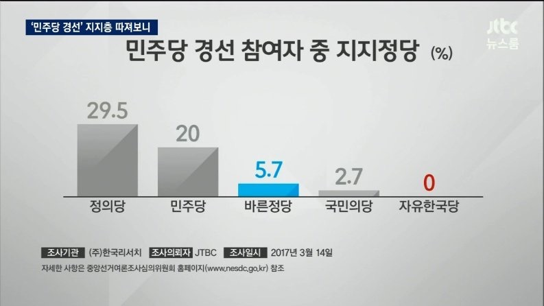
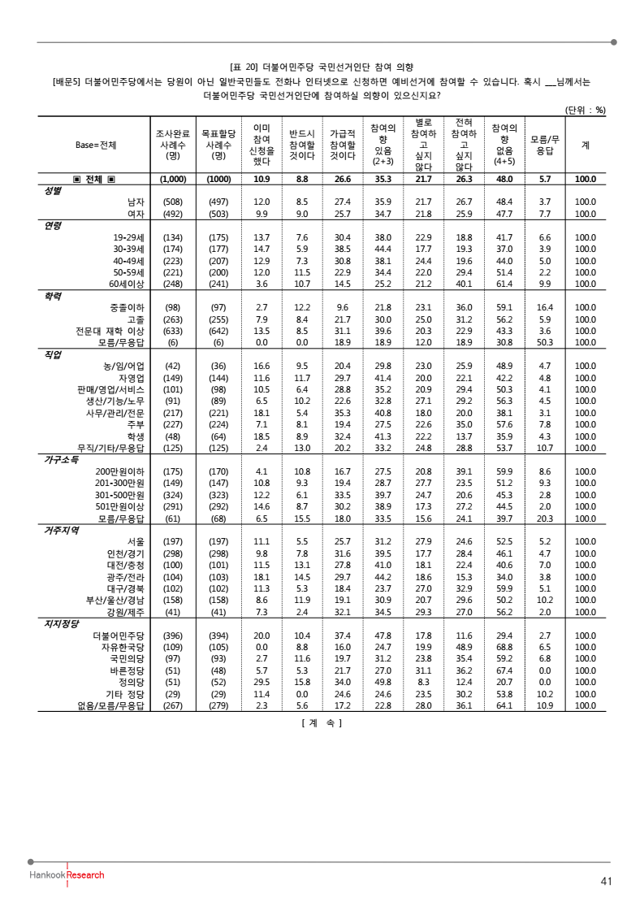

```{r setup, include=FALSE}
knitr::opts_chunk$set(echo = TRUE)
library(extrafont)
library(knitr)
library(RColorBrewer)
```

## Problem

JTBC 뉴스룸에서는 "민주당 경선 참여자 중 지지정당"이라는 제목의 다음 도표를 제시하여 마치 정의당 지지자들이 민주당 지지자들보다 많은 것처럼 보도함. 



<P style = "page-break-before:always">

사실을 파악하기 위하여 이 보도의 근거인 한국리서치의 보도자료에서 해당되는 부분을 발췌하면 다음 그림과 같음.

`r knitr::include_graphics("../pics/44.png", dpi = 120)`

<!--

-->

<P style = "page-break-before:always">

## Data

```{r}
party <- c("더불어민주당", "자유한국당", "국민의당", "바른정당", "정의당", "기타정당", "없음/모름/무응답")
counts <- c(396, 109, 97, 51, 51, 29, 267)
prop_in_already <- c(20.0, 0.0, 2.7, 5.7, 29.5, 11.4, 2.3)
prop_in_total <- c(47.8, 24.7, 31.2, 27.0, 49.8, 24.6, 22.8)
prop_not_total <- c(29.4, 68.8, 59.2, 67.4, 20.7, 53.8, 64.1)
prop_dunno <- c(2.7, 6.5, 6.8, 0.0, 0.0, 10.2, 10.9)
counts_in_already <- round(counts * prop_in_already / 100)
counts_in_total <- round(counts * prop_in_total / 100)
counts_not_total <- round(counts * prop_not_total / 100)
counts_dunno <- round(counts * prop_dunno / 100)
counts_df <- data.frame(지지정당 = party, 
                        사례수 = counts, 
                        이미참여 = counts_in_already,
                        참여의사 = counts_in_total,
                        참여않음 = counts_not_total,
                        모름 = counts_dunno,
                        stringsAsFactors = FALSE)
kable(counts_df)
```

<P style = "page-break-before:always">

## Barplot

```{r, fig.height = 6, fig.width = 8}
par(family = "KoPubWorldDotum Medium")
bar_pal <- brewer.pal(4, "Set1")
barplot(t(as.matrix(counts_df[, 3:6])), 
        axes = FALSE, 
        beside = FALSE, 
        names.arg = counts_df[, 1], 
        legend.text = names(counts_df)[3:6], 
        col = bar_pal)
axis(side = 2, at = counts, labels = counts)
main_title <- "지지정당 별 민주당 경선 참여 비교"
sub_title <- "JTBC 뉴스룸, 한국리서치 2017. 3. 14"
main_text <- "더불어민주당 지지자 중 20%,\n 정의당 지지자 중 29.5%,\n 더불어민주당 경선 이미 참여"
title(main = main_title, 
      sub = sub_title, 
      cex.main = 2)
text(4, 250, main_text)
box(which = "figure", lwd = 3)
dev.copy(png, "../pics/jtbc170314.png", width = 640, height = 480)
dev.off()
```

<P style = "page-break-before:always">

## ggplot

```{r, fig.height = 5, fig.width = 8}
library(reshape2)
counts_df$party_f <- factor(party, 
                            levels = party)
kable(counts_df)
str(counts_df)
counts_df_melt <- melt(counts_df, 
                       id.vars = "party_f", 
                       measure.vars = c("사례수", "이미참여", "참여의사", "참여않음", "모름"), 
                       variable.name = "Participation", 
                       value.name = "Counts")
counts_df_melt2 <- counts_df_melt[counts_df_melt$Participation != "사례수", ]
library(ggplot2)
# ggplot(data = counts_df_melt2, mapping = aes(x = party_f, y = Counts, fill = Participation)) +
#   geom_bar(stat = "identity") + 
#   theme_bw(base_family = "KoPubWorldDotum Medium") +
#     scale_fill_manual(name = "경선참여", values = c("red", "cyan")) +
#     scale_x_discrete(name = "지지정당") +
#     scale_y_continuous(name = "사례수", breaks = counts, labels = counts) +
#     labs(title = main_title, subtitle = sub_title) +
g1 <- ggplot(data = counts_df_melt2, 
             mapping = aes(x = party_f, 
                           y = Counts, 
                           fill = Participation)) 
g2 <- g1 + 
  geom_bar(stat = "identity") 
g2
```

<P style = "page-break-before:always">

```{r, fig.height = 5, fig.width = 8}
g3 <- g2 +
  theme_bw(base_family = "KoPubWorldDotum Medium")
g3
```

<P style = "page-break-before:always">

```{r, fig.height = 5, fig.width = 8}
g4 <- g3 + 
    scale_fill_manual(name = "경선참여", 
                      values = bar_pal)
g4
```

<P style = "page-break-before:always">

```{r, fig.height = 5, fig.width = 8}
g5 <- g4 + 
    scale_x_discrete(name = "지지정당")
g5
```

<P style = "page-break-before:always">

```{r, fig.height = 5, fig.width = 8}
g6 <- g5 +
    scale_y_continuous(name = "사례수", 
                       breaks = counts, 
                       labels = counts)
g6
```

<P style = "page-break-before:always">

```{r, fig.height = 5, fig.width = 8}
g7 <- g6 +
    labs(title = main_title, 
         subtitle = sub_title)
g7
```

<P style = "page-break-before:always">

```{r, fig.height = 5, fig.width = 8}
g8 <- g7 +
  theme(plot.title = element_text(size = 18, hjust = 0.5, family = "KoPubWorldDotum Bold"))
g8
```