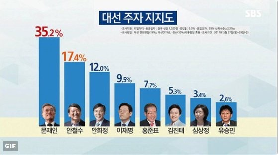

## Problem

SBS 뉴스에서는 다음과 같은 도표의 후보지지도 여론조사 결과를 보도. 

```{r, echo = FALSE, out.width = "60%", fig.align = "left"}

```

막대의 높이에 의구심을 표한 시청자들의 항의에 직면함. 

제대로 된 막대그래프를 그리면서 R Base plot과 ggplot에 대하여 학습.

<P style = "page-break-before:always">

## Data Setup

```{r, data}
library(extrafont)
candidates <- c("문재인", "안철수", "안희정", "이재명", "홍준표", "김진태", "심상정", "유승민") 
rates <- c(35.2, 17.4, 12.0, 9.5, 7.7, 5.3, 3.4, 2.6)
party <- c("더불어민주당", "자유한국당", "국민의당", "정의당", "바른정당")
colour_party <- c("blue", "lightgrey", "darkgreen", "purple", "darkblue")
candidates_party <-  c("더불어민주당", "국민의당", "더불어민주당",  "더불어민주당", "자유한국당", "자유한국당", "정의당", "바른정당")
match(candidates_party, party)
candidates_colour <- colour_party[match(candidates_party, party)]
```

### `strsplit()`

```{r, strsplit}
c_rates <- format(rates, nsmall = 1, justify = "right")
a <- sapply(strsplit(c_rates, "[.]"), `[`, 1)
b <- sapply(strsplit(c_rates, "[.]"), `[`, 2)
b_perc <- paste(".", b, "%", sep = "")
```

### Colours for rates

```{r, colour for rates}
col_rates <- c("red", "orange", rep("darkblue", 6))
```

<P style = "page-break-before:always">

## Barplot (R Base)

```{r, fig.width = 8, fig.height = 3.6}
barplot(rates)
```

<P style = "page-break-before:always">

### Place Names under Bars

```{r, names, fig.width = 8, fig.height = 3.6}
par(family = "KoPubWorldDotum Medium")
b1 <- barplot(rates, 
              axes = FALSE, 
              col = "dodgerblue", 
              names.arg = candidates,
              cex.names = 1.2,
              ylim = c(0, max(rates) * 1.1))
```

<P style = "page-break-before:always">

### Names closer to Bars using `mtext()`

```{r, names closer to bars,  fig.width = 8, fig.height = 4}
par(family = "KoPubWorldDotum Medium")
b1 <- barplot(rates, 
              axes = FALSE, 
              col = "dodgerblue", 
              names.arg = NULL,
              cex.names = 1.2,
              ylim = c(0, max(rates) * 1.1))
mtext(side = 1, at = b1, line = 0, text = candidates)
#> Rates written on top of the Bars with different Colours
text(x = b1, y = rates + rep(1.5, 8), 
    labels = paste(c_rates, "%", sep = ""), 
    col = col_rates, 
    cex = 1.2)
main_title <- "대선주자 지지도"
note_text <- "조사기관:리얼미터, 총응답자:전국 성인 1,525명, 응답률:9.5%, 표준오차:95%신뢰수준 2.5%,
조사방법:유선 ARS 10%, 무선 ARS 71%, 무선전화면접 19%, 조사기간:2017년 3월27일(월)~29일(수)" 
#> Main title inside the plot region
title(main = main_title, cex.main = 1.5, line = -2)
```

<P style = "page-break-before:always">

## Rates with different font size for digits

```{r, different font sizes, fig.width = 8, fig.height = 4}
par(family = "KoPubWorldDotum Medium")
b1 <- barplot(rates, 
              axes = FALSE, 
              col = "dodgerblue", 
              names.arg = NULL,
              cex.names = 1.2,
              ylim = c(0, max(rates) * 1.1))
mtext(side = 1, at = b1, line = 0, text = candidates)
#> text for integer part
text(x = b1 - c(rep(0.4, 3), rep(0.3, 5)), y = rates + rep(1.5, 8), 
     labels = a, 
     col = col_rates, 
     cex = 1.6)
#> text for digits
text(x = b1 + 0.2, y = rates + rep(1.5, 8), 
     labels = b_perc, 
     col = col_rates, 
     cex = 1.2)
#> Rectagle for main title
rect(xleft = mean(b1) - 2, ybottom = max(rates) - 6, xright = mean(b1) + 2, 
     ytop = max(rates), col = "dodgerblue4")
#> Main title
text(x = mean(b1), y = max(rates) - 3, labels = main_title, col = "white", cex = 1.5)
#> Text for notes
text(x = mean(b1) - 2, y = max(rates) - 8, labels = note_text, cex = 0.5, adj = 0)
box(which = "outer", lwd = 3)
# dev.copy(png, "../pics/sbs170331.png", width = 640, height = 320)
# dev.off()
```
<P style = "page-break-before:always">

## ggplot

### Data for ggplot

```{r, ggplot, fig.width = 8, fig.height = 4}
library(ggplot2)
candidates_f <- factor(candidates, levels = candidates)
rates_df <- data.frame(후보 = candidates_f, 
                       정당 = candidates_party, 
                       색깔 = candidates_colour,
                       지지도 = rates)
```

### data and mapping

```{r, data and mapping, fig.width = 8, fig.height = 4}
g0 <- ggplot(data = rates_df, 
             mapping = aes(x = 후보, y = 지지도))
```

### `geom_bar()` with single colour for the bars

```{r, single colour for the bars 2, fig.width = 8, fig.height = 4}
(g1 <- g0 +
  geom_bar(stat = "identity", 
           fill = "dodgerblue"))
```

<P style = "page-break-before:always">

### Fill the bars with party colours

```{r, party colours to fill, fig.width = 8, fig.height = 4}
(g1.1 <- g0 +
  geom_bar(stat = "identity", 
           fill = candidates_colour))
```

### Font family setting with `g1`

```{r, font family 2, fig.width = 8, fig.height = 4}
(g2 <- g1 +
  theme_void(base_family = "KoPubWorldDotum Medium"))
```

<P style = "page-break-before:always">

### Add rates on top of the bars

```{r, rates on top 2, fig.width = 8, fig.height = 4}
(g3.0 <- g2 +
  geom_text(mapping = aes(x = 후보, 
                          y = 지지도 + rep(1, 8), 
                          label = paste(지지도, "%", sep = "")), 
                          size = 6))
```

<P style = "page-break-before:always">

### Different font size for digits

```{r, different font size 2, fig.width = 8, fig.height = 4}
(g3 <- g2 +
    geom_text(mapping = aes(x = 후보, 
                            y = 지지도 + rep(1, 8), 
                            label = a), 
              hjust = 1,
              size = 8,
              colour = col_rates) +
    geom_text(mapping = aes(x = 후보, 
                          y = 지지도 + rep(1, 8), 
                          label = b_perc),
              hjust = 0,
              size = 5,
              colour = col_rates))
```

<P style = "page-break-before:always">

### Main title (left-justified)

```{r, leftjustified title, fig.width = 8, fig.height = 4}
(g4 <- g3 +
  labs(title = main_title))
```

### Main title at the center

```{r, centred title, fig.width = 8, fig.height = 4}
(g5 <- g4 +
  theme(plot.title = element_text(hjust = 0.5)))
```

<P style = "page-break-before:always">

### Rates at y-axis

```{r, rates at y 2, fig.width = 8, fig.height = 4}
(g6 <- g5 +
  scale_y_continuous(breaks = rates, 
                     labels = c_rates))
```

<P style = "page-break-before:always">

### Clear axes

```{r, clear axes, fig.width = 8, fig.height = 4}
(g7 <- g6 +
  theme(panel.border = element_blank(),
        axis.title.x = element_blank(),
        axis.title.y = element_blank(),
        axis.text.x = element_blank(),
        axis.ticks = element_blank(), 
        axis.text.y = element_blank()))
```

<P style = "page-break-before:always">

### Names closer to the bars

```{r, names closer to bars 2, fig.width = 8, fig.height = 4}
(g8 <- g7 +
    geom_text(mapping = aes(x = 후보,
                            y = -1,
                            label = 후보),
              size = 5,
              family = "KoPubWorldDotum Medium"))
```

<P style = "page-break-before:always">

### Main title inside the plot region

```{r, main title inside, fig.width = 8, fig.height = 4}
(g9 <- g8 +
    ggtitle("") +
    annotate("text", 
             x = mean(b1), 
             y = max(rates) - 3, 
             label = main_title, 
             vjust = 0, 
             size = 10, 
             family = "KoPubWorldDotum Medium"))
```

<P style = "page-break-before:always">

### `geom_label()` to enclose the main title in bounding box

```{r, bounding box main title, fig.width = 8, fig.height = 4}
(g9.1 <- g8 +
    ggtitle("") +
    geom_label(mapping = aes(x = mean(b1), 
                             y = max(rates) - 3, 
                             label = main_title),
               label.padding = unit(0.9, "lines"),
               size = 10,
               fill = "dodgerblue4",
               colour = "white",
               family = "KoPubWorldDotum Bold"))
```

<P style = "page-break-before:always">

### Notes

```{r, notes 2, fig.width = 8, fig.height = 4}
(g9.2 <- g9.1 + 
    annotate("text", 
             x = mean(b1) - 1, y = max(rates) - 8, 
             label = note_text, 
             size = 2, 
             hjust = 0,
             family = "KoPubWorldDotum Medium"))
ggsave("../pics/sbs170331.png", 
       g9.2, width = 8, height = 4, dpi = 72)
```

## Comments